# Infron vs OpenRouter Prompt Caching A/B Replication Study

## Abstract and Executive Outline

**Keywords**: Prompt Caching; A/B Testing; Provider Routing; Cache Affinity; E2E Latency; Streaming TTFT; Throughput; Cost Attribution; DeepSeek V4 Flash

### Abstract

This report evaluates `deepseek/deepseek-v4-flash` on two OpenAI-compatible inference platforms, Infron and OpenRouter, under prompt caching workloads. The experiment compares provider routing behavior, token-level cache hit rate, observed cost, response throughput, Streaming TTFT, and E2E latency across three routing sort strategies: `throughput`, `price`, and `latency`.

The benchmark used 4 experiment groups and 50 rounds per group. Each round sent two identical streaming Chat Completions requests to each platform. After excluding abnormal usage records, non-successful records, and A/B pairs whose first/second `usage.prompt_tokens` were not exactly equal, the final analysis retained 364 strict A/B pairs and 1,456 request-level observations. A total of 472 records were excluded by the data quality rules.

The core finding is that, among samples with exactly matched `usage.prompt_tokens`, Infron achieved a higher token-level cache hit rate in every routing mode. Infron had lower observed cost in `price` and `latency` modes, while OpenRouter had lower observed cost in `throughput` mode. OpenRouter delivered higher response throughput in all three routing modes. Infron delivered lower E2E latency and lower Streaming TTFT in `latency` mode, while OpenRouter delivered lower E2E latency and lower Streaming TTFT in `throughput` and `price` modes. Overall, Infron's advantage is concentrated in cache reuse, cost control, and the low-E2E-latency path under Latency First. OpenRouter's advantage is concentrated in throughput, Streaming TTFT, and E2E latency in two of the three modes. Platform selection should therefore be driven by business objectives rather than a single metric.

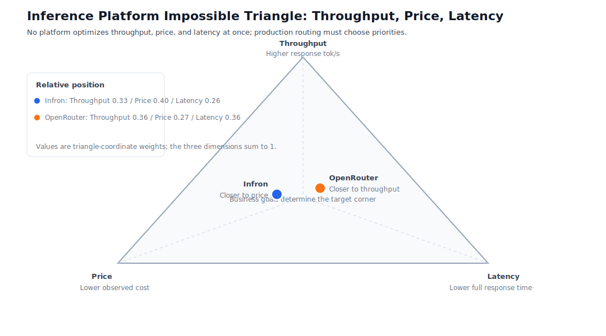

Figure 0: The inference platform "impossible quadrilateral" routing-mode position chart. The chart shows Infron and OpenRouter under Throughput First, Price First, and Latency First, plus each weighted aggregate position. Coordinates use nonlinear visual scaling to preserve the overlap zone while separating advantage directions; source metrics and winner conclusions are unchanged.

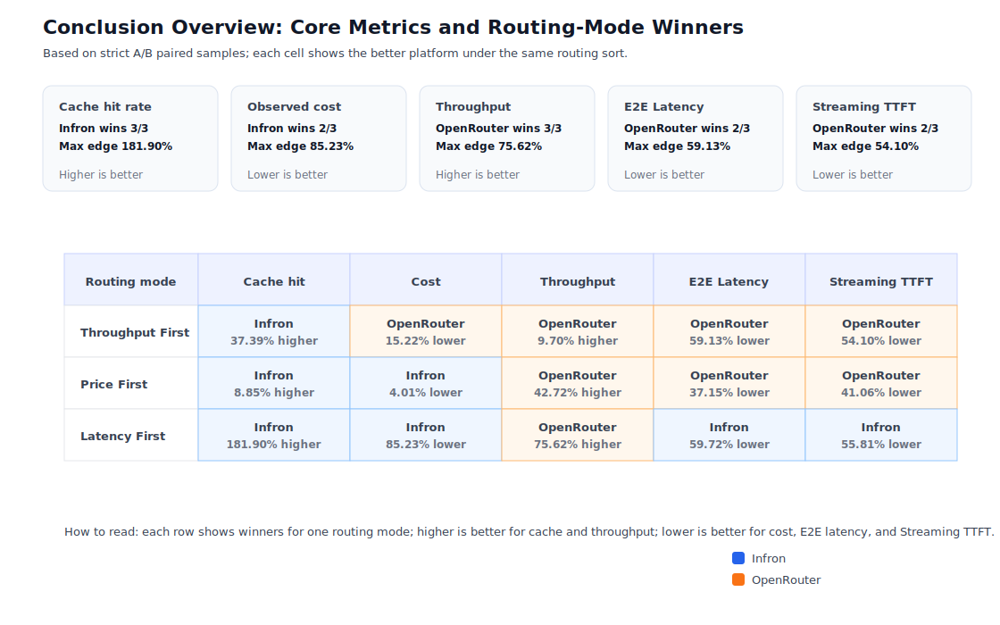

Figure A: Conclusion overview. The upper cards summarize cross-mode winners, while the matrix shows the A/B outcome for cache hit rate, cost, throughput, E2E latency, and Streaming TTFT under each routing mode.

### Executive Outline

| Dimension | Finding | Evidence |
| --- | --- | --- |
| Controlled variables | Included A/B samples have exactly equal first/second `usage.prompt_tokens` for the same `sort/group/round`; input token totals are `throughput`=657312/657312, `price`=181436/181436, and `latency`=357916/357916 | Methodology and data quality sections |
| Cache reuse | Infron has higher token-level cache hit rate in all routing modes, consistent with stronger provider stick/cache affinity for repeated long prefixes | Results and mechanism analysis |
| Observed cost | Infron is cheaper in `price` and `latency`; OpenRouter is cheaper in `throughput`; the cost pattern moves with cache read tokens and provider selection | Results sections |
| Performance | OpenRouter has higher throughput in all routing modes; Infron has lower E2E latency and Streaming TTFT in `latency`; OpenRouter has lower E2E latency and Streaming TTFT in `throughput` and `price` | Visualization and conclusion sections |
| Attribution boundary | The report uses only observable telemetry: provider fields, usage, cost breakdown, Streaming TTFT, E2E latency, and cache tokens. It does not treat private routing trace as observed evidence | Mechanism and drill-down sections |
| Business implication | Stable long-context prompts, RAG prefixes, agent tool instructions, and batch workloads benefit most from cache hit rate and cost predictability. Real-time products should still constrain E2E latency independently | Discussion section |

### Routing-Mode Conclusions

#### Throughput First

| Metric | Platform | Bar and value | Winner |
| --- | --- | --- | --- |
| Token cache hit rate | Infron | **████████ 92.38%** | **Infron** (37.39% higher) |
|  | OpenRouter | ██████░░ 67.24% |  |
| Observed cost | Infron | ████████ $0.05493100 | **OpenRouter** (15.22% lower) |
|  | OpenRouter | **███████░ $0.04656992** |  |
| Throughput | Infron | ███████░ 36.52 tok/s | **OpenRouter** (9.70% higher) |
|  | OpenRouter | **████████ 40.06 tok/s** |  |
| E2E Latency | Infron | ████████ 7391.44 ms | **OpenRouter** (59.13% lower) |
|  | OpenRouter | **███░░░░░ 3020.63 ms** |  |
| Streaming TTFT | Infron | ████████ 3443.99 ms | **OpenRouter** (54.10% lower) |
|  | OpenRouter | **████░░░░ 1580.62 ms** |  |

#### Price First

| Metric | Platform | Bar and value | Winner |
| --- | --- | --- | --- |
| Token cache hit rate | Infron | **████████ 82.67%** | **Infron** (8.85% higher) |
|  | OpenRouter | ███████░ 75.95% |  |
| Observed cost | Infron | **████████ $0.01059100** | **Infron** (4.01% lower) |
|  | OpenRouter | ████████ $0.01103342 |  |
| Throughput | Infron | ██████░░ 23.03 tok/s | **OpenRouter** (42.72% higher) |
|  | OpenRouter | **████████ 32.87 tok/s** |  |
| E2E Latency | Infron | ████████ 8802.77 ms | **OpenRouter** (37.15% lower) |
|  | OpenRouter | **█████░░░ 5532.32 ms** |  |
| Streaming TTFT | Infron | ████████ 6419.29 ms | **OpenRouter** (41.06% lower) |
|  | OpenRouter | **█████░░░ 3783.70 ms** |  |

#### Latency First

| Metric | Platform | Bar and value | Winner |
| --- | --- | --- | --- |
| Token cache hit rate | Infron | **████████ 93.55%** | **Infron** (181.90% higher) |
|  | OpenRouter | ███░░░░░ 33.19% |  |
| Observed cost | Infron | **█░░░░░░░ $0.00555800** | **Infron** (85.23% lower) |
|  | OpenRouter | ████████ $0.03762893 |  |
| Throughput | Infron | █████░░░ 8.66 tok/s | **OpenRouter** (75.62% higher) |
|  | OpenRouter | **████████ 15.21 tok/s** |  |
| E2E Latency | Infron | **███░░░░░ 1847.59 ms** | **Infron** (59.72% lower) |
|  | OpenRouter | ████████ 4587.12 ms |  |
| Streaming TTFT | Infron | **████░░░░ 1536.19 ms** | **Infron** (55.81% lower) |
|  | OpenRouter | ████████ 3476.52 ms |  |

Note: Each block corresponds to one routing mode. For each metric, Infron and OpenRouter are split into two rows so the bars start from the left edge of the same column in GitHub Markdown and GitHub Pages rendering. Higher is better for cache hit rate and throughput. Lower is better for observed cost, E2E latency, and Streaming TTFT.

## 1. Introduction

This study evaluates prompt caching behavior for the same OpenAI-compatible Chat Completions workload on Infron and OpenRouter. The focus is how routing sort strategies affect cache reuse, cost, throughput, Streaming TTFT, and E2E latency when input size is strictly controlled.

Prompt caching matters in production because many LLM workloads contain stable system prompts, long context templates, RAG prefixes, tool descriptions, or workflow instructions. When the prefix is repeated, later requests can reuse cached prefill work and reduce marginal cost. This benchmark models that pattern by issuing two identical requests per round and using the second request's cache read tokens as the primary cache reuse signal.

The report addresses three questions:

- Under identical payloads and matched `usage.prompt_tokens`, how do Infron and OpenRouter differ in cache hit rate and observed cost?
- How do `throughput`, `price`, and `latency` routing sort strategies change the speed/cost/cache trade-off?
- What can observable telemetry tell us about provider routing and attribution boundaries?

### 1.1 Hypotheses

| Hypothesis | Statement | Validation metrics |
| --- | --- | --- |
| H1 | Stronger provider/cache affinity improves token-level cache hit rate for repeated stable long-prefix requests | Second-request cache read tokens; token-level cache hit rate |
| H2 | Higher cache hit rate can reduce observed cost, but it does not necessarily reduce Streaming TTFT or E2E latency | Observed cost; average Streaming TTFT; average request E2E latency |
| H3 | Different routing sort strategies change provider selection and therefore create different Pareto frontiers | Provider distribution; throughput; E2E latency; cost |

### 1.2 Contributions

- A strict paired A/B benchmark method that uses response-side `usage.prompt_tokens` as the true input-token control variable.
- A prompt caching evaluation framework that includes cache hit rate, observed cost, throughput, E2E latency, Streaming TTFT, provider distribution, and reproducible datasets.
- A provider-routing analysis based only on observable telemetry, with explicit attribution boundaries when private routing trace is unavailable.
- A full open artifact: paired CSV, request-level JSONL, figures, report pages, checksums, and benchmark runner code.

## 2. Methodology: Experiment Design, Dataset, and Controls

### 2.1 Dataset Construction

The dataset was generated by the benchmark runner. It covers three routing sort modes, two platforms, four experiment groups, and 50 rounds per group. Each round contains two identical `chat/completions` requests. The first request establishes or refreshes cache state; the second request measures cache reuse.

The prompt corpus uses built-in representative business templates covering RAG support, agent tool instructions, marketing automation, and code review. These templates are intended to mimic stable long-context production prompts without including private customer data.

### 2.2 Controlled Variables

The A/B pairing key is `sort/group/round`. A pair is included only when both platforms have successful first and second requests, and both first and second `usage.prompt_tokens` match exactly. Records are excluded if they have HTTP failures, request exceptions, `usage.prompt_tokens <= 0`, incomplete pairs, or unequal input tokens.

Total Input Tokens in this report are computed from response-returned `usage.prompt_tokens`, not from a local tokenizer estimate. This matters because provider-side prompt wrapping, tokenizer differences, cache accounting, and billing logic ultimately surface through response usage.

### 2.3 Experimental Flow and Request Example

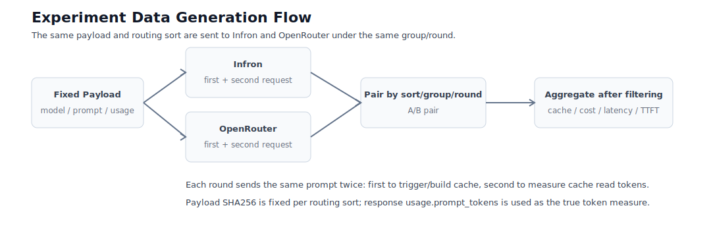

Figure 1: Experiment flow. The same payload is sent to Infron and OpenRouter under each routing mode. Each platform receives two identical requests per round, and final analysis is performed on strict `sort/group/round` pairs.

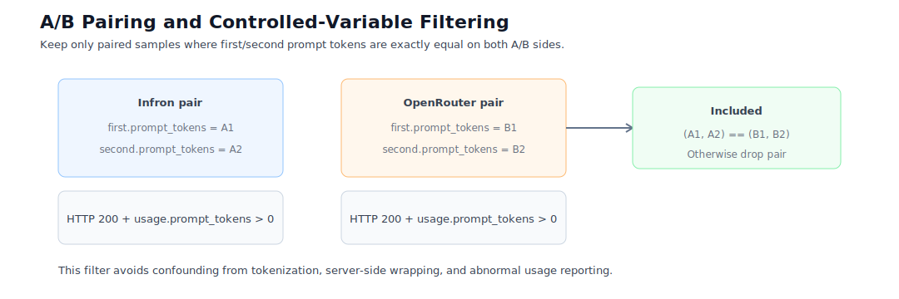

Figure 2: A/B pairing filter. Abnormal usage, HTTP failures, incomplete pairs, and unequal input-token pairs are removed before aggregation.

Core payload shape:

```json
{
  "model": "deepseek/deepseek-v4-flash",
  "messages": [
    {"role": "system", "content": "<stable long cache probe prefix>"},
    {"role": "user", "content": "Reply with exactly: cache probe ok"}
  ],
  "temperature": 0,
  "max_tokens": 320,
  "stream": true,
  "stream_options": {"include_usage": true},
  "usage": {"include": true},
  "provider": {"sort": "<throughput|price|latency>"}
}
```

### 2.4 Metric Definitions

| Metric | Definition | Direction |
| --- | --- | --- |
| Total Input Tokens | Sum of response-side `usage.prompt_tokens` for included requests | Control variable |
| Call-level hit rate | Share of rounds whose second request returned positive cache read tokens | Higher is better |
| Token-level hit rate | Second-request cache read tokens / second-request prompt tokens | Higher is better |
| Observed cost | Response-returned cost or cost breakdown; missing cost is not counted as zero | Lower is better |
| Response throughput | Completion tokens divided by total response E2E-latency seconds; reasoning tokens are included when present in response usage | Higher is better |
| E2E Latency | End-to-end streaming response time | Lower is better |
| Streaming TTFT | Time to first streamed chunk/token | Lower is better |

## 3. Experimental Environment and Data Quality

| Item | Configuration |
| --- | --- |
| Model | `deepseek/deepseek-v4-flash` |
| Platforms | Infron and OpenRouter |
| Routing modes | `throughput`, `price`, `latency` |
| Dataset | `business_representative` |
| Dataset type | Built-in representative business prompt templates |
| External business corpus | Not provided in this run |
| Groups | 4 per platform per routing mode |
| Rounds per group | 50 |
| Workers | 8 |
| Requests per round | Two identical prompt requests |
| Usage collection | Requests include `usage: {"include": true}`; streaming requests include `stream_options: {"include_usage": true}` |
| Cost accounting | Only response-returned cost fields or cost breakdown are used |
| Streaming/TTFT | Streaming is enabled; TTFT and first reasoning/content token timing are recorded |
| Provider attribution | Response provider fields, headers, model/id, request id, routing trace candidates, and cost breakdown candidates are captured when available |
| Exclusion rules | HTTP non-200, request exception, `usage.prompt_tokens <= 0`, incomplete pair, or unequal A/B input tokens |
| Excluded records | 472 |
| `throughput` payload SHA256 | `089b263a7bc3bb2b929ab39826288d1890bf6f41fe68da94a0b86191a0db01c8` |
| `price` payload SHA256 | `5adb21ae80865036e53e29d072f943f34a85313abdbd69d51b5c72a39327e9a5` |
| `latency` payload SHA256 | `4a66878c9563dcddc9f447053ca5d34ab1a3a225093c150976c59be1f837c8c5` |

## 4. Results: Aggregate Metrics

Throughput, E2E latency, and Streaming TTFT are response-level metrics. If response usage includes reasoning tokens in `completion_tokens` or related usage fields, reasoning is included in throughput. Request E2E latency covers the complete streamed response and therefore includes reasoning time. Streaming TTFT captures first streamed output timing and represents first-response experience.

| Routing mode | Platform | Rounds | Successful rounds | Total Input Tokens (`usage.prompt_tokens`) | Call hit rate | Token hit rate | Observed total cost | Avg cost / pair | Avg response throughput | Avg E2E latency / request | Avg Streaming TTFT | HTTP status |
| --- | ---: | ---: | ---: | ---: | ---: | ---: | ---: | ---: | ---: | ---: | ---: | --- |
| `throughput` | Infron | **200** | **200** | **657312** | **100.00%** | **92.38%** | $0.05493100 | $0.00027466 | 36.52 response tok/s | 7391.44 ms | 3443.99 ms | **200** |
| `throughput` | OpenRouter | **200** | **200** | **657312** | 95.00% | 67.24% | **$0.04656992** | **$0.00023285** | **40.06 response tok/s** | **3020.63 ms** | **1580.62 ms** | **200** |
| `price` | Infron | **55** | **55** | **181436** | 92.73% | **82.67%** | **$0.01059100** | **$0.00019256** | 23.03 response tok/s | 8802.77 ms | 6419.29 ms | **200** |
| `price` | OpenRouter | **55** | **55** | **181436** | **98.18%** | 75.95% | $0.01103342 | $0.00020061 | **32.87 response tok/s** | **5532.32 ms** | **3783.70 ms** | **200** |
| `latency` | Infron | **109** | **109** | **357916** | **100.00%** | **93.55%** | **$0.00555800** | **$0.00005099** | 8.66 response tok/s | **1847.59 ms** | **1536.19 ms** | **200** |
| `latency` | OpenRouter | **109** | **109** | **357916** | 38.53% | 33.19% | $0.03762893 | $0.00034522 | **15.21 response tok/s** | 4587.12 ms | 3476.52 ms | **200** |

### 4.1 Tail Latency and Statistical Tests

| Routing mode | Platform | P50 Latency | P95 Latency | P99 Latency | P50 TTFT | P95 TTFT | P99 TTFT |
| --- | --- | ---: | ---: | ---: | ---: | ---: | ---: |
| `throughput` | Infron | 6520.96 ms | 15381.90 ms | 19665.50 ms | 2364.55 ms | 8210.19 ms | 13635.37 ms |
| `throughput` | OpenRouter | **1886.98 ms** | **9421.90 ms** | **12227.75 ms** | **1102.78 ms** | **4144.75 ms** | **10549.79 ms** |
| `price` | Infron | 6851.63 ms | 19220.74 ms | 43363.33 ms | 4485.83 ms | 15184.65 ms | 39860.92 ms |
| `price` | OpenRouter | **4862.85 ms** | **13173.48 ms** | **13727.46 ms** | **2753.68 ms** | **8726.44 ms** | **13376.75 ms** |
| `latency` | Infron | **1780.56 ms** | **2385.82 ms** | **2768.60 ms** | **1479.62 ms** | **2076.64 ms** | **2491.27 ms** |
| `latency` | OpenRouter | 1944.45 ms | 13859.66 ms | 15620.77 ms | 1499.42 ms | 12169.26 ms | 13616.78 ms |

| Routing mode | Metric | Mean difference | 95% CI | p-value | Pairs | Interpretation |
| --- | --- | ---: | --- | ---: | ---: | --- |
| `throughput` | Latency: OpenRouter - Infron | -8741.62 ms | [-9721.83 ms, -7823.76 ms] | <0.001 | 200 | Positive means Infron has lower latency |
| `throughput` | TTFT: OpenRouter - Infron | -3726.73 ms | [-4401.37 ms, -3067.25 ms] | <0.001 | 200 | Positive means Infron has lower TTFT |
| `throughput` | Throughput: Infron - OpenRouter | 6.1620 tok/s | [3.0452 tok/s, 9.2156 tok/s] | <0.001 | 200 | Positive means Infron has higher throughput |
| `throughput` | Cost: OpenRouter - Infron | $-0.00004181 | [$-0.00005753, $-0.00002643] | <0.001 | 200 | Positive means Infron has lower cost |
| `throughput` | Token Cache Hit: Infron - OpenRouter | 25.15 pp | [21.30 pp, 29.11 pp] | <0.001 | 200 | Positive means Infron has higher cache hit |
| `price` | Latency: OpenRouter - Infron | -6540.90 ms | [-9783.30 ms, -3682.28 ms] | <0.001 | 55 | Positive means Infron has lower latency |
| `price` | TTFT: OpenRouter - Infron | -5271.18 ms | [-8276.94 ms, -2572.67 ms] | <0.001 | 55 | Positive means Infron has lower TTFT |
| `price` | Throughput: Infron - OpenRouter | -3.7055 tok/s | [-9.2506 tok/s, 1.4200 tok/s] | 0.1875 | 55 | Positive means Infron has higher throughput |
| `price` | Cost: OpenRouter - Infron | $0.00000804 | [$-0.00001288, $0.00002823] | 0.4564 | 55 | Positive means Infron has lower cost |
| `price` | Token Cache Hit: Infron - OpenRouter | 6.76 pp | [-0.10 pp, 13.46 pp] | 0.0437 | 55 | Positive means Infron has higher cache hit |
| `latency` | Latency: OpenRouter - Infron | 5479.06 ms | [4060.45 ms, 6927.04 ms] | <0.001 | 109 | Positive means Infron has lower latency |
| `latency` | TTFT: OpenRouter - Infron | 3880.66 ms | [2785.28 ms, 4985.39 ms] | <0.001 | 109 | Positive means Infron has lower TTFT |
| `latency` | Throughput: Infron - OpenRouter | -5.1114 tok/s | [-6.9470 tok/s, -3.3416 tok/s] | <0.001 | 109 | Positive means Infron has higher throughput |
| `latency` | Cost: OpenRouter - Infron | $0.00029423 | [$0.00026472, $0.00032314] | <0.001 | 109 | Positive means Infron has lower cost |
| `latency` | Token Cache Hit: Infron - OpenRouter | 60.43 pp | [52.28 pp, 68.74 pp] | <0.001 | 109 | Positive means Infron has higher cache hit |

## 5. Visualization by Routing Mode

### Latency First

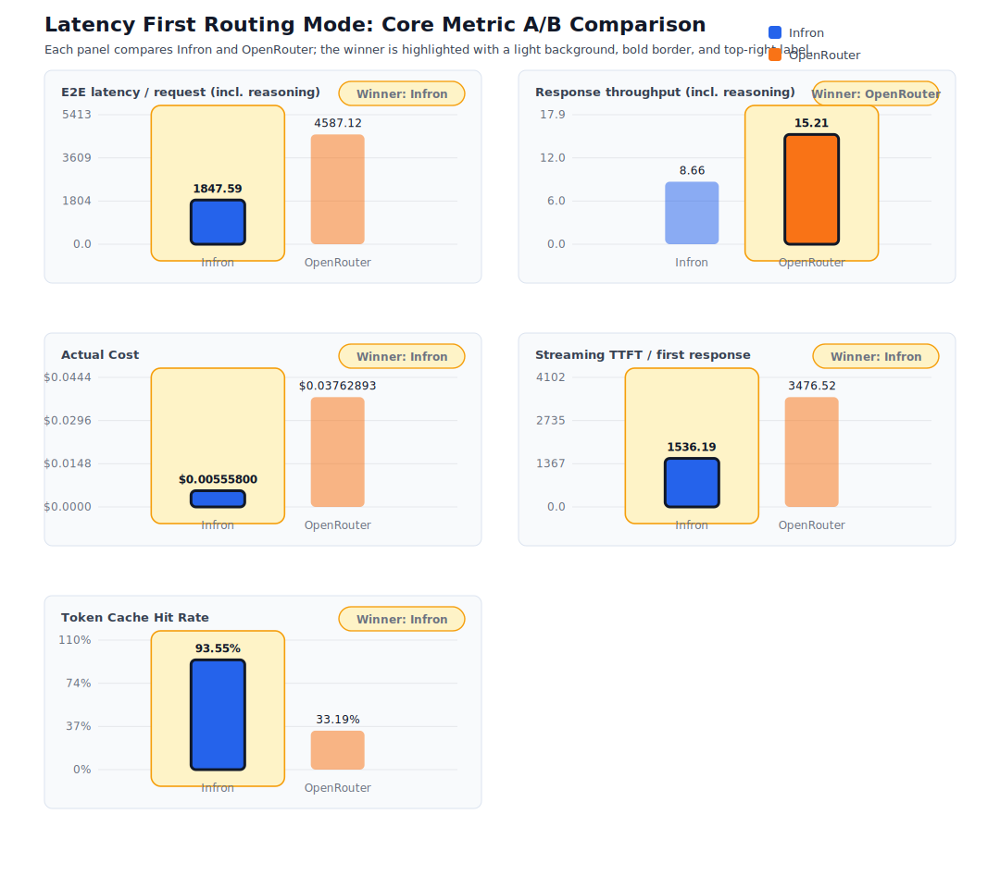

Figure 3: Core metrics under Latency First routing.

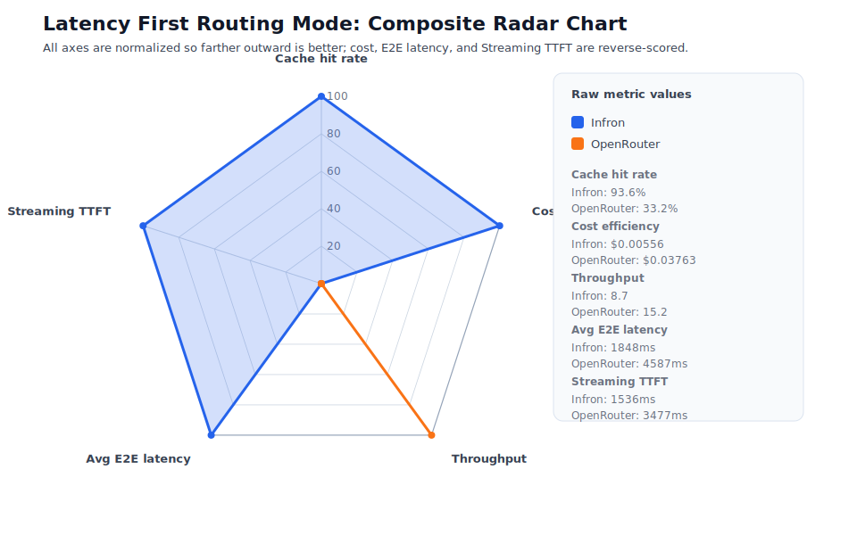

Figure 4: Normalized radar chart under Latency First. All axes are oriented so the outer direction is better.

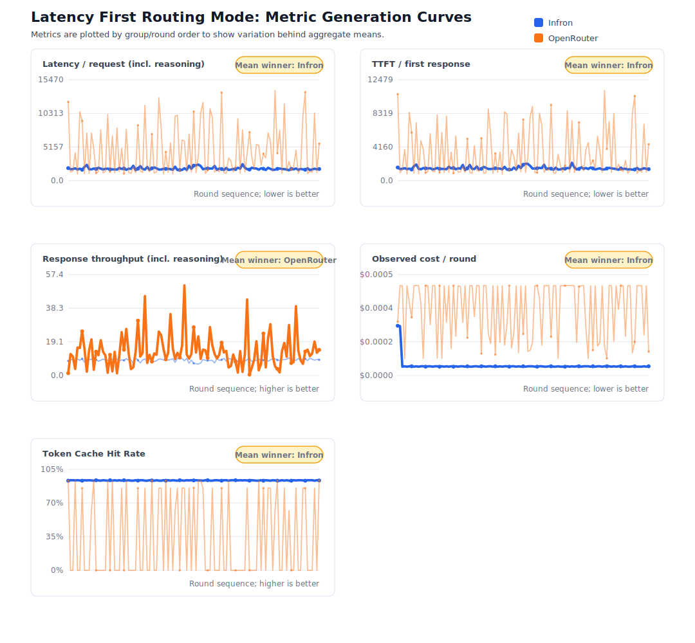

Figure 5: Metric generation curves by group/round under Latency First.

### Throughput First

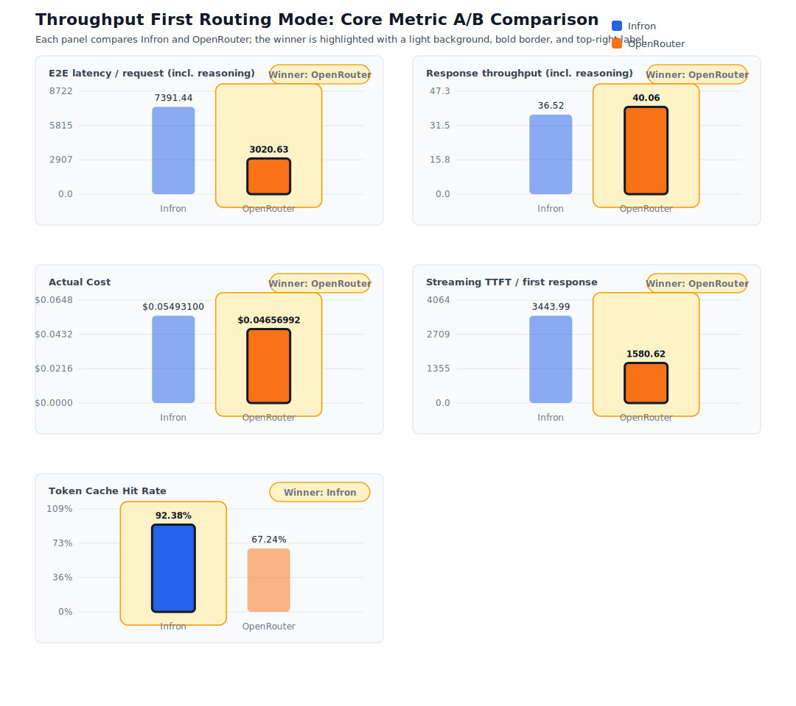

Figure 6: Core metrics under Throughput First routing.

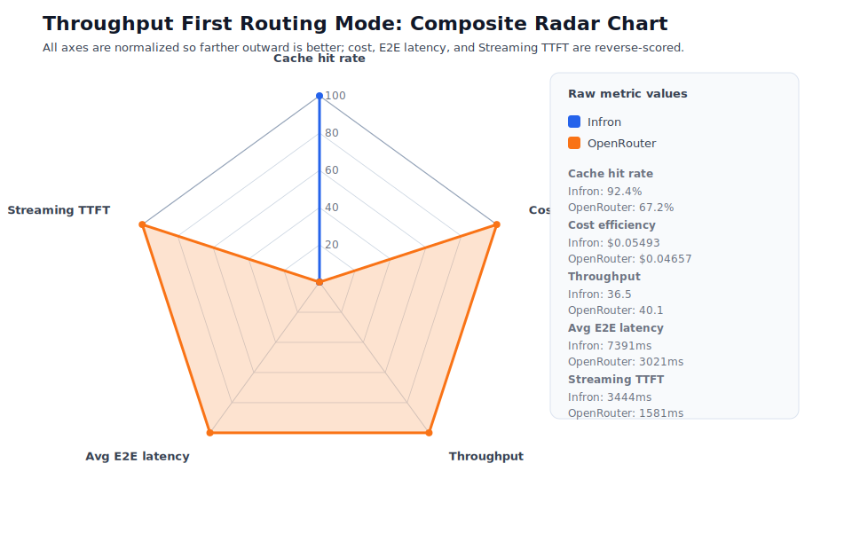

Figure 7: Normalized radar chart under Throughput First.

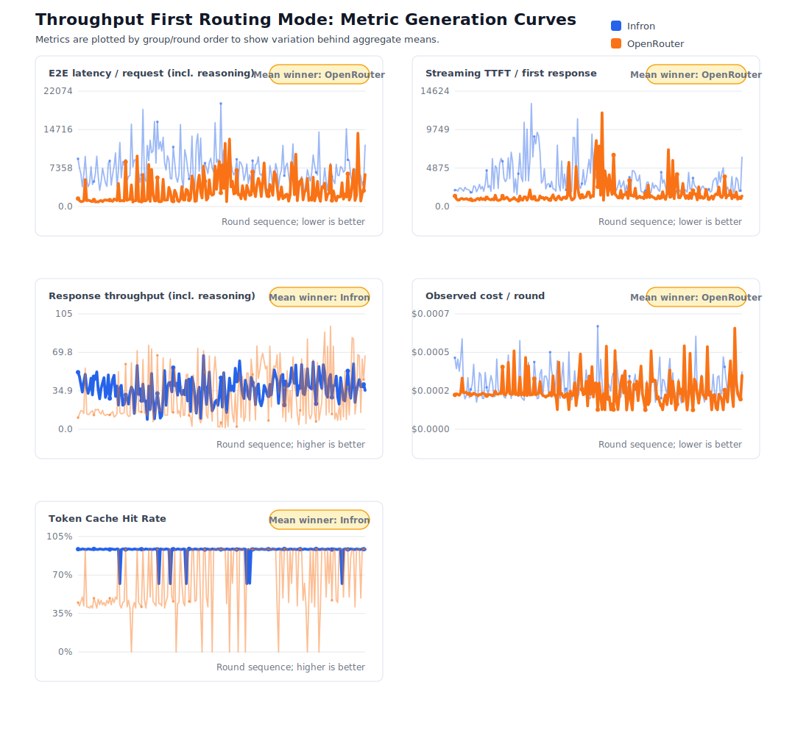

Figure 8: Metric generation curves by group/round under Throughput First.

### Price First

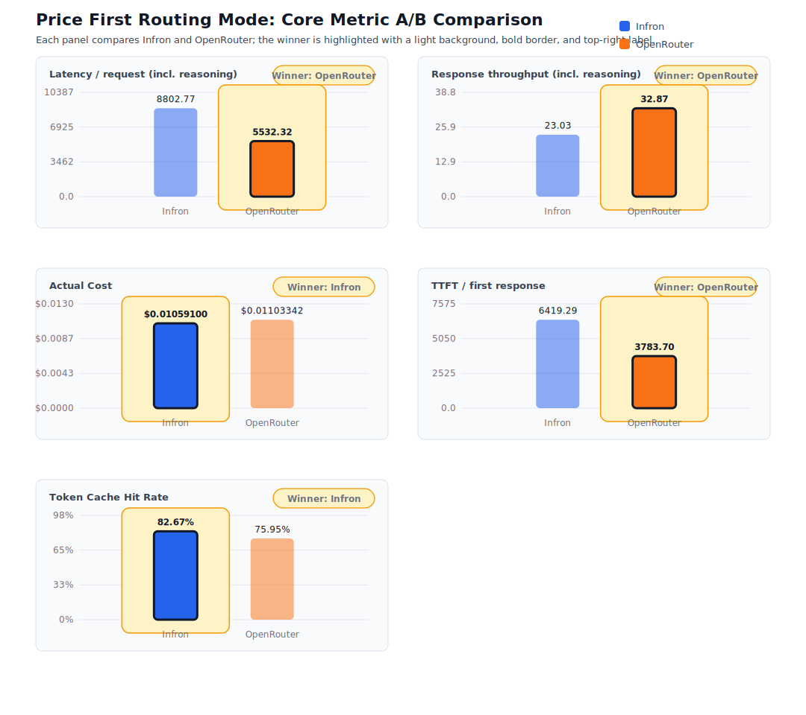

Figure 9: Core metrics under Price First routing.

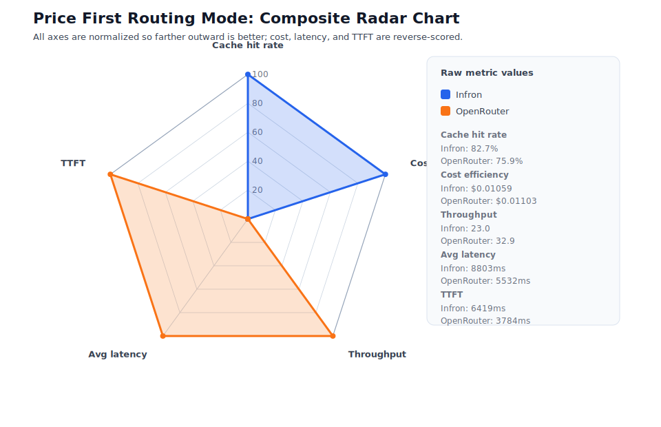

Figure 10: Normalized radar chart under Price First.

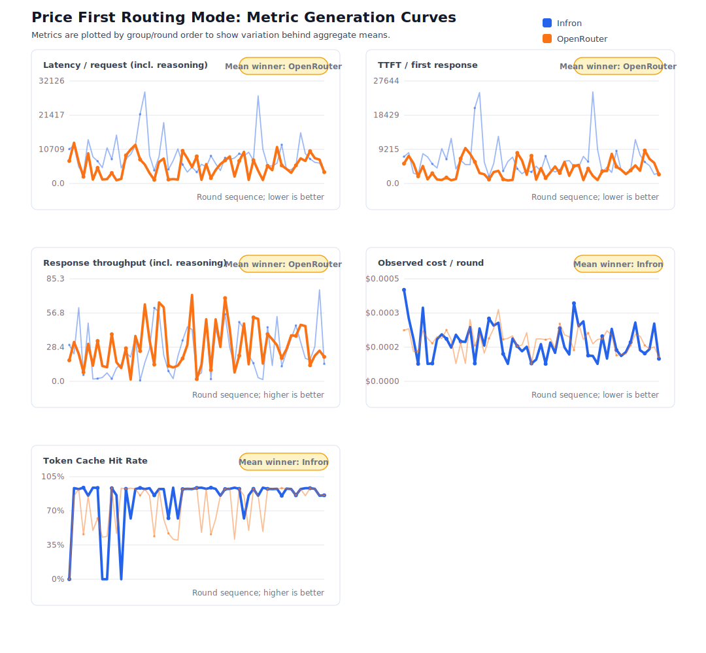

Figure 11: Metric generation curves by group/round under Price First.

## 6. Infron Architecture and Cache/Cost Mechanism

This section interprets the observed results through a multi-provider routing architecture. The benchmark does not contain private Infron routing trace; therefore, the explanation below distinguishes observable evidence from mechanism interpretation.

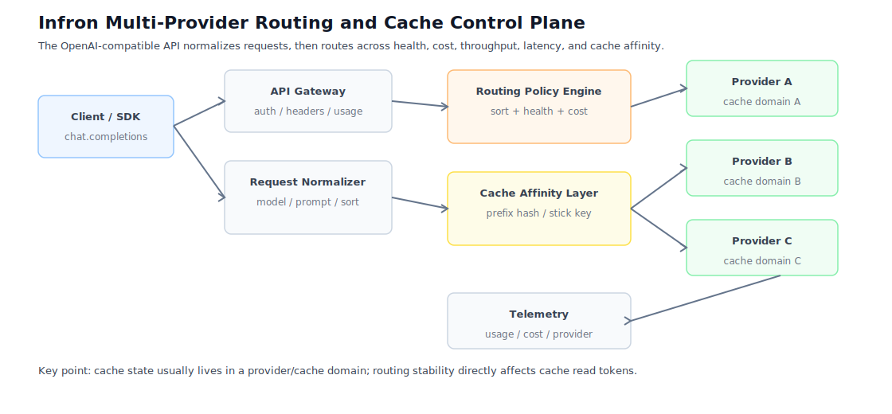

Figure 12: Infron multi-provider routing and cache control plane.

Infron exposes an OpenAI-compatible API at the edge while routing internally across multiple upstream providers, model deployments, and policy objectives. For prompt caching workloads, routing must consider more than provider availability: it also affects cache affinity, cost, throughput, and latency. The observed provider distribution is concentrated by routing mode, which is consistent with routing decisions that maintain cache locality for repeated prefixes.

### 6.1 Provider Stick and Cache Affinity

Provider stick is a cache-affinity strategy in a multi-provider gateway. When requests share a stable prompt prefix, the router tends to send them to the same healthy provider or cache domain, reducing cache fragmentation. It is not equivalent to pinning forever; fallback remains necessary when health, rate limit, or SLA conditions change.

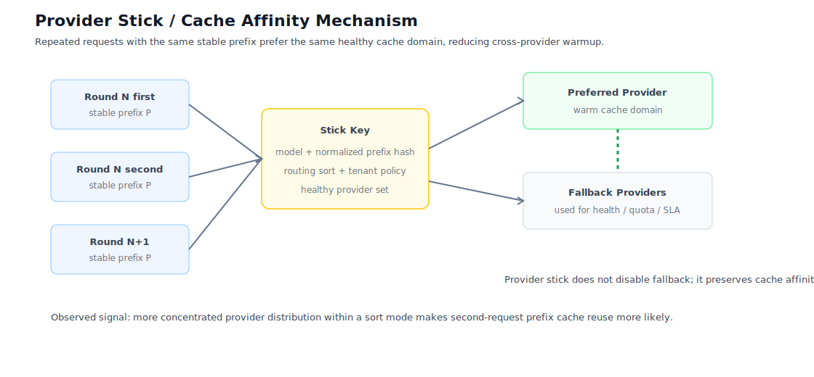

Figure 13: Provider stick and cache affinity. Keeping similar requests within the same cache domain increases the probability that the second request can reuse cache produced by the first request.

### 6.2 Cost Control Path

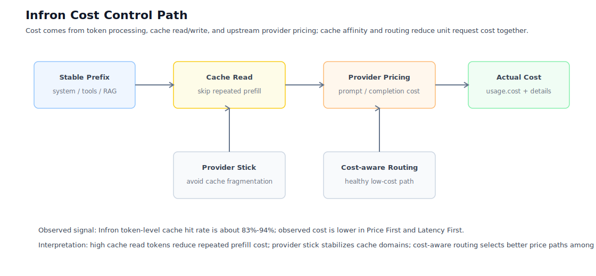

Figure 14: Cost control path. Cache hit rate and provider choice jointly shape observed cost.

| Mechanism | Cache effect | Cost effect | Observable signal in this run |
| --- | --- | --- | --- |
| Stable prefix reuse | Repeated prefixes are more likely to hit cache | Reduces repeated prefill work | Same payload SHA256; high second-request cache read tokens |
| Provider stick/cache affinity | Reduces cross-provider cache fragmentation | Reduces repeated cache warmup | More concentrated Infron provider distribution; higher token hit rate |
| Health checks and fallback | Protects availability | Fallback may trade cache for reliability | HTTP status 200 across included records |
| Cost-aware routing | Selects lower-cost paths under policy constraints | Reduces total and per-pair cost | Lower observed cost in `price` and `latency` |

## 7. Provider and Route Drill-Down

| Routing mode | Platform | Valid rounds | Input Tokens | Token hit rate | Observed cost | Cost / 1K Input | Response throughput | Streaming TTFT | E2E latency / request | Observable route profile |
| --- | ---: | ---: | ---: | ---: | ---: | ---: | ---: | ---: | ---: | --- |
| `throughput` | Infron | **200** | **657312** | **92.38%** | $0.05493100 | $0.000084 | 36.52 response tok/s | 3443.99 ms | 7391.44 ms | Balanced, no single extreme |
| `throughput` | OpenRouter | **200** | **657312** | 67.24% | **$0.04656992** | **$0.000071** | **40.06 response tok/s** | **1580.62 ms** | **3020.63 ms** | Aggressive speed path |
| `price` | Infron | **55** | **181436** | **82.67%** | **$0.01059100** | **$0.000058** | 23.03 response tok/s | 6419.29 ms | 8802.77 ms | Strong cache affinity and cost control |
| `price` | OpenRouter | **55** | **181436** | 75.95% | $0.01103342 | $0.000061 | **32.87 response tok/s** | **3783.70 ms** | **5532.32 ms** | Aggressive speed path |
| `latency` | Infron | **109** | **357916** | **93.55%** | **$0.00555800** | **$0.000016** | 8.66 response tok/s | **1536.19 ms** | **1847.59 ms** | Cache affinity, cost control, and low latency |
| `latency` | OpenRouter | **109** | **357916** | 33.19% | $0.03762893 | $0.000105 | **15.21 response tok/s** | 3476.52 ms | 4587.12 ms | Throughput-oriented |

### Upstream Provider Distribution

| Routing mode | Platform | Requests | Attributed requests | Attribution coverage | Provider distribution | Cost breakdown requests |
| --- | ---: | ---: | ---: | ---: | --- | ---: |
| `throughput` | Infron | 400 | 400 | 100.00% | alibaba/cn: 400 (100.00%) | 400 |
| `throughput` | OpenRouter | 400 | 400 | 100.00% | StreamLake: 226 (56.50%), Baidu: 173 (43.25%), Alibaba: 1 (0.25%) | 400 |
| `price` | Infron | 110 | 110 | 100.00% | gmicloud: 110 (100.00%) | 110 |
| `price` | OpenRouter | 110 | 110 | 100.00% | GMICloud: 75 (68.18%), Baidu: 27 (24.55%), Wafer: 8 (7.27%) | 110 |
| `latency` | Infron | 218 | 218 | 100.00% | deepseek: 218 (100.00%) | 218 |
| `latency` | OpenRouter | 218 | 218 | 100.00% | WandB: 129 (59.17%), GMICloud: 89 (40.83%) | 218 |

| Routing mode | Platform | Upstream provider | Requests | Share | first/second | Covered rounds | Avg Streaming TTFT | Avg E2E latency | Prompt Tokens | Completion Tokens | Reasoning Tokens | Cache Read Tokens | Observed cost | Cost breakdown requests |
| --- | --- | --- | ---: | ---: | ---: | ---: | ---: | ---: | ---: | ---: | ---: | ---: | ---: | ---: |
| `throughput` | Infron | `alibaba/cn` | 400 | 100.00% | 200/200 | 200 | 3443.99 ms | 7391.44 ms | 657312 | 107979 | 102289 | 601600 | $0.05493100 | 400 |
| `throughput` | OpenRouter | `StreamLake` | 226 | 56.50% | 112/114 | 118 | 2039.63 ms | 4438.01 ms | 371438 | 45568 | 43910 | 315776 | $0.02792378 | 226 |
| `throughput` | OpenRouter | `Baidu` | 173 | 43.25% | 88/85 | 91 | 983.67 ms | 1177.94 ms | 284236 | 2768 | 2768 | 128209 | $0.01840736 | 173 |
| `throughput` | OpenRouter | `Alibaba` | 1 | 0.25% | 0/1 | 1 | 1118.53 ms | 1477.31 ms | 1638 | 72 | 53 | 0 | $0.00023879 | 1 |
| `price` | Infron | `gmicloud` | 110 | 100.00% | 55/55 | 55 | 6419.29 ms | 8802.77 ms | 181436 | 22299 | 21335 | 147456 | $0.01059100 | 110 |
| `price` | OpenRouter | `GMICloud` | 75 | 68.18% | 39/36 | 40 | 4529.69 ms | 6968.35 ms | 124029 | 19442 | 18567 | 105600 | $0.00772867 | 75 |
| `price` | OpenRouter | `Baidu` | 27 | 24.55% | 13/14 | 14 | 1107.83 ms | 1313.23 ms | 44242 | 432 | 432 | 20158 | $0.00284950 | 27 |
| `price` | OpenRouter | `Wafer` | 8 | 7.27% | 3/5 | 6 | 5821.03 ms | 6309.00 ms | 13165 | 128 | 0 | 10752 | $0.00045525 | 8 |
| `latency` | Infron | `deepseek` | 218 | 100.00% | 109/109 | 109 | 1536.19 ms | 1847.59 ms | 357916 | 3488 | 3488 | 331776 | $0.00555800 | 218 |
| `latency` | OpenRouter | `WandB` | 129 | 59.17% | 64/65 | 68 | 2014.51 ms | 2349.02 ms | 211511 | 1947 | 0 | 0 | $0.03015670 | 129 |
| `latency` | OpenRouter | `GMICloud` | 89 | 40.83% | 45/44 | 48 | 5595.62 ms | 7831.11 ms | 146405 | 13262 | 12553 | 121472 | $0.00747223 | 89 |

## 8. Group-Level Stability

### throughput

| Platform | Group | Rounds | Successful rounds | Token hit rate | Observed cost |
| --- | ---: | ---: | ---: | ---: | ---: |
| Infron | 1 | **50** | **50** | **92.85%** | $0.01392500 |
| Infron | 2 | **50** | **50** | **91.60%** | $0.01422500 |
| Infron | 3 | **50** | **50** | **92.23%** | $0.01356800 |
| Infron | 4 | **50** | **50** | **92.85%** | $0.01321300 |
| OpenRouter | 1 | **50** | **50** | 49.18% | **$0.01175886** |
| OpenRouter | 2 | **50** | **50** | 64.90% | **$0.01174602** |
| OpenRouter | 3 | **50** | **50** | 80.87% | **$0.01130917** |
| OpenRouter | 4 | **50** | **50** | 74.01% | **$0.01175587** |

### price

| Platform | Group | Rounds | Successful rounds | Token hit rate | Observed cost |
| --- | ---: | ---: | ---: | ---: | ---: |
| Infron | 1 | **14** | **14** | 63.35% | $0.00302400 |
| Infron | 2 | **9** | **9** | **88.75%** | **$0.00188300** |
| Infron | 3 | **16** | **16** | **88.18%** | **$0.00300700** |
| Infron | 4 | **16** | **16** | **90.57%** | **$0.00267700** |
| OpenRouter | 1 | **14** | **14** | **66.36%** | **$0.00270490** |
| OpenRouter | 2 | **9** | **9** | 71.41% | $0.00209436 |
| OpenRouter | 3 | **16** | **16** | 75.01% | $0.00326722 |
| OpenRouter | 4 | **16** | **16** | 87.79% | $0.00296695 |

### latency

| Platform | Group | Rounds | Successful rounds | Token hit rate | Observed cost |
| --- | ---: | ---: | ---: | ---: | ---: |
| Infron | 1 | **28** | **28** | **93.55%** | **$0.00174200** |
| Infron | 2 | **29** | **29** | **93.54%** | **$0.00136800** |
| Infron | 3 | **25** | **25** | **93.58%** | **$0.00117600** |
| Infron | 4 | **27** | **27** | **93.55%** | **$0.00127200** |
| OpenRouter | 1 | **28** | **28** | 28.40% | $0.01005455 |
| OpenRouter | 2 | **29** | **29** | 41.40% | $0.00935959 |
| OpenRouter | 3 | **25** | **25** | 21.21% | $0.00952233 |
| OpenRouter | 4 | **27** | **27** | 40.42% | $0.00869246 |

## 9. Discussion: Business Value and Engineering Implications

The three routing modes correspond to different business goals:

| Routing mode | Primary business goal | Observed result | Suitable scenarios | Caveats |
| --- | --- | --- | --- | --- |
| `throughput` | Maximize output capacity per unit time | Infron wins cache; OpenRouter wins cost, throughput, E2E latency, and Streaming TTFT | Batch generation, offline summarization, background data processing | Validate cache stability if cost predictability matters |
| `price` | Minimize unit request/token cost | Infron wins cache and cost; OpenRouter wins throughput, E2E latency, and Streaming TTFT | High-frequency templated calls, support automation, marketing workflows | Check throughput and latency against SLA |
| `latency` | Minimize user-visible waiting time | Infron wins cache, cost, E2E latency, and Streaming TTFT; OpenRouter wins throughput | Chat, agent tool chains, IDE/writing assistance, real-time operations tools | Throughput may not be optimal |

Prompt caching value is not only single-request savings. Its larger impact is reducing marginal cost for repeated long-context requests. If a workload is highly templated, token-level cache hit rate and observed cost should be primary metrics. If the workload is user-facing, E2E latency and Streaming TTFT should be constrained separately. If the workload is offline batch generation, throughput can be the dominant objective.

## 10. Conclusion

| Routing mode | Better cache hit | Lower cost | Higher throughput | Lower E2E latency | Lower Streaming TTFT | Integrated interpretation |
| --- | --- | --- | --- | --- | --- | --- |
| `throughput` | **Infron** | **OpenRouter** | **OpenRouter** | **OpenRouter** | **OpenRouter** | OpenRouter leads on 4/5 comparable metrics |
| `price` | **Infron** | **Infron** | **OpenRouter** | **OpenRouter** | **OpenRouter** | OpenRouter leads on 3/5 comparable metrics |
| `latency` | **Infron** | **Infron** | **OpenRouter** | **Infron** | **Infron** | Infron leads on 4/5 comparable metrics |

The experiment supports a trade-off view rather than a universal platform ranking. Infron is stronger when cache affinity, cost control, and E2E-latency-mode response experience matter. OpenRouter is stronger when throughput and fast Streaming TTFT/E2E latency in throughput or price mode are the primary objectives.

## 11. Limitations and Future Work

| Limitation | Impact | Future extension | Current treatment |
| --- | --- | --- | --- |
| Full upstream routing trace is not available | Cannot prove each internal routing decision, fallback, or retry path | Add provider routing trace, decision logs, and fallback reasons | Use only response-returned provider fields and distribution |
| Full provider cost breakdown is incomplete | Cannot always split platform fee, provider fee, cache read/write cost | Add detailed cost breakdown and cache billing items | Use only explicit response cost/cost_details |
| Effect size not fully reported | Statistical significance does not capture all practical magnitude | Add Cohen's d, Cliff's delta, and tail amplification | Use strict pairing, equal input-token filtering, CI, and permutation tests |
| Single-model scope | Results should not be generalized to all models | Add DeepSeek, Qwen, Claude, GPT, and other model families | Scope conclusions to this model and run |
| Synthetic representative corpus | Built-in templates are not equivalent to private production traffic | Add anonymized real RAG, agent, support, code, and summarization corpora | Runner supports `--dataset-file` JSONL |
| Limited soak testing | The run is concurrent but not a long-duration stability study | Add stepped concurrency and 24h soak tests | Interpret results within this 4x50 run |

## 12. Reproducibility Appendix: Benchmark Dataset

The checked-in dataset is sufficient to reproduce the aggregate tables and figures without making new API calls. The paired CSV is the direct input to the summary tables and core metric figures. The request-level JSONL preserves per-request telemetry for auditing usage, cost, provider, E2E latency, Streaming TTFT, and cache fields. Click each path to open the corresponding GitHub file or directory.

| Data file | Granularity | Rows | SHA256 | Purpose |
| --- | ---: | ---: | --- | --- |
| [`benchmark_pairs.csv`](https://github.com/InfronAI/prompt-cache-bench/blob/main/experiments/deepseek/deepseek-v4-flash/infron-vs-openrouter-routing-sort-cache-cost-4x50-stream-2026-06-19/data/benchmark_pairs.csv) | A/B pair | 364 | `7643b7306b5b7df722e3f39568e2e9a513eb1ee60a5fc18300249ed7005044d5` | Reproduce aggregate tables and figures |
| [`benchmark_requests.jsonl`](https://github.com/InfronAI/prompt-cache-bench/blob/main/experiments/deepseek/deepseek-v4-flash/infron-vs-openrouter-routing-sort-cache-cost-4x50-stream-2026-06-19/data/benchmark_requests.jsonl) | Request | 1456 | `44dff2126aabf640d63c01e28715a4ae3d7fdcd6250506a67a32e102143735ae` | Audit per-request telemetry |
| [`records.json`](https://github.com/InfronAI/prompt-cache-bench/blob/main/experiments/deepseek/deepseek-v4-flash/infron-vs-openrouter-routing-sort-cache-cost-4x50-stream-2026-06-19/data/records.json) | Filtered record | - | `869ba4afbb00bd8cbe71e63d2bd30e17157a4110775a95c3526169dc85b4660e` | Audit filtered structured records |
| [`records_excluded.json`](https://github.com/InfronAI/prompt-cache-bench/blob/main/experiments/deepseek/deepseek-v4-flash/infron-vs-openrouter-routing-sort-cache-cost-4x50-stream-2026-06-19/data/records_excluded.json) | Excluded record | - | `95d1b231048893611cc09f6c677a46703827d01739657c79ae5b161a50cf7e23` | Audit excluded samples |
| [`records_anomalous_usage.json`](https://github.com/InfronAI/prompt-cache-bench/blob/main/experiments/deepseek/deepseek-v4-flash/infron-vs-openrouter-routing-sort-cache-cost-4x50-stream-2026-06-19/data/records_anomalous_usage.json) | Anomalous usage record | - | `-` | Audit anomalous usage samples |
| [`records_unequal_input_tokens.json`](https://github.com/InfronAI/prompt-cache-bench/blob/main/experiments/deepseek/deepseek-v4-flash/infron-vs-openrouter-routing-sort-cache-cost-4x50-stream-2026-06-19/data/records_unequal_input_tokens.json) | Unequal input-token record | - | `-` | Audit pairs removed by input-token control |
| [`summary.json`](https://github.com/InfronAI/prompt-cache-bench/blob/main/experiments/deepseek/deepseek-v4-flash/infron-vs-openrouter-routing-sort-cache-cost-4x50-stream-2026-06-19/data/summary.json) | Summary | - | `-` | Machine-readable aggregate summary |

Directory shortcuts:

| Directory | Link |
| --- | --- |
| Experiment root | [`experiments/deepseek/deepseek-v4-flash/infron-vs-openrouter-routing-sort-cache-cost-4x50-stream-2026-06-19`](https://github.com/InfronAI/prompt-cache-bench/tree/main/experiments/deepseek/deepseek-v4-flash/infron-vs-openrouter-routing-sort-cache-cost-4x50-stream-2026-06-19) |
| Data directory | [`experiments/deepseek/deepseek-v4-flash/infron-vs-openrouter-routing-sort-cache-cost-4x50-stream-2026-06-19/data`](https://github.com/InfronAI/prompt-cache-bench/tree/main/experiments/deepseek/deepseek-v4-flash/infron-vs-openrouter-routing-sort-cache-cost-4x50-stream-2026-06-19/data) |
| Code directory | [`experiments/deepseek/deepseek-v4-flash/infron-vs-openrouter-routing-sort-cache-cost-4x50-stream-2026-06-19/code`](https://github.com/InfronAI/prompt-cache-bench/tree/main/experiments/deepseek/deepseek-v4-flash/infron-vs-openrouter-routing-sort-cache-cost-4x50-stream-2026-06-19/code) |
| Reports directory | [`experiments/deepseek/deepseek-v4-flash/infron-vs-openrouter-routing-sort-cache-cost-4x50-stream-2026-06-19/reports`](https://github.com/InfronAI/prompt-cache-bench/tree/main/experiments/deepseek/deepseek-v4-flash/infron-vs-openrouter-routing-sort-cache-cost-4x50-stream-2026-06-19/reports) |
| Figures directory | [`experiments/deepseek/deepseek-v4-flash/infron-vs-openrouter-routing-sort-cache-cost-4x50-stream-2026-06-19/figures`](https://github.com/InfronAI/prompt-cache-bench/tree/main/experiments/deepseek/deepseek-v4-flash/infron-vs-openrouter-routing-sort-cache-cost-4x50-stream-2026-06-19/figures) |
| Metadata directory | [`experiments/deepseek/deepseek-v4-flash/infron-vs-openrouter-routing-sort-cache-cost-4x50-stream-2026-06-19/metadata`](https://github.com/InfronAI/prompt-cache-bench/tree/main/experiments/deepseek/deepseek-v4-flash/infron-vs-openrouter-routing-sort-cache-cost-4x50-stream-2026-06-19/metadata) |

Field dictionary:

| Field | Meaning |
| --- | --- |
| `sort/group/round` | A/B pairing key; input tokens are equal for Infron and OpenRouter within included pairs |
| `*_pair_cost_usd` | Observed first + second request cost |
| `*_avg_latency_ms` | Mean E2E latency of first/second requests |
| `*_avg_ttft_ms` | Mean Streaming TTFT of first/second requests |
| `*_response_throughput_tps` | Completion tokens divided by total response E2E-latency seconds |
| `*_second_cache_read_tokens` | Cache read tokens in the second request |
| `*_second_cache_hit_rate` | Second-request cache read tokens / second-request prompt tokens |
| `*_provider` | Observable upstream provider identifier |

## 13. Reproducibility Appendix: Experiment Code

| File | Size | SHA256 | Purpose |
| --- | ---: | --- | --- |
| [`scripts/rerun_routing_sort_cache_cost_ab.py`](https://github.com/InfronAI/prompt-cache-bench/blob/main/scripts/rerun_routing_sort_cache_cost_ab.py) | 208447 bytes | `30eb09fece5356d2ade086fb939e5f753793a6aaf2f54251914c0616ae0474de` | A/B testing runner |
| [`scripts/export_routing_report_pdf.py`](https://github.com/InfronAI/prompt-cache-bench/blob/main/scripts/export_routing_report_pdf.py) | 9358 bytes | `-` | PDF export helper |
| [`experiment-local rerun script copy`](https://github.com/InfronAI/prompt-cache-bench/blob/main/experiments/deepseek/deepseek-v4-flash/infron-vs-openrouter-routing-sort-cache-cost-4x50-stream-2026-06-19/code/rerun_routing_sort_cache_cost_ab.py) | 208447 bytes | `30eb09fece5356d2ade086fb939e5f753793a6aaf2f54251914c0616ae0474de` | Experiment-local runner copy |
| [`experiment-local PDF export copy`](https://github.com/InfronAI/prompt-cache-bench/blob/main/experiments/deepseek/deepseek-v4-flash/infron-vs-openrouter-routing-sort-cache-cost-4x50-stream-2026-06-19/code/export_routing_report_pdf.py) | 9358 bytes | `-` | Experiment-local PDF helper copy |

Reproduce the live experiment:

```bash
PYTHONPATH=. python3 scripts/rerun_routing_sort_cache_cost_ab.py \
  --groups 4 \
  --rounds 50 \
  --timeout 120 \
  --workers 8 \
  --stream \
  --dataset-name business_representative \
  --soak-duration-seconds 0 \
  --out-dir export/routing_sort_cache_cost_ab_4x50_stream_academic_1781889000 \
  --report export/routing_sort_cache_cost_ab_4x50_stream_academic_1781889000-report-en.md
```

## 14. Reproducibility Appendix: Reports and Figures

| Asset | Link |
| --- | --- |
| Chinese HTML report | [`experiments/deepseek/deepseek-v4-flash/infron-vs-openrouter-routing-sort-cache-cost-4x50-stream-2026-06-19/reports/prompt-cache-routing-ab-study__deepseek-v4-flash__infron-vs-openrouter__4x50-stream__2026-06-19.zh.html`](https://github.com/InfronAI/prompt-cache-bench/blob/main/experiments/deepseek/deepseek-v4-flash/infron-vs-openrouter-routing-sort-cache-cost-4x50-stream-2026-06-19/reports/prompt-cache-routing-ab-study__deepseek-v4-flash__infron-vs-openrouter__4x50-stream__2026-06-19.zh.html) |
| Chinese Markdown report | [`experiments/deepseek/deepseek-v4-flash/infron-vs-openrouter-routing-sort-cache-cost-4x50-stream-2026-06-19/reports/prompt-cache-routing-ab-study__deepseek-v4-flash__infron-vs-openrouter__4x50-stream__2026-06-19.zh.md`](https://github.com/InfronAI/prompt-cache-bench/blob/main/experiments/deepseek/deepseek-v4-flash/infron-vs-openrouter-routing-sort-cache-cost-4x50-stream-2026-06-19/reports/prompt-cache-routing-ab-study__deepseek-v4-flash__infron-vs-openrouter__4x50-stream__2026-06-19.zh.md) |
| English HTML report | [`experiments/deepseek/deepseek-v4-flash/infron-vs-openrouter-routing-sort-cache-cost-4x50-stream-2026-06-19/reports/prompt-cache-routing-ab-study__deepseek-v4-flash__infron-vs-openrouter__4x50-stream__2026-06-19.en.html`](https://github.com/InfronAI/prompt-cache-bench/blob/main/experiments/deepseek/deepseek-v4-flash/infron-vs-openrouter-routing-sort-cache-cost-4x50-stream-2026-06-19/reports/prompt-cache-routing-ab-study__deepseek-v4-flash__infron-vs-openrouter__4x50-stream__2026-06-19.en.html) |
| English Markdown report | [`experiments/deepseek/deepseek-v4-flash/infron-vs-openrouter-routing-sort-cache-cost-4x50-stream-2026-06-19/reports/prompt-cache-routing-ab-study__deepseek-v4-flash__infron-vs-openrouter__4x50-stream__2026-06-19.en.md`](https://github.com/InfronAI/prompt-cache-bench/blob/main/experiments/deepseek/deepseek-v4-flash/infron-vs-openrouter-routing-sort-cache-cost-4x50-stream-2026-06-19/reports/prompt-cache-routing-ab-study__deepseek-v4-flash__infron-vs-openrouter__4x50-stream__2026-06-19.en.md) |
| Experiment manifest | [`experiments/deepseek/deepseek-v4-flash/infron-vs-openrouter-routing-sort-cache-cost-4x50-stream-2026-06-19/metadata/manifest.json`](https://github.com/InfronAI/prompt-cache-bench/blob/main/experiments/deepseek/deepseek-v4-flash/infron-vs-openrouter-routing-sort-cache-cost-4x50-stream-2026-06-19/metadata/manifest.json) |
| Figures directory | [`experiments/deepseek/deepseek-v4-flash/infron-vs-openrouter-routing-sort-cache-cost-4x50-stream-2026-06-19/figures`](https://github.com/InfronAI/prompt-cache-bench/tree/main/experiments/deepseek/deepseek-v4-flash/infron-vs-openrouter-routing-sort-cache-cost-4x50-stream-2026-06-19/figures) |
