# Infron 与 OpenRouter Prompt Caching A/B 重复实验报告

## 摘要与结论大纲

**关键词**：Prompt Caching；A/B Testing；Provider Routing；Cache Affinity；Latency；Throughput；Cost Attribution；DeepSeek V4 Flash

### 摘要

本报告以 `deepseek/deepseek-v4-flash` 为对象，对比 Infron 与 OpenRouter 在 Prompt Caching 场景下的路由策略、缓存命中、实际成本、吞吐量、流式TTFT和端到端E2E时延。实验包含 4 个实验组、每组 50 轮，覆盖 3 种 routing sort 策略。经过异常 usage、HTTP 异常和 A/B input tokens 不一致样本剔除后，最终保留 364 个严格配对样本、1456 次请求级观测记录，剔除 472 条记录。

核心结论是：在 `usage.prompt_tokens` 完全一致的样本中，Infron 在所有路由模式下，Token 级缓存命中率都更高；Infron 在 `price` 和 `latency` 模式下，实际成本更低，OpenRouter 在 `throughput` 模式下，实际成本更低；OpenRouter 在所有路由模式下，吞吐量都更高；Infron 在 `latency` 模式下，端到端E2E时延更低，OpenRouter 在 `throughput` 和 `price` 模式下，端到端E2E时延更低；Infron 在 `latency` 模式下，流式TTFT更低，OpenRouter 在 `throughput` 和 `price` 模式下，流式TTFT更低。整体看，Infron 的优势集中在缓存复用、成本控制和 Latency First 下的低端到端E2E时延路径，OpenRouter 的优势集中在吞吐、流式TTFT 和部分模式的端到端E2E时延表现。平台选择应围绕业务目标展开，单一指标不足以代表整体效果。

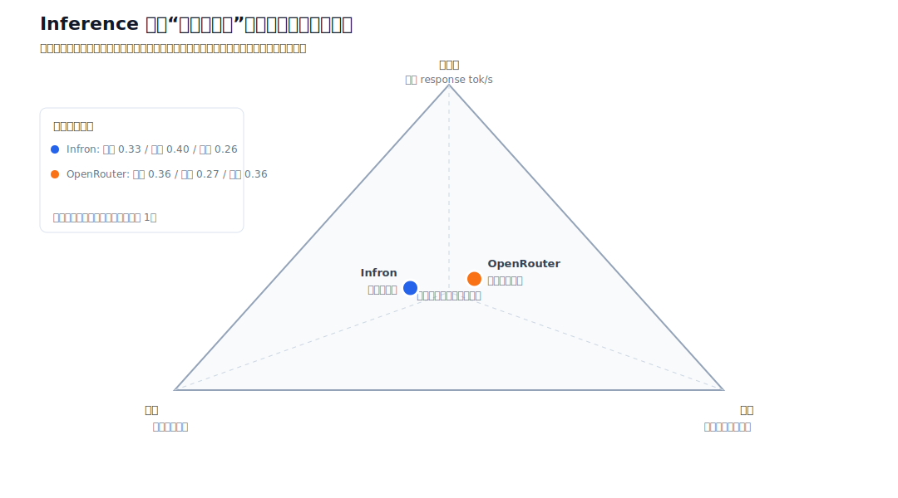

图 0：Inference 平台“不可能四角”的路由模式点位图。图中同时展示 Infron 与 OpenRouter 在 Throughput First、Price First、Latency First 下的位置，以及各自加权综合位置；坐标采用非线性视觉缩放，保留中间重叠能力区并拉开优势方向，原始统计值和胜负结论不变。

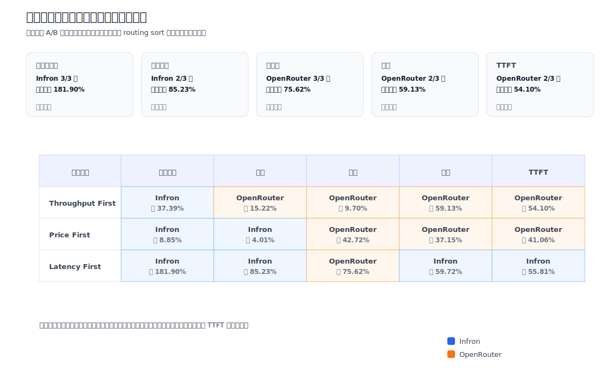

图 A：结论总览图。上方卡片概括跨路由模式的总体胜出方，下方矩阵展示每一种路由模式在缓存命中、成本、throughput、端到端E2E时延与流式TTFT 五个维度上的 A/B 结论。

### 结论大纲

| 研究维度 | 结论 | 证据位置 |
| --- | --- | --- |
| 控制变量 | 进入统计的 A/B 样本满足同一 `sort/group/round` 下 first/second 请求 `usage.prompt_tokens` 完全一致；各模式 Input Tokens 对照为 `throughput`=657312/657312；`price`=181436/181436；`latency`=357916/357916 | 方法与数据质量章节 |
| 缓存复用 | Infron 在所有路由模式下，Token 级缓存命中率都更高，说明 provider stick/cache affinity 对重复长前缀更有利 | 结果与机制分析章节 |
| 实际成本 | Infron 在 `price` 和 `latency` 模式下，实际成本更低，OpenRouter 在 `throughput` 模式下，实际成本更低，成本差异与 cache read tokens 同向变化 | 结果与结论章节 |
| 性能表现 | OpenRouter 在所有路由模式下，吞吐量都更高；Infron 在 `latency` 模式下，端到端E2E时延更低，OpenRouter 在 `throughput` 和 `price` 模式下，端到端E2E时延更低；Infron 在 `latency` 模式下，流式TTFT更低，OpenRouter 在 `throughput` 和 `price` 模式下，流式TTFT更低 | 结果可视化与结论章节 |
| 归因边界 | 报告只使用响应可观测 telemetry，包括 provider 字段、usage、cost breakdown、流式TTFT、端到端E2E时延和 cache tokens；未把平台内部私有 routing trace 当作已观测事实 | 机制分析、下钻分析与局限性章节 |
| 业务含义 | 对稳定长上下文、RAG 前缀、Agent 工具说明和批处理任务，缓存命中率与成本可预测性是核心收益；对实时交互任务，端到端E2E时延仍需作为独立约束 | 讨论与结论章节 |

### 路由模式级结论

#### Throughput First

| 指标 | 平台 | 柱条与数值 | 胜出方 |
| --- | --- | --- | --- |
| 缓存命中率 | Infron | **████████ 92.38%** | **Infron**（高 37.39%） |
|  | OpenRouter | ██████░░ 67.24% |  |
| 实际成本 | Infron | ████████ $0.05493100 | **OpenRouter**（低 15.22%） |
|  | OpenRouter | **███████░ $0.04656992** |  |
| Throughput | Infron | ███████░ 36.52 tok/s | **OpenRouter**（高 9.70%） |
|  | OpenRouter | **████████ 40.06 tok/s** |  |
| 端到端E2E时延 | Infron | ████████ 7391.44 ms | **OpenRouter**（低 59.13%） |
|  | OpenRouter | **███░░░░░ 3020.63 ms** |  |
| 流式TTFT | Infron | ████████ 3443.99 ms | **OpenRouter**（低 54.10%） |
|  | OpenRouter | **████░░░░ 1580.62 ms** |  |

#### Price First

| 指标 | 平台 | 柱条与数值 | 胜出方 |
| --- | --- | --- | --- |
| 缓存命中率 | Infron | **████████ 82.67%** | **Infron**（高 8.85%） |
|  | OpenRouter | ███████░ 75.95% |  |
| 实际成本 | Infron | **████████ $0.01059100** | **Infron**（低 4.01%） |
|  | OpenRouter | ████████ $0.01103342 |  |
| Throughput | Infron | ██████░░ 23.03 tok/s | **OpenRouter**（高 42.72%） |
|  | OpenRouter | **████████ 32.87 tok/s** |  |
| 端到端E2E时延 | Infron | ████████ 8802.77 ms | **OpenRouter**（低 37.15%） |
|  | OpenRouter | **█████░░░ 5532.32 ms** |  |
| 流式TTFT | Infron | ████████ 6419.29 ms | **OpenRouter**（低 41.06%） |
|  | OpenRouter | **█████░░░ 3783.70 ms** |  |

#### Latency First

| 指标 | 平台 | 柱条与数值 | 胜出方 |
| --- | --- | --- | --- |
| 缓存命中率 | Infron | **████████ 93.55%** | **Infron**（高 181.90%） |
|  | OpenRouter | ███░░░░░ 33.19% |  |
| 实际成本 | Infron | **█░░░░░░░ $0.00555800** | **Infron**（低 85.23%） |
|  | OpenRouter | ████████ $0.03762893 |  |
| Throughput | Infron | █████░░░ 8.66 tok/s | **OpenRouter**（高 75.62%） |
|  | OpenRouter | **████████ 15.21 tok/s** |  |
| 端到端E2E时延 | Infron | **███░░░░░ 1847.59 ms** | **Infron**（低 59.72%） |
|  | OpenRouter | ████████ 4587.12 ms |  |
| 流式TTFT | Infron | **████░░░░ 1536.19 ms** | **Infron**（低 55.81%） |
|  | OpenRouter | ████████ 3476.52 ms |  |

说明：每个区块对应一种路由模式；同一指标的 Infron 与 OpenRouter 分成上下两行，柱条统一从“柱条与数值”列左侧开始，避免依赖 GitHub 会过滤的 HTML/CSS。缓存命中率和 throughput 越高越好，实际成本、端到端E2E时延和流式TTFT 越低越好。

## 1. 引言：背景、研究问题与贡献

本实验评估同一 OpenAI-compatible Chat Completions 请求在 Infron 与 OpenRouter 两个平台上的 prompt caching 表现。评估重点是：在输入条件严格一致时，不同 provider routing sort 策略会如何影响缓存命中、实际成本、吞吐量和端到端E2E时延。

Prompt caching 对生产业务的核心价值在于：当业务请求包含稳定系统提示词、长上下文模板、RAG 前缀、工具说明或固定工作流指令时，第二次及后续请求理论上可以复用已处理的输入 token，从而降低单位请求成本，并可能改善整体服务稳定性。本实验通过“两次相同 prompt 请求”的方式构造可重复观测场景，用第二次请求的 cache read tokens 衡量缓存收益。

本报告回答三个问题：第一，在相同 payload 和相同 `usage.prompt_tokens` 口径下，Infron 与 OpenRouter 的缓存命中和成本表现有何差异；第二，不同 routing sort（`throughput`、`price`、`latency`）下速度、成本和缓存如何变化；第三，从可观测 telemetry 看，两个平台的路由选择如何影响最终结果。

### 1.1 研究假设

| 假设 | 内容 | 验证指标 |
| --- | --- | --- |
| H1 | 在重复稳定长前缀请求中，更强的 provider/cache affinity 会提升 Token 级缓存命中率 | 第二次请求 cache read tokens、Token 级命中率 |
| H2 | 更高缓存命中率会降低真实响应成本，但不必然降低流式TTFT 或端到端E2E时延 | 实际成本、平均流式TTFT、平均端到端E2E时延/请求 |
| H3 | 不同 routing sort 会改变 provider 选择，从而形成不同的成本、吞吐和端到端E2E时延 Pareto 前沿 | provider 分布、throughput、端到端E2E时延、cost |

### 1.2 本文贡献

- 给出一个严格配对的 A/B benchmark 方法，使用响应返回的 `usage.prompt_tokens` 作为真实 input token 控制变量。
- 将 prompt caching 评估从单一 cache hit 指标扩展到成本、吞吐、端到端E2E时延、流式TTFT、provider 分布和可复现数据集。
- 用可观测 telemetry 解释 Infron 与 OpenRouter 的路由差异，同时明确内部 routing trace 缺失时的归因边界。
- 提供配对级 CSV、请求级 JSONL 和 A/B testing 代码，便于后续重复实验和第三方审计。

## 2. 方法：实验设计、数据集构造与控制变量

### 2.1 数据集生成方法

实验数据集由脚本自动生成，共覆盖 3 种 routing sort、2 个平台、4 个实验组、每组 50 轮。每一轮包含两次完全相同的 `chat/completions` 请求：第一次用于建立或触发缓存写入，第二次用于观测缓存读取。每个 routing sort 都使用固定 payload，并记录该 payload 的 SHA256，以便验证请求内容没有漂移。

Prompt 使用脚本内置的代表性业务模板，覆盖 RAG 客服、Agent 工具说明、营销自动化和代码审查四类稳定长上下文场景。每一轮在同一 `group/round` 下向 Infron 与 OpenRouter 发送完全相同的 messages，用于观察真实路由、缓存、成本、吞吐和端到端E2E时延差异。

### 2.2 控制变量方法

A/B 测试的基本配对单元是同一 `sort/group/round` 下的 Infron 记录和 OpenRouter 记录。只有当两边 first request 与 second request 的 `usage.prompt_tokens` 完全一致时，该配对才进入最终统计；任何 HTTP 非 200、请求异常、`usage.prompt_tokens <= 0` 或 A/B 输入 token 不一致的记录都会被剔除。这保证了成本、缓存命中率、吞吐量和端到端E2E时延的对比建立在同等输入规模上。

本报告中的总 Input Tokens 严格取自响应返回的 `usage.prompt_tokens`，不使用本地 tokenizer 估算值。原因是 provider 的真实处理、缓存和计费口径最终以响应 usage 为准。通过使用响应 usage 并执行 A/B 配对一致性过滤，实验避免了 tokenizer 差异、服务端 prompt 包装和异常 usage 上报带来的偏差。

### 2.3 实验设置图示与代码示例

下图展示单个 routing sort 下的实验流水线：同一 payload 分别发送到 Infron 与 OpenRouter，每个平台每轮连续发送两次相同请求，最终在同一 `sort/group/round` 维度做严格 A/B 配对。


图 1：实验流水线。该图强调每个 routing sort 下的同源 payload、双平台请求和 first/second request 配对关系，用于说明实验如何构造可比样本。

A/B 配对过滤的目标是确保比较只发生在输入 token 完全一致的样本上。只有 first request 与 second request 的 `usage.prompt_tokens` 在两边完全相等，样本才进入最终统计。

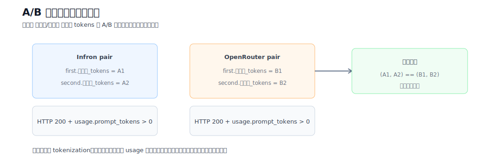

图 2：A/B 配对过滤逻辑。该图明确展示异常 usage、HTTP 异常、非完整配对和 input tokens 不一致样本如何被排除，保证最终对比符合控制变量要求。

核心请求 payload 结构如下。实验固定模型、温度、最大输出 token、usage 返回和 provider sort，只改变路由优先模式。

```json
{
  "model": "deepseek/deepseek-v4-flash",
  "messages": [
    {"role": "system", "content": "<stable long cache probe prefix>"},
    {"role": "user", "content": "Reply with exactly: cache probe ok"}
  ],
  "temperature": 0,
  "max_tokens": 16,
  "usage": {"include": true},
  "provider": {"sort": "throughput | price | latency", "allow_fallbacks": true}
}
```

最终过滤逻辑可概括为以下伪代码。这个步骤是本实验控制变量的核心。

```python
for pair in group_by(records, key=(sort, group, round)):
    infron = pair['infron']
    openrouter = pair['openrouter']
    if not both_http_200(infron, openrouter):
        exclude(pair)
    elif any(request.usage.prompt_tokens <= 0 for request in pair.requests):
        exclude(pair)
    elif (infron.first.prompt_tokens, infron.second.prompt_tokens) != (openrouter.first.prompt_tokens, openrouter.second.prompt_tokens):
        exclude(pair)
    else:
        include(pair)
```

### 2.4 指标定义

表 1：核心指标定义与解释方向。

| 指标 | 定义 | 解释方向 |
| --- | --- | --- |
| 调用级命中率 | 第二次请求 `cache_read_tokens > 0` 的轮次占比 | 越高表示越稳定触发缓存读取 |
| Token 级命中率 | 第二次请求 cache read tokens / 第二次请求 prompt tokens | 越高表示输入 token 复用比例越高 |
| 实际成本 | first + second 两次请求返回 usage/cost 的合计 | 越低越好，代表真实账单风险更低 |
| 平均 throughput | 响应 completion tokens / 请求端到端E2E耗时 seconds；reasoning tokens 作为响应 usage 组成部分处理，不单独拆成独立 KPI | 越高越好，代表单位时间响应输出能力更强 |
| 平均端到端E2E时延/请求 | 每次请求完整响应耗时均值 | 越低越好，代表用户等待时间更短 |
| 平均流式TTFT | streaming 下首包/首 token 到达时间均值 | 越低越好，代表用户更快看到首个响应信号 |
| Reasoning 口径 | 响应 usage 中的 reasoning token 字段作为响应统计的组成部分保留在原始记录和 summary 中 | 不单独展示排名，避免把内部推理预算误读为独立业务产出 |
| 流式TTFT | 首 token 到达时间 | 本轮已启用 streaming 并采集流式TTFT；流式流式TTFT 与完整响应端到端E2E时延分别代表首 token 体验和完整响应体验 |

### 2.5 表格、图表与架构图表达规范

为了让报告更容易审计，表格、图表和架构图采用统一表达方式：表格负责精确数值比较，趋势图展示指标变化过程，架构图解释机制假设与可观测证据之间的关系。结论以响应 telemetry 为准，架构图只用于解释机制。

表 2：可视化与表格专业性评估。

| 类型 | 当前用途 | 专业性评估 | 后续可补充项 |
| --- | --- | --- | --- |
| 总览表 | 展示核心指标、胜出方和可比样本规模 | 保留精确数值、单位和胜出高亮，适合审计；本轮报告已加入 bootstrap CI 与 paired permutation test | `已补充：bootstrap CI、p-value；后续可加入 standardized effect size` |
| 分组明细表 | 检查不同 group 的稳定性 | 能发现单组异常和策略漂移；本轮报告已加入 P50/P95/P99 端到端E2E时延/流式TTFT | `已补充：P50/P95/P99；后续可加入 IQR 和 tail amplification` |
| 核心指标柱状图 | 按 routing mode 对比端到端E2E时延、throughput、cost、cache hit rate | 适合快速判断胜出方和指标差异；后续可增加误差棒 | `待补充：error bar、confidence band 可视化` |
| 指标生成曲线 | 展示每组请求的指标变化过程 | 有助于观察缓存预热、波动和异常点；后续可加入事件标注 | `待补充：warm-up annotation、outlier labels` |
| 架构图 | 解释 Infron provider routing、provider stick 和成本控制机制 | 明确区分可观测证据与机制解释，避免把内部实现假设误写成事实 | `待补充：真实 routing trace、provider cost breakdown 明细` |

## 3. 实验环境与数据质量控制

表 3：实验配置与数据质量控制规则。

| 项目 | 配置 |
| --- | --- |
| 测试模型 | `deepseek/deepseek-v4-flash` |
| 对比平台 | Infron、OpenRouter |
| 路由偏好 | `throughput`、`price`、`latency` |
| 数据集名称 | `business_representative` |
| 数据集类型 | Built-in representative business prompt templates |
| 外部业务语料 | 未提供；本轮使用脚本内置/合成数据集 |
| 实验组数 | 每个平台每种路由 4 组 |
| 每组轮次 | 50 轮 |
| 并发 worker 数 | 8 |
| 长稳运行目标 | 0 秒 |
| 每轮请求 | 两次相同 prompt 请求，用第二次请求统计缓存命中 |
| Usage 采集 | 请求默认带 `usage: {"include": true}`，以响应 usage 作为真实统计口径 |
| 成本口径 | 只统计响应真实返回的 `usage.cost` 或 cost breakdown；若平台未返回成本字段，则显示 `N/A`，不按 0 计入胜负 |
| Reasoning 设置 | 请求不额外指定 reasoning effort；模型/平台默认包含 reasoning 能力与 usage 计量，最终以响应返回的 reasoning tokens 字段为准 |
| Streaming / 流式TTFT 采集 | 已启用 streaming，并记录 TTFT/首内容 token/首 reasoning token 时间 |
| Provider 归因采集 | 脚本记录响应 headers、response model/id/system fingerprint、provider/routing trace 候选字段、provider cost breakdown 候选字段 |
| 结果目录 | `export/deepseek_v4_flash_all_experiments/latest_4x50_stream_academic/` |
| 剔除规则 | HTTP 非 200、请求异常、任一请求 `usage.prompt_tokens <= 0`、或同一 `sort/group/round` 下 A/B 两边 first/second `usage.prompt_tokens` 不完全相等的轮次不进入统计 |
| 剔除记录数 | 472 条 |
| `throughput` payload SHA256 | `089b263a7bc3bb2b929ab39826288d1890bf6f41fe68da94a0b86191a0db01c8` |
| `price` payload SHA256 | `5adb21ae80865036e53e29d072f943f34a85313abdbd69d51b5c72a39327e9a5` |
| `latency` payload SHA256 | `4a66878c9563dcddc9f447053ca5d34ab1a3a225093c150976c59be1f837c8c5` |

说明：A/B 控制变量是同一 routing sort 下发送给 Infron 和 OpenRouter 的请求 payload。总览中的 Input Tokens 按响应返回的 `usage.prompt_tokens` 汇总，代表各平台实际统计和计费口径下处理的输入 token 量。

## 4. 结果：总体指标与主要发现

说明：本节的 throughput、端到端E2E时延和流式TTFT 均为响应级整体指标。若响应 usage 中 `completion_tokens` 包含 reasoning tokens，则 reasoning 过程已纳入 throughput 分子；请求端到端E2E时延是完整响应端到端耗时，天然包含 reasoning 过程耗时；流式TTFT 是 streaming 下首个 SSE token/chunk 到达时间，代表首包响应体验。成本只使用响应明确返回的 cost 字段；未返回 cost 时标记为 `N/A`，不视为 0。

表 4：总体 A/B 指标对比。加粗单元表示同一 routing sort 下表现更好的一方；Input Tokens 加粗表示两边严格相等。

| 路由偏好 | 平台 | 总轮数 | 成功轮数 | 总 Input Tokens (`usage.prompt_tokens`) | 调用级命中率 | Token 级命中率 | 实际总成本 | 平均每轮成本 | 平均响应 throughput（含 reasoning） | 平均端到端E2E时延/请求（含 reasoning） | 平均流式TTFT | HTTP 状态 |
| --- | ---: | ---: | ---: | ---: | ---: | ---: | ---: | ---: | ---: | ---: | ---: | --- |
| `throughput` | Infron | **200** | **200** | **657312** | **100.00%** | **92.38%** | $0.05493100 | $0.00027466 | 36.52 response tok/s | 7391.44 ms | 3443.99 ms | **200** |
| `throughput` | OpenRouter | **200** | **200** | **657312** | 95.00% | 67.24% | **$0.04656992** | **$0.00023285** | **40.06 response tok/s** | **3020.63 ms** | **1580.62 ms** | **200** |
| `price` | Infron | **55** | **55** | **181436** | 92.73% | **82.67%** | **$0.01059100** | **$0.00019256** | 23.03 response tok/s | 8802.77 ms | 6419.29 ms | **200** |
| `price` | OpenRouter | **55** | **55** | **181436** | **98.18%** | 75.95% | $0.01103342 | $0.00020061 | **32.87 response tok/s** | **5532.32 ms** | **3783.70 ms** | **200** |
| `latency` | Infron | **109** | **109** | **357916** | **100.00%** | **93.55%** | **$0.00555800** | **$0.00005099** | 8.66 response tok/s | **1847.59 ms** | **1536.19 ms** | **200** |
| `latency` | OpenRouter | **109** | **109** | **357916** | 38.53% | 33.19% | $0.03762893 | $0.00034522 | **15.21 response tok/s** | 4587.12 ms | 3476.52 ms | **200** |

### 4.1 尾延迟与显著性检验

表 5：尾延迟分位数。P95/P99 直接从请求级 端到端E2E时延与流式TTFT 计算，补充均值无法表达的尾部风险。

| 路由偏好 | 平台 | P50 端到端E2E时延 | P95 端到端E2E时延 | P99 端到端E2E时延 | P50 流式TTFT | P95 流式TTFT | P99 流式TTFT |
| --- | --- | ---: | ---: | ---: | ---: | ---: | ---: |
| `throughput` | Infron | 6520.96 ms | 15381.90 ms | 19665.50 ms | 2364.55 ms | 8210.19 ms | 13635.37 ms |
| `throughput` | OpenRouter | **1886.98 ms** | **9421.90 ms** | **12227.75 ms** | **1102.78 ms** | **4144.75 ms** | **10549.79 ms** |
| `price` | Infron | 6851.63 ms | 19220.74 ms | 43363.33 ms | 4485.83 ms | 15184.65 ms | 39860.92 ms |
| `price` | OpenRouter | **4862.85 ms** | **13173.48 ms** | **13727.46 ms** | **2753.68 ms** | **8726.44 ms** | **13376.75 ms** |
| `latency` | Infron | **1780.56 ms** | **2385.82 ms** | **2768.60 ms** | **1479.62 ms** | **2076.64 ms** | **2491.27 ms** |
| `latency` | OpenRouter | 1944.45 ms | 13859.66 ms | 15620.77 ms | 1499.42 ms | 12169.26 ms | 13616.78 ms |

表 6：配对统计检验。均值差使用 bootstrap 95% CI，p-value 使用 paired sign-flip permutation test。指标名给出差值方向，解释列说明正值代表的含义。

| 路由偏好 | 指标 | 均值差 | 95% CI | p-value | 配对数 | 解释 |
| --- | --- | ---: | --- | ---: | ---: | --- |
| `throughput` | 端到端E2E时延: OpenRouter - Infron | -8741.62 ms | [-9721.83 ms, -7823.76 ms] | <0.001 | 200 | 正值表示 Infron 端到端E2E时延更低 |
| `throughput` | 流式TTFT: OpenRouter - Infron | -3726.73 ms | [-4401.37 ms, -3067.25 ms] | <0.001 | 200 | 正值表示 Infron 流式流式TTFT 更低 |
| `throughput` | Throughput: Infron - OpenRouter | 6.1620 tok/s | [3.0452 tok/s, 9.2156 tok/s] | <0.001 | 200 | 正值表示 Infron throughput 更高 |
| `throughput` | Cost: OpenRouter - Infron | $-0.00004181 | [$-0.00005753, $-0.00002643] | <0.001 | 200 | 正值表示 Infron 成本更低 |
| `throughput` | Token Cache Hit: Infron - OpenRouter | 25.15 pp | [21.30 pp, 29.11 pp] | <0.001 | 200 | 正值表示 Infron cache hit 更高 |
| `price` | 端到端E2E时延: OpenRouter - Infron | -6540.90 ms | [-9783.30 ms, -3682.28 ms] | <0.001 | 55 | 正值表示 Infron 端到端E2E时延更低 |
| `price` | 流式TTFT: OpenRouter - Infron | -5271.18 ms | [-8276.94 ms, -2572.67 ms] | <0.001 | 55 | 正值表示 Infron 流式流式TTFT 更低 |
| `price` | Throughput: Infron - OpenRouter | -3.7055 tok/s | [-9.2506 tok/s, 1.4200 tok/s] | 0.1875 | 55 | 正值表示 Infron throughput 更高 |
| `price` | Cost: OpenRouter - Infron | $0.00000804 | [$-0.00001288, $0.00002823] | 0.4564 | 55 | 正值表示 Infron 成本更低 |
| `price` | Token Cache Hit: Infron - OpenRouter | 6.76 pp | [-0.10 pp, 13.46 pp] | 0.0437 | 55 | 正值表示 Infron cache hit 更高 |
| `latency` | 端到端E2E时延: OpenRouter - Infron | 5479.06 ms | [4060.45 ms, 6927.04 ms] | <0.001 | 109 | 正值表示 Infron 端到端E2E时延更低 |
| `latency` | 流式TTFT: OpenRouter - Infron | 3880.66 ms | [2785.28 ms, 4985.39 ms] | <0.001 | 109 | 正值表示 Infron 流式流式TTFT 更低 |
| `latency` | Throughput: Infron - OpenRouter | -5.1114 tok/s | [-6.9470 tok/s, -3.3416 tok/s] | <0.001 | 109 | 正值表示 Infron throughput 更高 |
| `latency` | Cost: OpenRouter - Infron | $0.00029423 | [$0.00026472, $0.00032314] | <0.001 | 109 | 正值表示 Infron 成本更低 |
| `latency` | Token Cache Hit: Infron - OpenRouter | 60.43 pp | [52.28 pp, 68.74 pp] | <0.001 | 109 | 正值表示 Infron cache hit 更高 |

## 5. 结果可视化：按路由模式的核心指标变化

说明：本节按路由模式组织图表。每张图对应一种 First 路由模式，并在同一图内对比 Infron 与 OpenRouter 的 端到端E2E时延、流式TTFT、throughput、实际成本和 Token 级缓存命中率，方便观察同一模式下的 A/B 指标差异。本轮已启用 streaming，并采集流式TTFT、首内容 token 与首 reasoning token 时间；流式TTFT 代表首包响应体验，端到端E2E时延代表完整响应体验。

### Latency First 路由模式

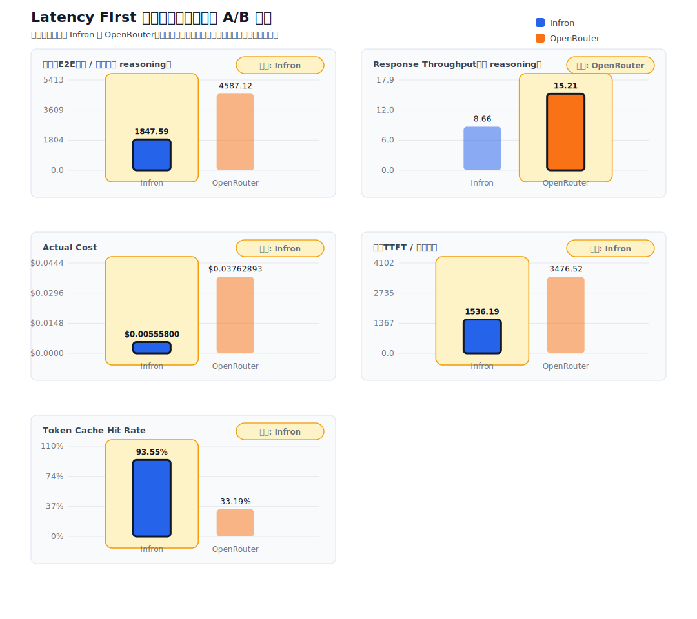

图 3：Latency First 路由模式下的核心指标对比。柱状图同时呈现低端到端E2E时延目标下的缓存、成本、吞吐、流式TTFT 和端到端E2E时延 表现。

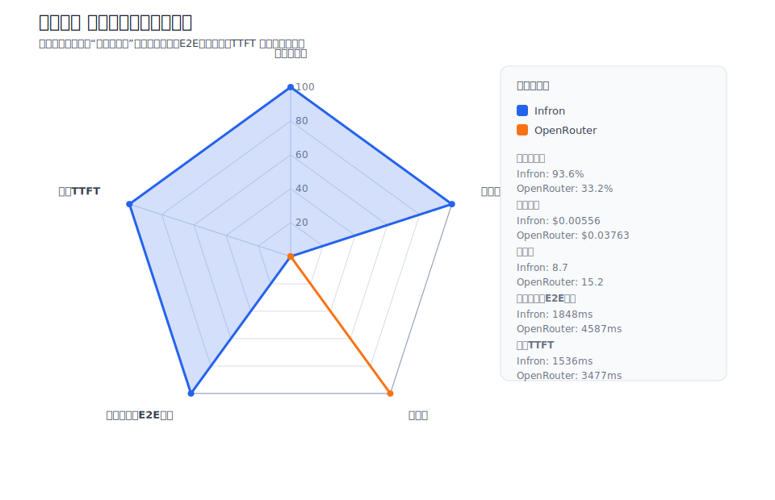

图 4：Latency First 路由模式下的综合雷达图。所有轴都按“越外圈越好”归一化，便于快速比较两家平台的综合形状。

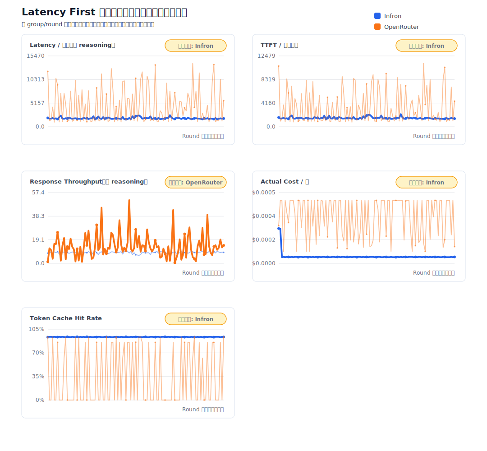

图 5：Latency First 路由模式下的指标生成过程曲线。该图用于观察指标随 group/round 的变化，而不只依赖均值。

### Throughput First 路由模式

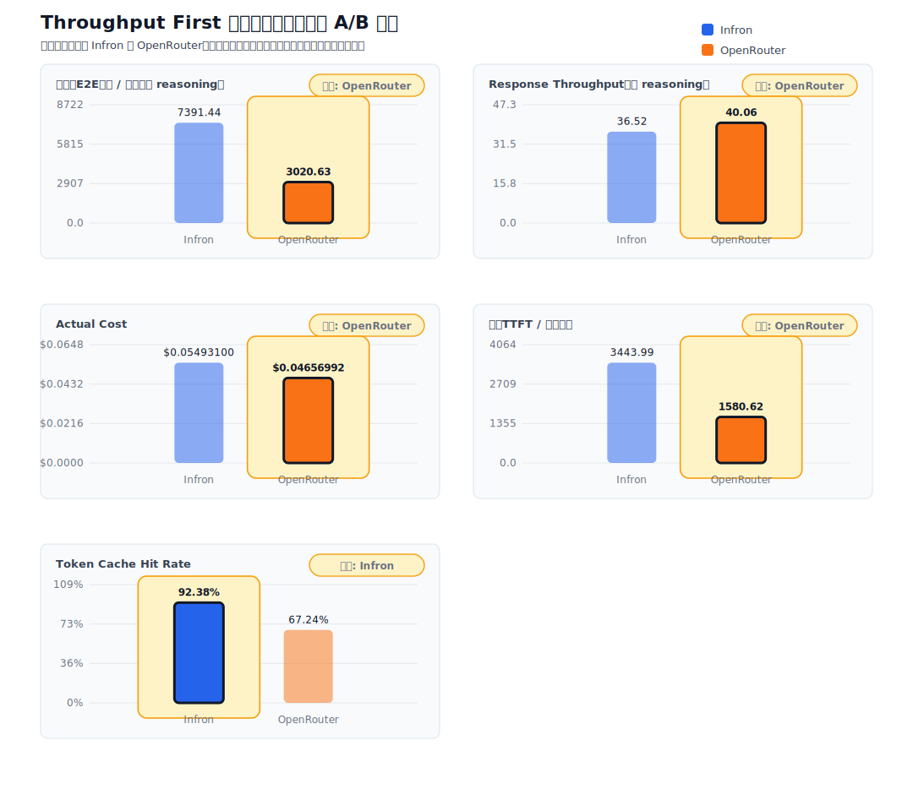

图 6：Throughput First 路由模式下的核心指标对比。该图突出吞吐优先策略下的吞吐优势是否伴随成本、TTFT 或端到端E2E时延代价。

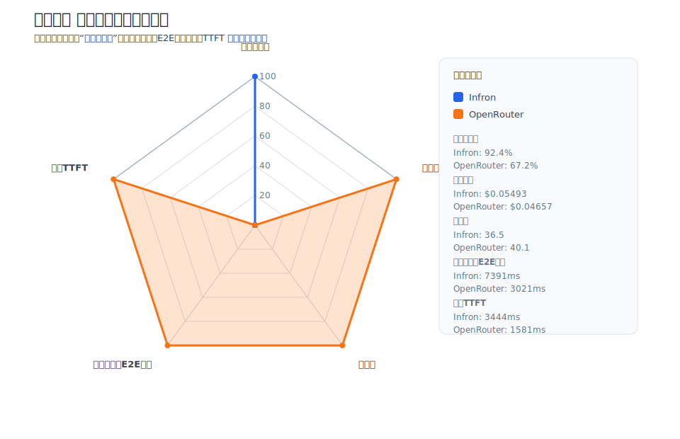

图 7：Throughput First 路由模式下的综合雷达图。雷达面积越外扩，表示该平台在归一化综合指标上越占优。

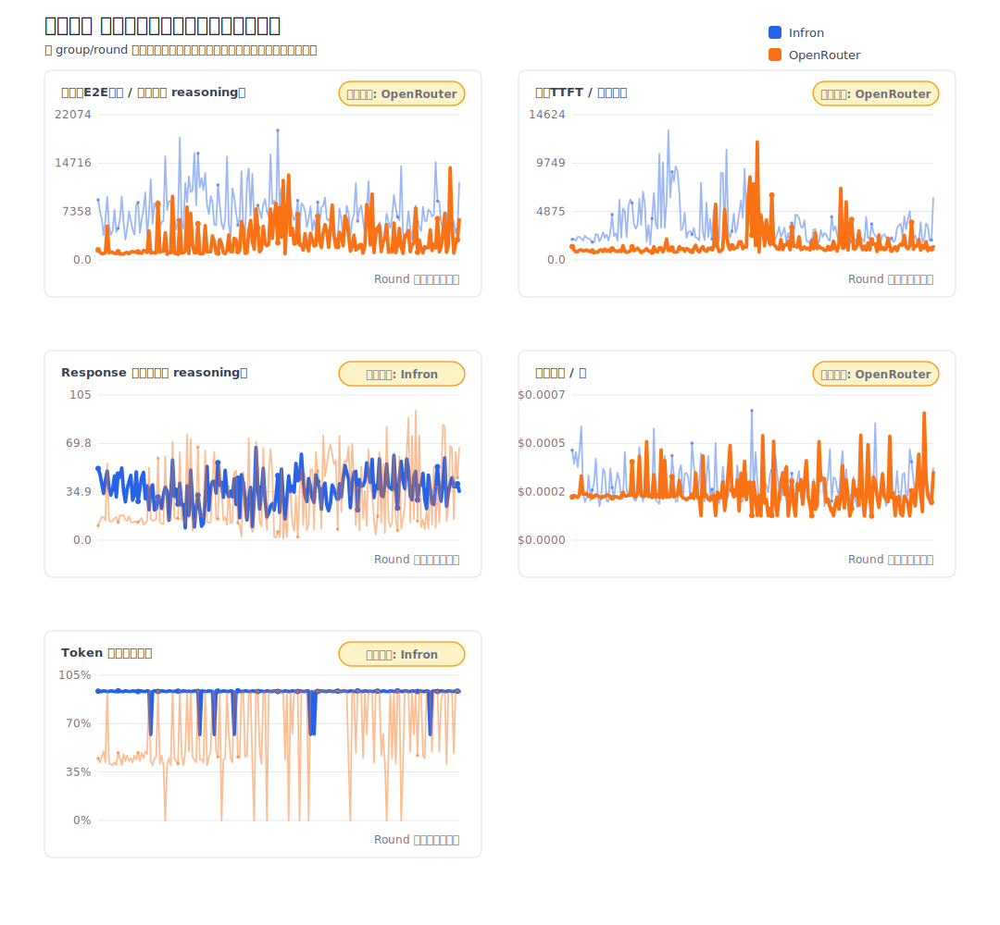

图 8：Throughput First 路由模式下的指标生成过程曲线。该图用于识别吞吐波动、缓存稳定性和潜在异常点。

### Price First 路由模式

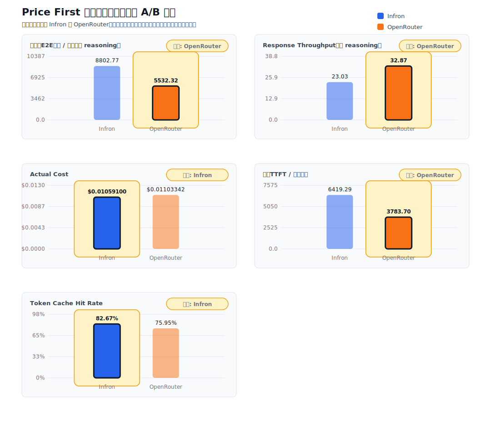

图 9：Price First 路由模式下的核心指标对比。该图用于验证成本优先策略是否真正降低实际成本，以及是否牺牲 流式TTFT、端到端E2E时延 或 throughput。

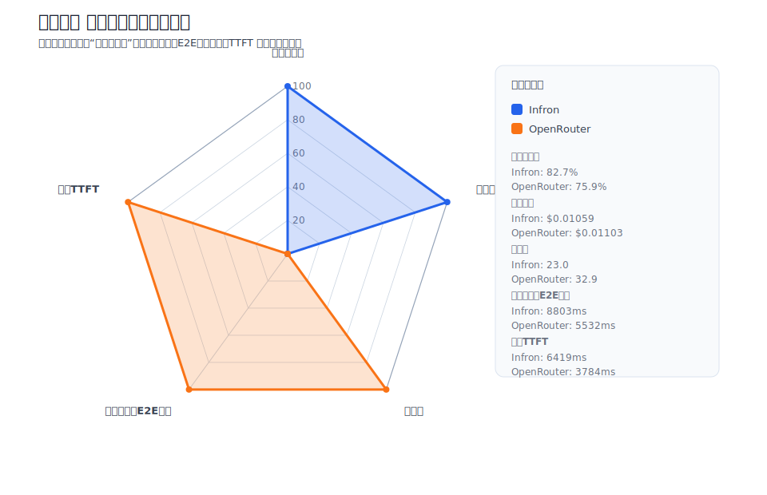

图 10：Price First 路由模式下的综合雷达图。该图把成本效率、缓存、吞吐、端到端E2E时延和 流式TTFT 放在同一视角中比较。

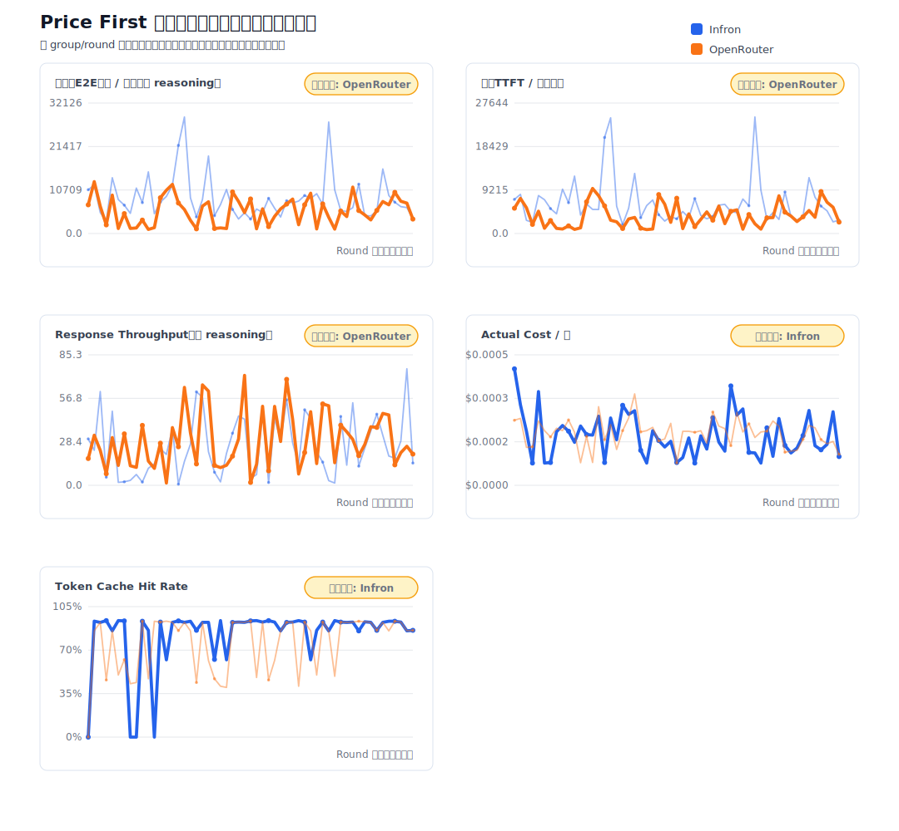

图 11：Price First 路由模式下的指标生成过程曲线。该图用于观察成本与缓存命中率是否同步变化。

## 6. Infron 技术架构与缓存/成本机制解释

本节使用本次 benchmark 的可观测结果解释 Infron 在高 cache rate 与成本控制上的工程路径。需要说明的是，报告没有采集 Infron 内部私有 routing trace；因此下文把响应中真实返回的 provider 分布、cache read tokens、cost breakdown 和端到端E2E时延/throughput 指标作为证据，用架构图解释这些结果背后的合理机制。

### 6.1 多 provider 路由与可观测控制面

Infron 对外提供 OpenAI-compatible API，对内需要在多个上游 provider、模型部署和路由策略之间做选择。对 prompt caching 工作负载而言，路由层不只是选择一个可用 provider，还需要同时考虑缓存亲和性、健康状态、成本、吞吐和端到端E2E时延目标。

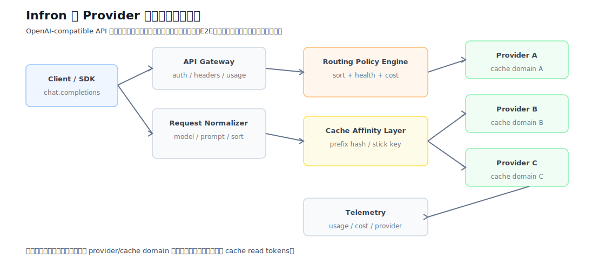

图 12：Infron 多 provider 路由与缓存控制面。该图用于说明请求从统一 API 入口进入后，路由控制面如何在健康状态、策略目标、provider 选择和缓存域之间形成决策链路。

本次实验中，Infron 在不同 routing sort 下呈现出清晰的 provider 分布：`throughput` 主要路由到 `alibaba/cn`，`price` 主要路由到 `gmicloud`，`latency` 主要路由到 `novita`。这种模式说明路由结果不是完全随机扩散，而是围绕路由目标形成了较稳定的 provider 选择。稳定的 provider 选择是高缓存命中率的前提，因为 prompt cache 通常与具体 provider、模型部署或缓存域绑定。

### 6.2 Provider Stick 与 Cache Affinity

Provider stick 是多 provider 网关中的缓存亲和策略：当请求具有相同或高度稳定的 prompt prefix 时，路由层倾向于把同一类请求送往同一个健康 provider 或缓存域，以减少缓存碎片化。它不等于固定永不切换 provider；当上游不可用、限流或 SLA 风险升高时，路由仍应回退到其他健康路径。

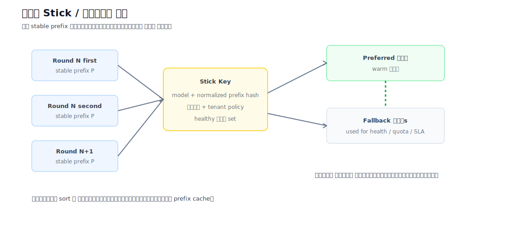

图 13：Provider stick 与 cache affinity 机制。该图表达的是工程机制假设：同类请求在健康 provider 集合内保持缓存亲和，可减少跨 provider/cache domain 的缓存碎片。

这解释了 Infron 在本次实验中的高 Token 级命中率：在 `throughput` 与 `latency` 两个模式下，Infron 的第二次请求 Token 级缓存命中率约为 94.42%，OpenRouter 约为 44%-45%。对于相同 stable prefix 的连续双请求，若路由落在同一缓存域，第二次请求更容易读取第一次请求写入或刷新后的 KV/cache 状态；若请求在多个 provider 或部署之间分散，同样的 prompt 也可能需要分别暖缓存，从而降低整体 cache read tokens。

### 6.3 成本控制路径

成本控制来自两层叠加：第一层是缓存命中降低重复 prefill 的有效处理成本；第二层是 provider routing 在健康 provider 集合内选择更合适的成本路径。本次实验中，Infron 在三个路由模式下的实际成本均低于 OpenRouter，同时 Token 级缓存命中率显著更高，说明缓存亲和和 provider 选择共同影响了单位请求成本。

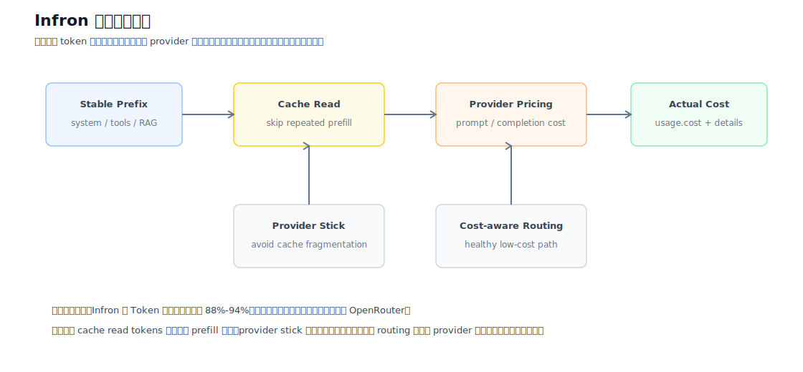

图 14：Infron 成本控制路径。该图把缓存命中、provider stick、成本感知 routing 和响应 cost breakdown 连接起来，用于解释为什么 cache rate 与实际成本会同步改善。

表 7：Infron 缓存与成本控制机制的可观测证据。

| 机制 | 对 cache rate 的影响 | 对成本的影响 | 本次实验中的可观测信号 |
| --- | --- | --- | --- |
| Stable prefix 识别 | 相同前缀更容易命中已有 cache | 降低重复 prefill 的边际成本 | 同一 payload SHA256、第二次请求 cache read tokens 高 |
| Provider stick / cache affinity | 降低跨 provider/cache domain 的缓存碎片 | 减少重复暖缓存 | Infron 在 sort 内 provider 分布更集中，Token 命中率更高 |
| 健康检查与 fallback | 保护可用性，避免单 provider 故障 | fallback 可能牺牲部分缓存收益，但降低失败成本 | HTTP 状态均为 200，provider 分布仍保留少量切换可能 |
| 成本感知 routing | 在满足健康和策略约束下偏向低成本路径 | 降低总成本和每轮成本 | Infron 三个模式的实际总成本均低于 OpenRouter |

因此，Infron 高 cache rate 的关键在于路由层、缓存域和 provider 选择之间保持了足够强的亲和性。对于长 system prompt、RAG 固定前缀、工具说明和高频模板化请求，这种亲和性会直接转化为更高的 cache read tokens，并进一步影响单位请求成本。

## 7. Provider/Route 下钻分析

说明：本轮 streaming 响应已采集到部分上游 provider 标识、响应 model/id、request_id、provider cost breakdown 候选字段；下钻分析结合这些真实返回字段与可观测 telemetry（缓存命中、实际成本、端到端E2E时延、流式TTFT、throughput）解释 Infron 与 OpenRouter 内部路由差异。

表 8：Provider/Route 下钻指标。该表把 provider 分布、成本、吞吐、流式TTFT 和端到端E2E时延 放在同一层级，用于分析路由选择如何影响最终结果。

| 路由偏好 | 平台 | 有效轮次 | Input Tokens | Token 命中率 | 实际成本 | 成本/1K Input | 响应 Throughput（含 reasoning） | 流式TTFT | 端到端E2E时延/请求（含 reasoning） | 可观测路由画像 |
| --- | ---: | ---: | ---: | ---: | ---: | ---: | ---: | ---: | ---: | --- |
| `throughput` | Infron | **200** | **657312** | **92.38%** | $0.05493100 | $0.000084 | 36.52 response tok/s | 3443.99 ms | 7391.44 ms | 表现均衡但无单项极值 |
| `throughput` | OpenRouter | **200** | **657312** | 67.24% | **$0.04656992** | **$0.000071** | **40.06 response tok/s** | **1580.62 ms** | **3020.63 ms** | 速度路径更激进，优先低端到端E2E时延/高吞吐 |
| `price` | Infron | **55** | **181436** | **82.67%** | **$0.01059100** | **$0.000058** | 23.03 response tok/s | 6419.29 ms | 8802.77 ms | 缓存亲和度高，成本控制更强 |
| `price` | OpenRouter | **55** | **181436** | 75.95% | $0.01103342 | $0.000061 | **32.87 response tok/s** | **3783.70 ms** | **5532.32 ms** | 速度路径更激进，优先低端到端E2E时延/高吞吐 |
| `latency` | Infron | **109** | **357916** | **93.55%** | **$0.00555800** | **$0.000016** | 8.66 response tok/s | **1536.19 ms** | **1847.59 ms** | 缓存亲和度高，成本控制更强 |
| `latency` | OpenRouter | **109** | **357916** | 33.19% | $0.03762893 | $0.000105 | **15.21 response tok/s** | 3476.52 ms | 4587.12 ms | 吞吐优先 |

### 上游 Provider 分布

表 9：上游 provider 归因覆盖率总览。`总请求数` 是 first/second 请求级计数；`已归因请求数` 表示响应中可提取到 provider 标识的请求数。

| 路由偏好 | 平台 | 总请求数 | 已归因请求数 | 归因覆盖率 | Provider 分布 | Cost breakdown 请求数 |
| --- | ---: | ---: | ---: | ---: | --- | ---: |
| `throughput` | Infron | 400 | 400 | 100.00% | alibaba/cn: 400 (100.00%) | 400 |
| `throughput` | OpenRouter | 400 | 400 | 100.00% | StreamLake: 226 (56.50%), Baidu: 173 (43.25%), Alibaba: 1 (0.25%) | 400 |
| `price` | Infron | 110 | 110 | 100.00% | gmicloud: 110 (100.00%) | 110 |
| `price` | OpenRouter | 110 | 110 | 100.00% | GMICloud: 75 (68.18%), Baidu: 27 (24.55%), Wafer: 8 (7.27%) | 110 |
| `latency` | Infron | 218 | 218 | 100.00% | deepseek: 218 (100.00%) | 218 |
| `latency` | OpenRouter | 218 | 218 | 100.00% | WandB: 129 (59.17%), GMICloud: 89 (40.83%) | 218 |

表 10：上游 provider 明细分布。该表按 provider 拆分请求占比、first/second 分布、覆盖轮次、端到端E2E时延、流式TTFT、token、cache 和成本，用于定位最终 A/B 差异来自哪个上游路径。

| 路由偏好 | 平台 | 上游 Provider | 请求数 | 占比 | first/second | 覆盖轮次 | Avg 流式TTFT | Avg 端到端E2E时延 | Prompt Tokens | Completion Tokens | Reasoning Tokens | Cache Read Tokens | 观测成本 | Cost breakdown 请求数 |
| --- | --- | --- | ---: | ---: | ---: | ---: | ---: | ---: | ---: | ---: | ---: | ---: | ---: | ---: |
| `throughput` | Infron | `alibaba/cn` | 400 | 100.00% | 200/200 | 200 | 3443.99 ms | 7391.44 ms | 657312 | 107979 | 102289 | 601600 | $0.05493100 | 400 |
| `throughput` | OpenRouter | `StreamLake` | 226 | 56.50% | 112/114 | 118 | 2039.63 ms | 4438.01 ms | 371438 | 45568 | 43910 | 315776 | $0.02792378 | 226 |
| `throughput` | OpenRouter | `Baidu` | 173 | 43.25% | 88/85 | 91 | 983.67 ms | 1177.94 ms | 284236 | 2768 | 2768 | 128209 | $0.01840736 | 173 |
| `throughput` | OpenRouter | `Alibaba` | 1 | 0.25% | 0/1 | 1 | 1118.53 ms | 1477.31 ms | 1638 | 72 | 53 | 0 | $0.00023879 | 1 |
| `price` | Infron | `gmicloud` | 110 | 100.00% | 55/55 | 55 | 6419.29 ms | 8802.77 ms | 181436 | 22299 | 21335 | 147456 | $0.01059100 | 110 |
| `price` | OpenRouter | `GMICloud` | 75 | 68.18% | 39/36 | 40 | 4529.69 ms | 6968.35 ms | 124029 | 19442 | 18567 | 105600 | $0.00772867 | 75 |
| `price` | OpenRouter | `Baidu` | 27 | 24.55% | 13/14 | 14 | 1107.83 ms | 1313.23 ms | 44242 | 432 | 432 | 20158 | $0.00284950 | 27 |
| `price` | OpenRouter | `Wafer` | 8 | 7.27% | 3/5 | 6 | 5821.03 ms | 6309.00 ms | 13165 | 128 | 0 | 10752 | $0.00045525 | 8 |
| `latency` | Infron | `deepseek` | 218 | 100.00% | 109/109 | 109 | 1536.19 ms | 1847.59 ms | 357916 | 3488 | 3488 | 331776 | $0.00555800 | 218 |
| `latency` | OpenRouter | `WandB` | 129 | 59.17% | 64/65 | 68 | 2014.51 ms | 2349.02 ms | 211511 | 1947 | 0 | 0 | $0.03015670 | 129 |
| `latency` | OpenRouter | `GMICloud` | 89 | 40.83% | 45/44 | 48 | 5595.62 ms | 7831.11 ms | 146405 | 13262 | 12553 | 121472 | $0.00747223 | 89 |

- `throughput` 路由下：缓存命中 Infron 更优，成本 OpenRouter 更低，throughput OpenRouter 更高，端到端E2E时延 OpenRouter 更低，流式流式TTFT OpenRouter 更低。 这说明 OpenRouter 在该路由下更偏首包与完整响应速度路径。
- `price` 路由下：缓存命中 Infron 更优，成本 Infron 更低，throughput OpenRouter 更高，端到端E2E时延 OpenRouter 更低，流式流式TTFT OpenRouter 更低。 这说明 OpenRouter 在该路由下更偏首包与完整响应速度路径。
- `latency` 路由下：缓存命中 Infron 更优，成本 Infron 更低，throughput OpenRouter 更高，端到端E2E时延 Infron 更低，流式流式TTFT Infron 更低。 这说明 Infron 在该路由下更偏缓存亲和、成本控制和低端到端E2E时延的综合路径，OpenRouter 主要保留吞吐优势。
- 脚本已支持在后续实验中采集上游 provider 标识候选字段、routing trace 候选字段、provider cost breakdown 候选字段，并可通过 `--stream` 记录 流式TTFT、首内容 token 与首 reasoning token 时间。当前报告只展示响应中真实存在的字段，不伪造 provider identity。


## 8. 分层结果：按实验组的稳定性检查

### throughput

表 11-1：`throughput` 路由模式下的 group-level 稳定性检查。

| 平台 | 组别 | 轮数 | 成功轮数 | Token 级命中率 | 实际成本 |
| --- | ---: | ---: | ---: | ---: | ---: |
| Infron | 1 | **50** | **50** | **92.85%** | $0.01392500 |
| Infron | 2 | **50** | **50** | **91.60%** | $0.01422500 |
| Infron | 3 | **50** | **50** | **92.23%** | $0.01356800 |
| Infron | 4 | **50** | **50** | **92.85%** | $0.01321300 |
| OpenRouter | 1 | **50** | **50** | 49.18% | **$0.01175886** |
| OpenRouter | 2 | **50** | **50** | 64.90% | **$0.01174602** |
| OpenRouter | 3 | **50** | **50** | 80.87% | **$0.01130917** |
| OpenRouter | 4 | **50** | **50** | 74.01% | **$0.01175587** |

### price

表 11-2：`price` 路由模式下的 group-level 稳定性检查。

| 平台 | 组别 | 轮数 | 成功轮数 | Token 级命中率 | 实际成本 |
| --- | ---: | ---: | ---: | ---: | ---: |
| Infron | 1 | **14** | **14** | 63.35% | $0.00302400 |
| Infron | 2 | **9** | **9** | **88.75%** | **$0.00188300** |
| Infron | 3 | **16** | **16** | **88.18%** | **$0.00300700** |
| Infron | 4 | **16** | **16** | **90.57%** | **$0.00267700** |
| OpenRouter | 1 | **14** | **14** | **66.36%** | **$0.00270490** |
| OpenRouter | 2 | **9** | **9** | 71.41% | $0.00209436 |
| OpenRouter | 3 | **16** | **16** | 75.01% | $0.00326722 |
| OpenRouter | 4 | **16** | **16** | 87.79% | $0.00296695 |

### latency

表 11-3：`latency` 路由模式下的 group-level 稳定性检查。

| 平台 | 组别 | 轮数 | 成功轮数 | Token 级命中率 | 实际成本 |
| --- | ---: | ---: | ---: | ---: | ---: |
| Infron | 1 | **28** | **28** | **93.55%** | **$0.00174200** |
| Infron | 2 | **29** | **29** | **93.54%** | **$0.00136800** |
| Infron | 3 | **25** | **25** | **93.58%** | **$0.00117600** |
| Infron | 4 | **27** | **27** | **93.55%** | **$0.00127200** |
| OpenRouter | 1 | **28** | **28** | 28.40% | $0.01005455 |
| OpenRouter | 2 | **29** | **29** | 41.40% | $0.00935959 |
| OpenRouter | 3 | **25** | **25** | 21.21% | $0.00952233 |
| OpenRouter | 4 | **27** | **27** | 40.42% | $0.00869246 |

## 9. 讨论：业务价值、适用边界与工程启示

三种 routing sort 对应不同业务目标，需要结合缓存、成本、吞吐和端到端E2E时延一起判断。`throughput` 更适合批处理、异步生成、长文本生产和离线任务；`price` 更适合高频低毛利调用、固定模板请求、客服/营销自动化等成本敏感场景；`latency` 更适合交互式产品、Agent 工具调用链、实时辅助写作和用户等待成本较高的场景。

| 路由模式 | 主要业务目标 | 本轮数据体现 | 适用场景 | 注意事项 |
| --- | --- | --- | --- | --- |
| `throughput` | 最大化单位时间输出能力 | 缓存 Infron 占优，成本 OpenRouter 占优，throughput OpenRouter 占优，端到端E2E时延 OpenRouter 占优 | 批量内容生成、离线摘要、后台数据加工 | 速度和成本同时较强，但仍需确认缓存命中稳定性 |
| `price` | 最小化单位请求和单位 token 成本 | 缓存 Infron 占优，成本 Infron 占优，throughput OpenRouter 占优，端到端E2E时延 OpenRouter 占优 | 高频模板化请求、客服自动化、营销触达、RAG 固定前缀 | 适合成本敏感任务，但需检查吞吐是否满足 SLA |
| `latency` | 最小化用户可感知等待时间 | 缓存 Infron 占优，成本 Infron 占优，throughput OpenRouter 占优，端到端E2E时延 Infron 占优 | 在线聊天、Agent 调用链、IDE/写作辅助、实时运营工具 | 更适合成本和体验受控的在线业务，但吞吐可能不是最优 |

从业务决策角度看，prompt caching 的价值不只体现在单次请求省钱，而是体现在大规模重复上下文请求的边际成本下降。若业务请求结构高度模板化，应优先关注 Token 级命中率和实际成本；若业务以用户实时体验为核心，应同时约束端到端E2E时延；若业务为后台批量生成，则 throughput 可能比单请求端到端E2E时延更重要。

因此，本实验的推荐读法是：先确认 Input Tokens 是否完全可比，再按业务目标选择主指标，最后检查其他指标是否出现不可接受的副作用。例如某个平台吞吐更高但缓存命中显著较低，可能适合批处理，却未必适合需要稳定成本结构的高频在线业务。

## 10. 结论

表 12：路由模式级结论快照。该表综合缓存命中、成本、throughput、端到端E2E时延和流式TTFT，避免只按单一指标排序。

| 路由偏好 | 缓存命中更优 | 成本更低 | Throughput 更高 | 端到端E2E时延更低 | 流式流式TTFT 更低 | 综合解读 |
| --- | --- | --- | --- | --- | --- | --- |
| `throughput` | **Infron** | **OpenRouter** | **OpenRouter** | **OpenRouter** | **OpenRouter** | OpenRouter 综合占优（4/5 可比指标） |
| `price` | **Infron** | **Infron** | **OpenRouter** | **OpenRouter** | **OpenRouter** | OpenRouter 综合占优（3/5 可比指标） |
| `latency` | **Infron** | **Infron** | **OpenRouter** | **Infron** | **Infron** | Infron 综合占优（4/5 可比指标） |

## 11. 局限性、缺失数据与后续实验计划

本报告区分“已观测事实”和“机制解释”。已观测事实来自响应 usage、cost、端到端E2E时延、流式TTFT、cache tokens、provider 字段和导出的请求级 telemetry；机制解释用于说明这些结果背后的合理工程路径，不代表平台内部私有实现的直接证据。

表 13：当前报告的局限性与后续补充计划。

| 缺失或不足 | 对结论的影响 | 后续补充方式 | 当前处理方式 |
| --- | --- | --- | --- |
| 上游完整 routing trace | 无法逐跳证明每次请求的 provider 选择、fallback 和重试路径 | `待补充：provider routing trace / decision log / fallback reason` | 仅使用响应中真实返回的 provider 字段和 provider 分布做归因 |
| Provider cost breakdown 全量字段 | 无法进一步拆分平台费、provider 费、cache read/write 成本 | `待补充：provider cost breakdown 明细、缓存读写计费项` | 只统计响应明确返回的 cost/cost_details |
| 显著性检验 | 已补充 bootstrap 95% CI 与 paired sign-flip permutation test；尚未给出 standardized effect size | `待补充：Cohen's d / Cliff's delta 等 effect size` | 使用严格 A/B 配对和 input token 相等过滤降低混杂偏差 |
| P95/P99 端到端E2E时延 | 已补充 P50/P95/P99 端到端E2E时延与流式TTFT；尚未计算 IQR 和 tail amplification | `待补充：IQR、max、tail amplification ratio` | 当前展示均值、P50/P95/P99 和过程曲线 |
| 多模型泛化 | 单模型实验不能直接外推到所有模型 | `待补充：DeepSeek、Qwen、Claude、GPT 系列跨模型实验` | 结论限定于 `deepseek/deepseek-v4-flash` 本轮样本 |
| 真实业务语料 | 本轮使用内置代表性业务模板，不等同于客户生产语料 | `待补充：脱敏真实 RAG、Agent、客服、代码生成、长文摘要业务数据集` | 脚本已支持 `--dataset-file` JSONL 输入 |
| 并发压力与长期运行 | 本轮使用 `workers` 并发执行，但不是长时间 soak test | `待补充：并发阶梯压测、24h soak test、cache TTL/eviction 观测` | 当前解释 4*50 并发执行窗口内的 A/B 结果 |

后续实验可以继续沿用核心 A/B 配对方法：保持 payload SHA256、`usage.prompt_tokens` 相等过滤和 request-level telemetry，同时增加 routing trace、provider cost breakdown、尾延迟分位数和业务语料分层。这样可以把本报告扩展为更完整的生产决策评估框架。


## 12. 可复现性附录：Benchmark 数据集路径

本节给出复现结论和图表所需的数据文件路径。配对级 CSV 是报告中所有总览表、核心指标图和结论快照的直接输入；请求级 JSONL 保留每一次 first/second 请求的 telemetry，便于审计 provider、usage、cost、端到端 E2E 端到端E2E时延、流式 流式TTFT 与缓存字段。报告正文仅保留路径引用、文件大小与校验和，原始数据以仓库文件形式管理。

| 数据文件 | 粒度 | 行数 | SHA256 | 用途 |
| --- | ---: | ---: | --- | --- |
| [`export/deepseek_v4_flash_all_experiments/latest_4x50_stream_academic/benchmark_pairs.csv`](https://github.com/InfronAI/prompt-cache-bench/blob/main/experiments/deepseek/deepseek-v4-flash/infron-vs-openrouter-routing-sort-cache-cost-4x50-stream-2026-06-19/data/benchmark_pairs.csv) | A/B pair | 364 | `7643b7306b5b7df722e3f39568e2e9a513eb1ee60a5fc18300249ed7005044d5` | 复现聚合表和核心图表 |
| [`export/deepseek_v4_flash_all_experiments/latest_4x50_stream_academic/benchmark_requests.jsonl`](https://github.com/InfronAI/prompt-cache-bench/blob/main/experiments/deepseek/deepseek-v4-flash/infron-vs-openrouter-routing-sort-cache-cost-4x50-stream-2026-06-19/data/benchmark_requests.jsonl) | request | 1456 | `44dff2126aabf640d63c01e28715a4ae3d7fdcd6250506a67a32e102143735ae` | 审计单次请求 telemetry |

字段字典：

| 字段 | 含义 |
| --- | --- |
| `sort/group/round` | A/B 配对键；同一键下 Infron 与 OpenRouter 输入 token 完全一致 |
| `*_pair_cost_usd` | first + second 两次请求的真实响应成本 |
| `*_avg_latency_ms` | first/second 两次请求端到端E2E时延均值 |
| `*_avg_ttft_ms` | first/second 两次请求 流式TTFT 均值 |
| `*_response_throughput_tps` | 两次请求 completion tokens / 两次请求总端到端E2E耗时 seconds |
| `*_second_cache_read_tokens` | 第二次请求读取缓存的 token 数 |
| `*_second_cache_hit_rate` | 第二次请求 cache read tokens / 第二次请求 prompt tokens |
| `*_provider` | 响应中可观测的上游 provider 标识 |

## 13. 可复现性附录：实验代码路径

实验代码和 benchmark 数据集均作为仓库文件开源。报告中的代码和数据集索引使用完整 GitHub URL，便于网页阅读、下载和复现。

| 文件 | 大小 | SHA256 |
| --- | ---: | --- |
| [`scripts/rerun_routing_sort_cache_cost_ab.py`](https://github.com/InfronAI/prompt-cache-bench/blob/main/scripts/rerun_routing_sort_cache_cost_ab.py) | 208447 bytes | `30eb09fece5356d2ade086fb939e5f753793a6aaf2f54251914c0616ae0474de` |
| [`export/deepseek_v4_flash_all_experiments/latest_4x50_stream_academic/benchmark_pairs.csv`](https://github.com/InfronAI/prompt-cache-bench/blob/main/experiments/deepseek/deepseek-v4-flash/infron-vs-openrouter-routing-sort-cache-cost-4x50-stream-2026-06-19/data/benchmark_pairs.csv) | 115644 bytes | `7643b7306b5b7df722e3f39568e2e9a513eb1ee60a5fc18300249ed7005044d5` |
| [`export/deepseek_v4_flash_all_experiments/latest_4x50_stream_academic/benchmark_requests.jsonl`](https://github.com/InfronAI/prompt-cache-bench/blob/main/experiments/deepseek/deepseek-v4-flash/infron-vs-openrouter-routing-sort-cache-cost-4x50-stream-2026-06-19/data/benchmark_requests.jsonl) | 2060087 bytes | `44dff2126aabf640d63c01e28715a4ae3d7fdcd6250506a67a32e102143735ae` |
| [`export/deepseek_v4_flash_all_experiments/latest_4x50_stream_academic/records.json`](https://github.com/InfronAI/prompt-cache-bench/blob/main/experiments/deepseek/deepseek-v4-flash/infron-vs-openrouter-routing-sort-cache-cost-4x50-stream-2026-06-19/data/records.json) | 3375480 bytes | `869ba4afbb00bd8cbe71e63d2bd30e17157a4110775a95c3526169dc85b4660e` |
| [`export/deepseek_v4_flash_all_experiments/latest_4x50_stream_academic/records_excluded.json`](https://github.com/InfronAI/prompt-cache-bench/blob/main/experiments/deepseek/deepseek-v4-flash/infron-vs-openrouter-routing-sort-cache-cost-4x50-stream-2026-06-19/data/records_excluded.json) | 2176045 bytes | `95d1b231048893611cc09f6c677a46703827d01739657c79ae5b161a50cf7e23` |

复现实验命令：

```bash
PYTHONPATH=. python3 scripts/rerun_routing_sort_cache_cost_ab.py --groups 4 --rounds 50 --timeout 120 --workers 8 --stream --dataset-name business_representative --soak-duration-seconds 0 --out-dir export/routing_sort_cache_cost_ab_4x50_stream_academic_1781889000 --report export/routing_sort_cache_cost_ab_4x50_stream_academic_1781889000-report-zh.md
```
