# deepseek-v4-flash Routing, Prompt Caching, and Streaming TTFT A/B Benchmark Report

## Abstract and Executive Outline

This report evaluates `deepseek/deepseek-v4-flash` on Infron and OpenRouter across provider routing, prompt caching, observed cost, throughput, E2E latency, and Streaming TTFT. The experiment uses 4 groups, 50 rounds per group, and streaming requests. Each round sends two identical requests to each platform, then retains only strict A/B pairs with exactly equal `usage.prompt_tokens`.

The final analysis keeps 499 strict A/B pairs and 1996 request-level observations. Data-quality rules exclude 602 records. All core metrics are derived from response-returned telemetry: `usage.prompt_tokens`, cache tokens, cost fields, E2E latency, Streaming TTFT, and provider fields.

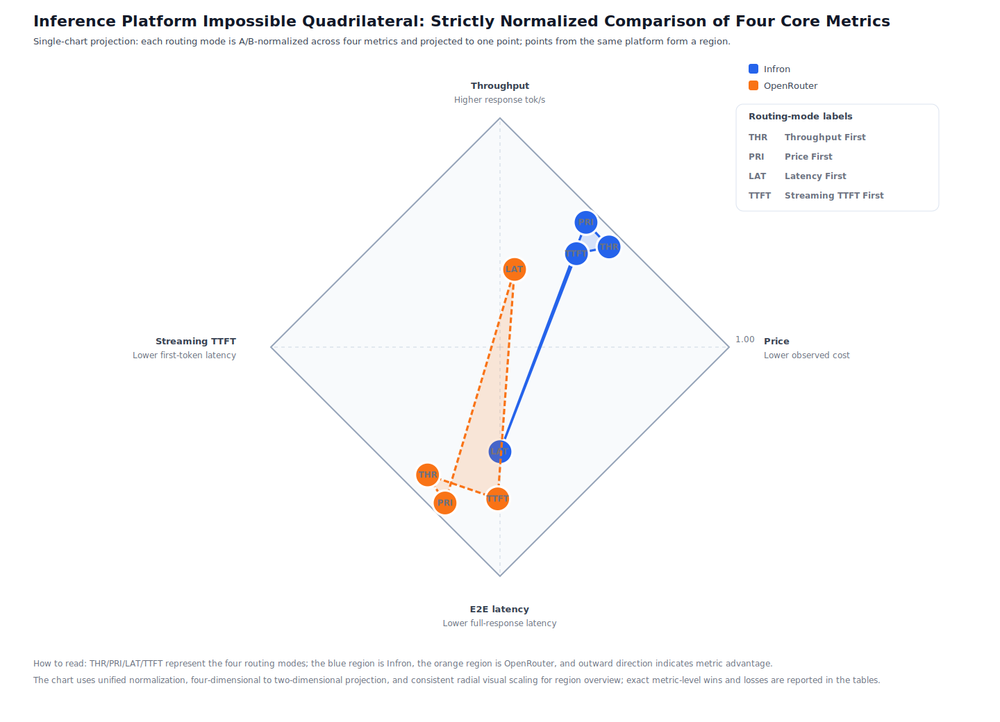

Figure 0: The inference-platform impossible quadrilateral. The chart compares throughput, price, E2E latency, and Streaming TTFT, showing how routing modes move across multi-objective trade-offs.

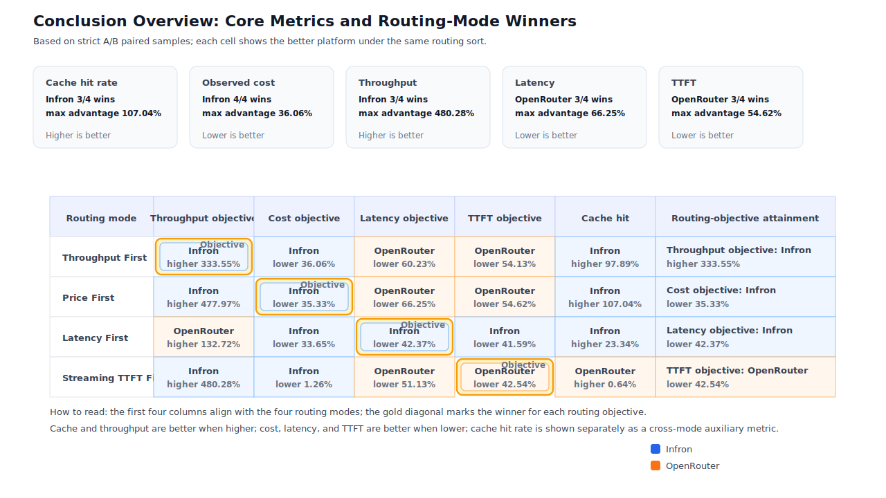

Figure A: Conclusion overview. The matrix shows winners for cache hit rate, observed cost, throughput, E2E latency, and Streaming TTFT under each routing mode.

### Routing-Mode Conclusions

| Routing mode | Objective winner | Cache hit rate | Observed cost | Throughput | E2E latency | Streaming TTFT |
| --- | --- | --- | --- | --- | --- | --- |
| Throughput First | **Infron** | **Infron**（97.89%） | **Infron**（56.40%） | **Infron**（333.55%） | **OpenRouter**（151.42%） | **OpenRouter**（118.00%） |
| Price First | **Infron** | **Infron**（107.04%） | **Infron**（54.63%） | **Infron**（477.97%） | **OpenRouter**（196.26%） | **OpenRouter**（120.37%） |
| Latency First | **Infron** | **Infron**（23.34%） | **Infron**（50.72%） | **OpenRouter**（132.72%） | **Infron**（73.51%） | **Infron**（71.20%） |
| TTFT First | **OpenRouter** | **OpenRouter**（0.64%） | **Infron**（1.27%） | **Infron**（480.28%） | **OpenRouter**（104.62%） | **OpenRouter**（74.02%） |

### Core Metric Winner Summary

| Metric | Infron-winning modes | OpenRouter-winning modes | Largest advantage |
| --- | --- | --- | --- |
| Cache hit rate | Throughput First, Price First, Latency First | TTFT First | Infron 107.04% |
| Observed cost | Throughput First, Price First, Latency First, TTFT First | - | Infron 56.40% |
| Throughput | Throughput First, Price First, TTFT First | Latency First | Infron 480.28% |
| E2E latency | Latency First | Throughput First, Price First, TTFT First | OpenRouter 196.26% |
| Streaming TTFT | Latency First | Throughput First, Price First, TTFT First | OpenRouter 120.37% |

## 1. Research Background

LLM inference-platform behavior is shaped not only by the model, but also by provider routing, prompt caching, streaming response handling, cost attribution, and fallback policy. For long-context, RAG, agent-tool, and stable system-prompt workloads, cache hit rate directly affects unit economics. Interactive products must also control E2E latency, Streaming TTFT, and throughput.

This study treats the inference platform as an observable system. The goal is not a single leaderboard score, but a controlled comparison of speed, cost, cache reuse, and first-token experience under different routing objectives.

## 2. Experimental Design, Dataset, and Controls

The experiment uses built-in representative business prompt templates covering stable long prefixes, RAG support, agent tool instructions, marketing automation, and code review. Each round contains a first request and a second request: the first establishes or refreshes cache state; the second observes cache reuse.

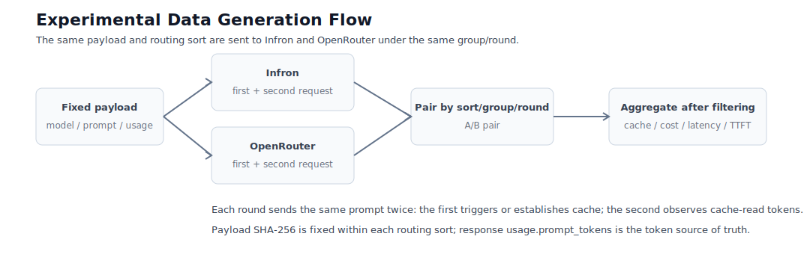

Figure 1: Experimental flow. The same payload is sent to Infron and OpenRouter under each routing mode, and final aggregation uses only strict paired samples.

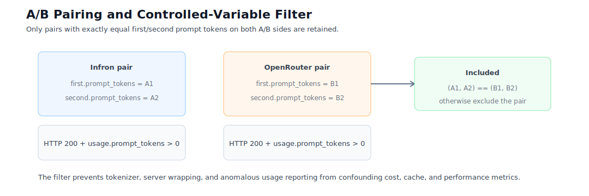

Figure 2: A/B pairing filter. HTTP failures, incomplete records, `usage.prompt_tokens <= 0`, and unequal input-token pairs are excluded.

Core request shape:

```json
{
  "model": "deepseek/deepseek-v4-flash",
  "messages": [
    {
      "role": "system",
      "content": "<stable long prefix for cache probing>"
    },
    {
      "role": "user",
      "content": "Reply with exactly: cache probe ok"
    }
  ],
  "temperature": 0,
  "max_tokens": 320,
  "stream": true,
  "stream_options": {
    "include_usage": true
  },
  "usage": {
    "include": true
  },
  "provider": {
    "sort": "throughput | price | latency | ttft",
    "allow_fallbacks": true
  }
}
```

Controlled-variable rule: within the same `sort/group/round`, both platforms must have exactly equal `usage.prompt_tokens` for the first and second requests. Total Input Tokens are computed from response-returned `usage.prompt_tokens`, not from local tokenizer estimates.

## 3. Experimental Environment and Data Quality

| Item | Configuration |
| --- | --- |
| Model | `deepseek/deepseek-v4-flash` |
| Platforms | Infron and OpenRouter |
| Routing modes | Throughput First, Price First, Latency First, TTFT First |
| Routing parameter mapping | Infron: `throughput, price, latency, ttft`; OpenRouter: `throughput, price, latency, latency` |
| Groups | 4 |
| Rounds per group | 50 |
| Workers | 4 |
| Request mode | Streaming Chat Completions with `stream_options.include_usage` and `usage.include` |
| Local network environment | Both platforms use the same local proxy: `socks5://127.0.0.1:1086` |
| Dataset | `business_representative`, Built-in representative business prompt templates |

## 4. Metric Definitions

| Metric | Definition | Direction |
| --- | --- | --- |
| Total Input Tokens | Sum of response-side `usage.prompt_tokens` for included requests | Control variable |
| Token cache hit rate | Second-request cache-read tokens / second-request prompt tokens | Higher is better |
| Observed cost | Sum of response-returned cost or cost breakdown | Lower is better |
| Throughput | Completion tokens / E2E latency seconds; reasoning is included when present in response usage | Higher is better |
| E2E latency | Elapsed time from request send to full response completion | Lower is better |
| Streaming TTFT | Time to first streamed chunk/token | Lower is better |

## 5. Core Metric Overview

| Routing mode | Platform | Strict paired rounds | Total Input Tokens | Token cache hit rate | Observed cost | Throughput | E2E latency | Streaming TTFT | P95 E2E latency | P99 E2E latency |
| --- | --- | ---: | ---: | ---: | ---: | ---: | ---: | ---: | ---: | ---: |
| Throughput First | Infron | 188 | 617874 | **91.99%** | **$0.02563400** | **27.93 tok/s** | 6244.30 ms | 4388.63 ms | 14659.28 ms | 18410.28 ms |
| Throughput First | OpenRouter | 188 | 617874 | 46.48% | $0.04009089 | 6.44 tok/s | **2483.62 ms** | **2013.14 ms** | 3747.62 ms | 5381.18 ms |
| Price First | Infron | 41 | 134752 | **91.95%** | **$0.00567200** | **37.34 tok/s** | 7337.67 ms | 4441.41 ms | 13426.01 ms | 15412.26 ms |
| Price First | OpenRouter | 41 | 134752 | 44.41% | $0.00877069 | 6.46 tok/s | **2476.80 ms** | **2015.41 ms** | 3514.34 ms | 5461.30 ms |
| Latency First | Infron | 95 | 312236 | **96.78%** | **$0.01152800** | 7.94 tok/s | **2014.82 ms** | **1558.68 ms** | 3779.69 ms | 6181.24 ms |
| Latency First | OpenRouter | 95 | 312236 | 78.46% | $0.01737505 | **18.48 tok/s** | 3496.01 ms | 2668.49 ms | 10243.48 ms | 14543.98 ms |
| TTFT First | Infron | 175 | 575212 | 83.31% | **$0.02923100** | **23.98 tok/s** | 6056.64 ms | 4227.42 ms | 15122.45 ms | 23232.36 ms |
| TTFT First | OpenRouter | 175 | 575212 | **83.85%** | $0.02960294 | 4.13 tok/s | **2959.99 ms** | **2429.24 ms** | 5961.47 ms | 10466.84 ms |

## 6. Routing-Mode Drill-Down

### Throughput First

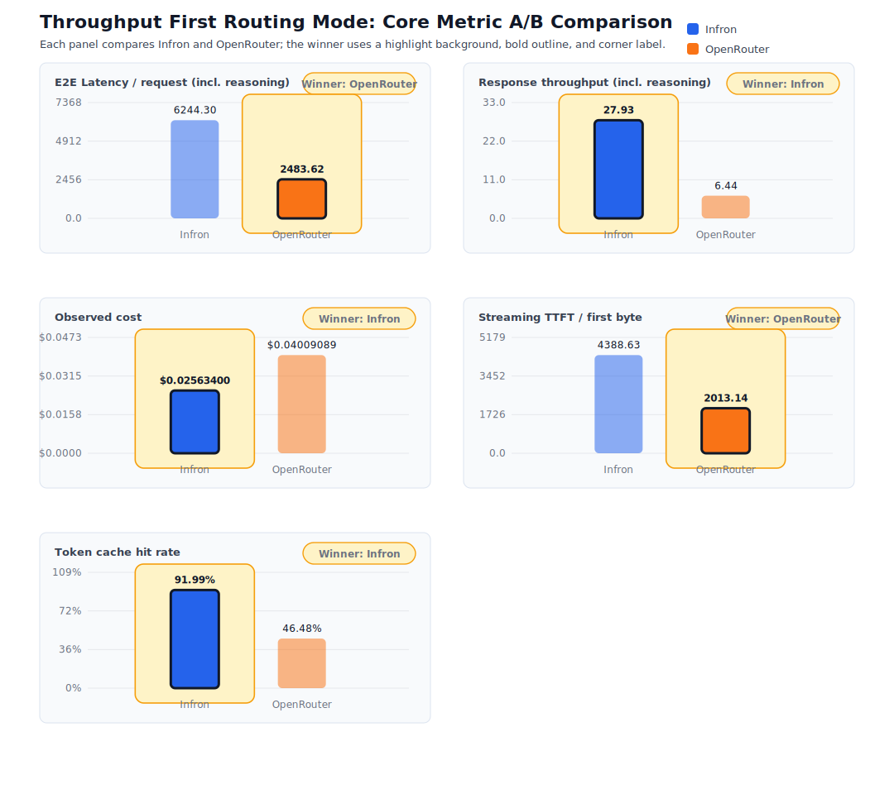

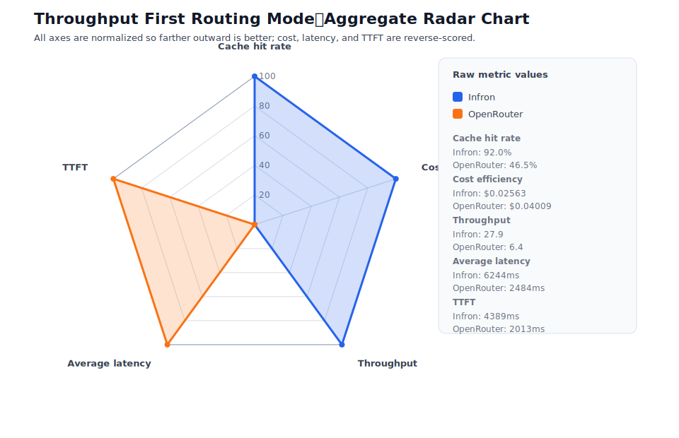

### Price First

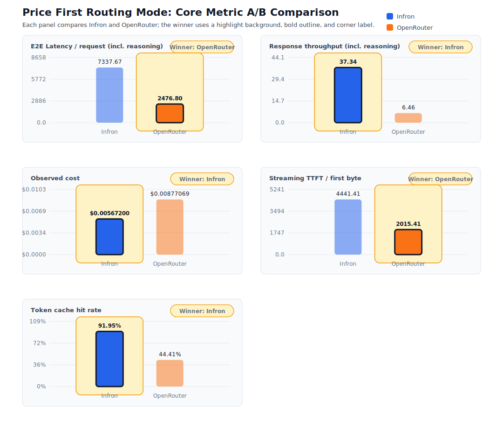

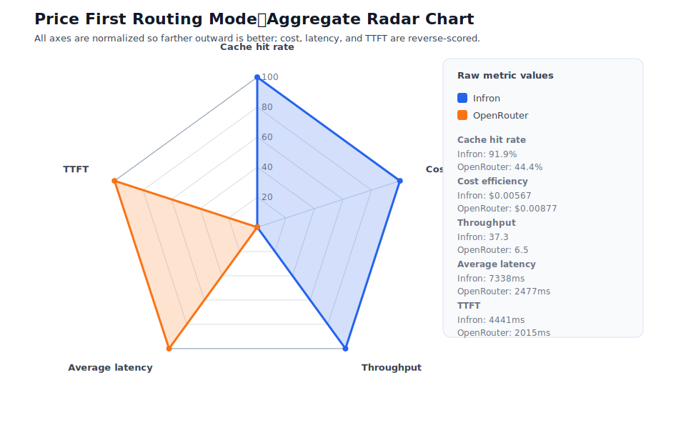

### Latency First

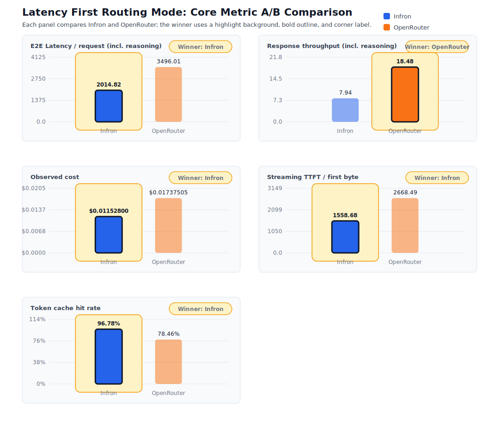

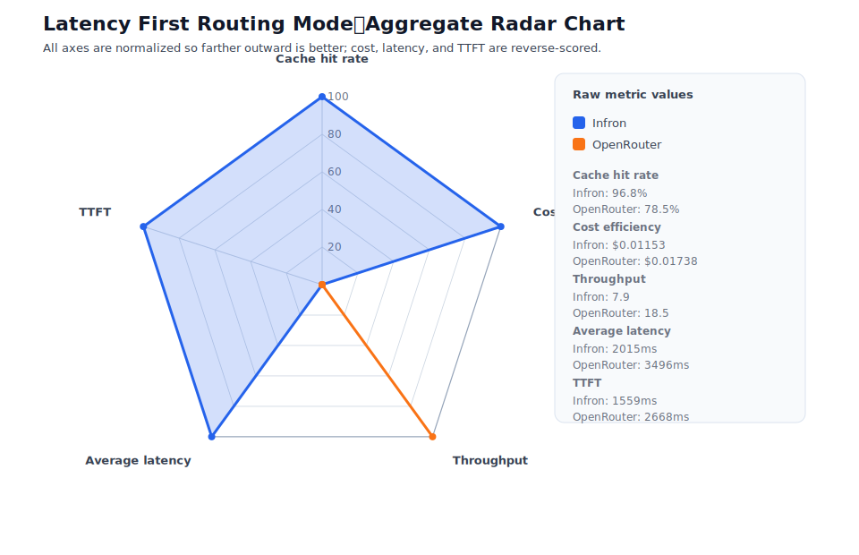

### TTFT First

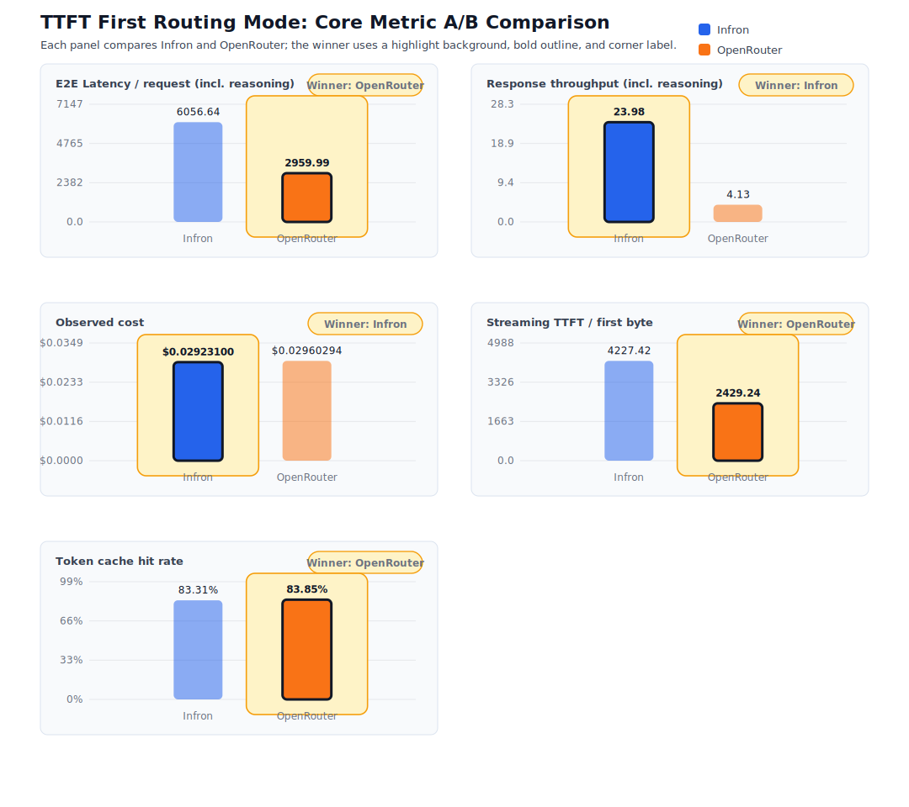

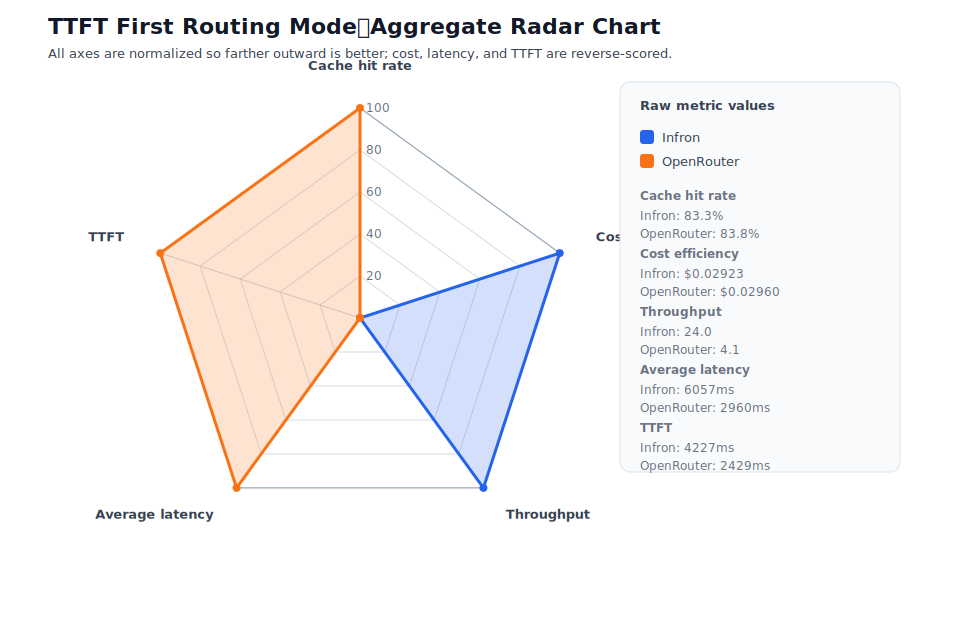


## 7. Core Metric Trend Charts

The charts are grouped by routing mode. Each chart compares E2E latency, throughput, observed cost, cache hit rate, and Streaming TTFT, with per-round curves where available.

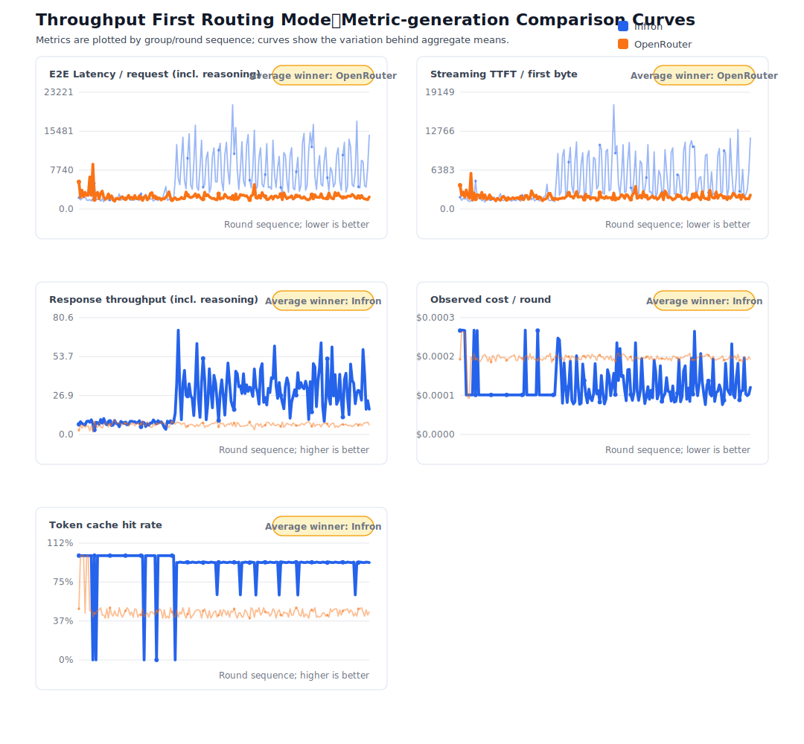

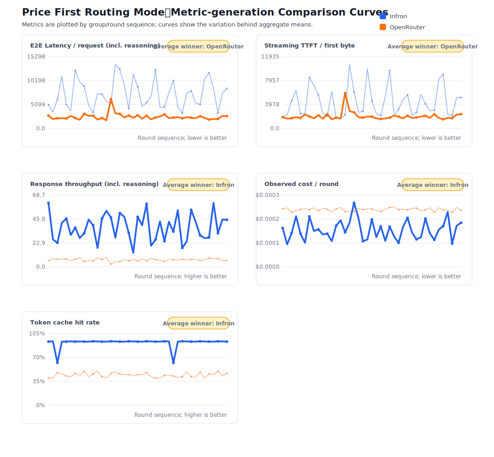

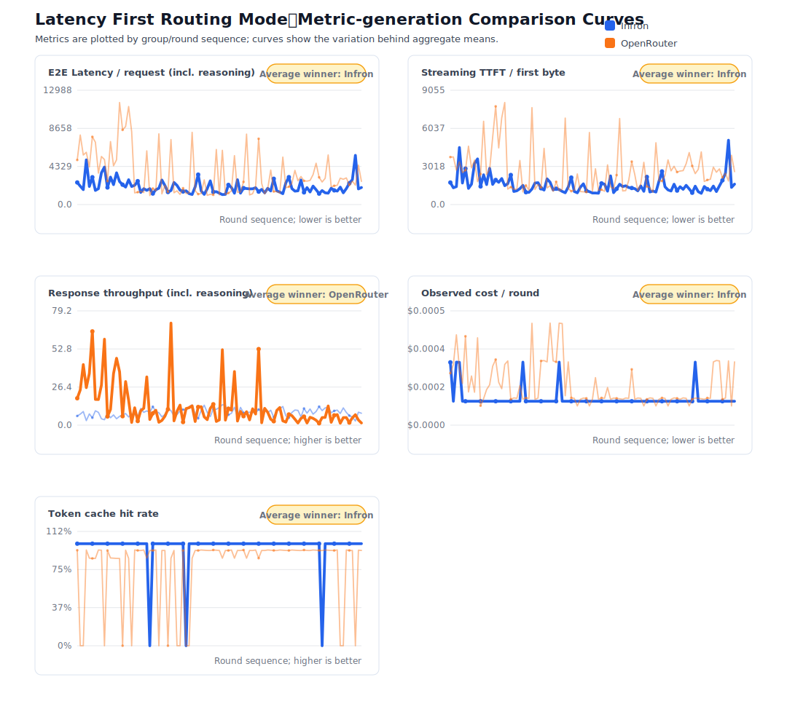

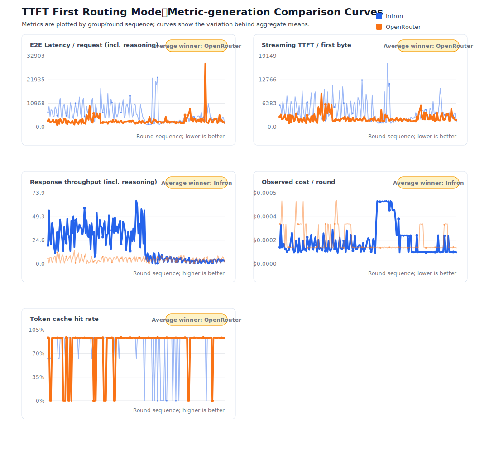

## 8. Provider Routing Drill-Down

| Routing mode | Platform | Total requests | Attributed requests | Provider distribution |
| --- | --- | ---: | ---: | --- |
| Throughput First | Infron | 376 | 0 | `alibaba/us` 250, `fireworks` 125, `alibaba/sg` 1 |
| Throughput First | OpenRouter | 376 | 0 | `Baidu` 366, `Fireworks` 10 |
| Price First | Infron | 82 | 0 | `alibaba/us` 82 |
| Price First | OpenRouter | 82 | 0 | `Baidu` 82 |
| Latency First | Infron | 190 | 0 | `fireworks` 190 |
| Latency First | OpenRouter | 190 | 0 | `Cloudflare` 124, `GMICloud` 65, `WandB` 1 |
| TTFT First | Infron | 350 | 0 | `alibaba/us` 191, `deepinfra` 126, `morph` 33 |
| TTFT First | OpenRouter | 350 | 0 | `Cloudflare` 348, `WandB` 2 |

## 9. Infron Technical Mechanism

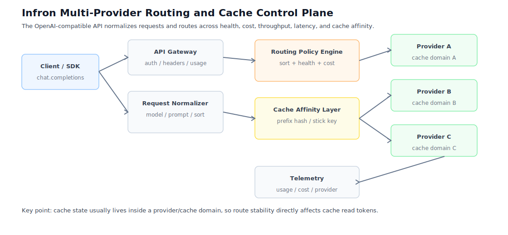

Figure 12: Infron architecture. Provider Stick and Cache Affinity make repeated long prefixes more likely to land in the same healthy cache domain.


Figure 13: Provider Stick and cache affinity. This mechanism does not disable fallback; it preserves cache-domain stability within the healthy provider set.


Figure 14: Cost-control mechanism. Observed cost is jointly determined by token processing, cache reads/writes, and upstream provider price.

## 10. Business Implications

Cache hit rate is most relevant to long-context, repeated system-prompt, RAG-prefix, and batch workloads. E2E latency and Streaming TTFT are most relevant to interactive products. Throughput matters for long-output and batch generation. Observed cost matters for budget-sensitive workloads. Routing mode should therefore follow the business KPI rather than a single average metric.

## 11. Limitations and Future Work

This run uses representative built-in business templates and does not cover every production corpus. Future work can add significance tests, longer time windows, concurrency stress tests, more models, more provider pairs, and finer upstream routing-trace and cost-breakdown evidence.

## 12. Reproducibility Appendix

| Artifact | Path |
| --- | --- |
| Chinese HTML report | [GitHub Pages](https://infronai.github.io/prompt-cache-bench/experiments/deepseek/deepseek-v4-flash/infron-vs-openrouter-routing-sort-cache-cost-4x50-stream-ttft-2026-06-27/reports/prompt-cache-routing-ab-study__deepseek-v4-flash__infron-vs-openrouter__4x50-stream-ttft__2026-06-27.zh.html) |
| English HTML report | [GitHub Pages](https://infronai.github.io/prompt-cache-bench/experiments/deepseek/deepseek-v4-flash/infron-vs-openrouter-routing-sort-cache-cost-4x50-stream-ttft-2026-06-27/reports/prompt-cache-routing-ab-study__deepseek-v4-flash__infron-vs-openrouter__4x50-stream-ttft__2026-06-27.en.html) |
| Chinese Markdown | [GitHub](https://github.com/InfronAI/prompt-cache-bench/blob/main/experiments/deepseek/deepseek-v4-flash/infron-vs-openrouter-routing-sort-cache-cost-4x50-stream-ttft-2026-06-27/reports/prompt-cache-routing-ab-study__deepseek-v4-flash__infron-vs-openrouter__4x50-stream-ttft__2026-06-27.zh.md) |
| English Markdown | [GitHub](https://github.com/InfronAI/prompt-cache-bench/blob/main/experiments/deepseek/deepseek-v4-flash/infron-vs-openrouter-routing-sort-cache-cost-4x50-stream-ttft-2026-06-27/reports/prompt-cache-routing-ab-study__deepseek-v4-flash__infron-vs-openrouter__4x50-stream-ttft__2026-06-27.en.md) |
| Data directory | [GitHub](https://github.com/InfronAI/prompt-cache-bench/tree/main/experiments/deepseek/deepseek-v4-flash/infron-vs-openrouter-routing-sort-cache-cost-4x50-stream-ttft-2026-06-27/data) |
| Paired dataset | [benchmark_pairs.csv](https://github.com/InfronAI/prompt-cache-bench/blob/main/experiments/deepseek/deepseek-v4-flash/infron-vs-openrouter-routing-sort-cache-cost-4x50-stream-ttft-2026-06-27/data/benchmark_pairs.csv) |
| Request-level dataset | [benchmark_requests.jsonl](https://github.com/InfronAI/prompt-cache-bench/blob/main/experiments/deepseek/deepseek-v4-flash/infron-vs-openrouter-routing-sort-cache-cost-4x50-stream-ttft-2026-06-27/data/benchmark_requests.jsonl) |
| Summary | [summary.json](https://github.com/InfronAI/prompt-cache-bench/blob/main/experiments/deepseek/deepseek-v4-flash/infron-vs-openrouter-routing-sort-cache-cost-4x50-stream-ttft-2026-06-27/data/summary.json) |
| Experiment code | [rerun_routing_sort_cache_cost_ab.py](https://github.com/InfronAI/prompt-cache-bench/blob/main/experiments/deepseek/deepseek-v4-flash/infron-vs-openrouter-routing-sort-cache-cost-4x50-stream-ttft-2026-06-27/code/rerun_routing_sort_cache_cost_ab.py) |
| Figure directory | [figures](https://github.com/InfronAI/prompt-cache-bench/tree/main/experiments/deepseek/deepseek-v4-flash/infron-vs-openrouter-routing-sort-cache-cost-4x50-stream-ttft-2026-06-27/figures) |
| Manifest | [manifest.json](https://github.com/InfronAI/prompt-cache-bench/blob/main/experiments/deepseek/deepseek-v4-flash/infron-vs-openrouter-routing-sort-cache-cost-4x50-stream-ttft-2026-06-27/metadata/manifest.json) |