# deepseek-v4-flash 路由策略、提示词缓存与流式 TTFT A/B 基准报告

## 摘要与结论大纲

本报告评估 `deepseek/deepseek-v4-flash` 在 Infron 与 OpenRouter 两个平台上的路由策略、提示词缓存、实际成本、吞吐量、端到端 E2E 时延与流式 TTFT。实验采用 4 个实验组、每组 50 轮、流式请求；每轮对两个平台分别发送两次相同请求，并只保留 `usage.prompt_tokens` 完全一致的严格 A/B 配对样本。

最终分析保留 499 个严格 A/B 配对样本、1996 条请求级观测记录；数据质量规则剔除 602 条记录。全部核心指标均来自响应返回的 telemetry，包括 `usage.prompt_tokens`、缓存 token、成本字段、端到端 E2E 时延、流式 TTFT 和 provider 字段。

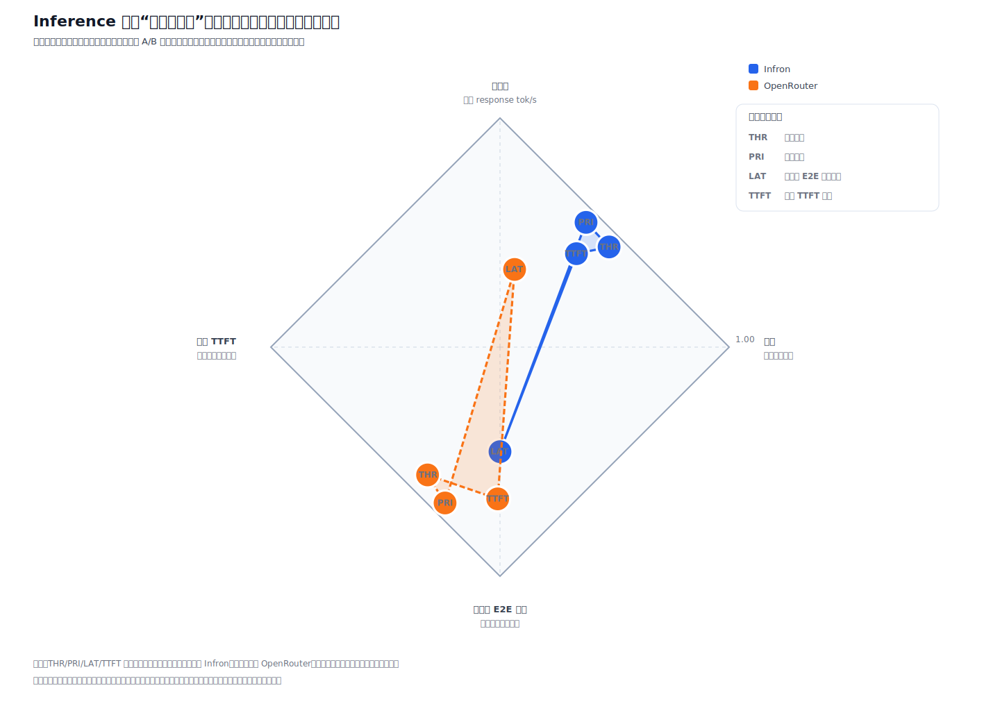

图 0：推理平台不可能四角。图中对比吞吐量、价格、端到端 E2E 时延、流式 TTFT 四个方向，展示各路由模式在多目标权衡中的相对位置。

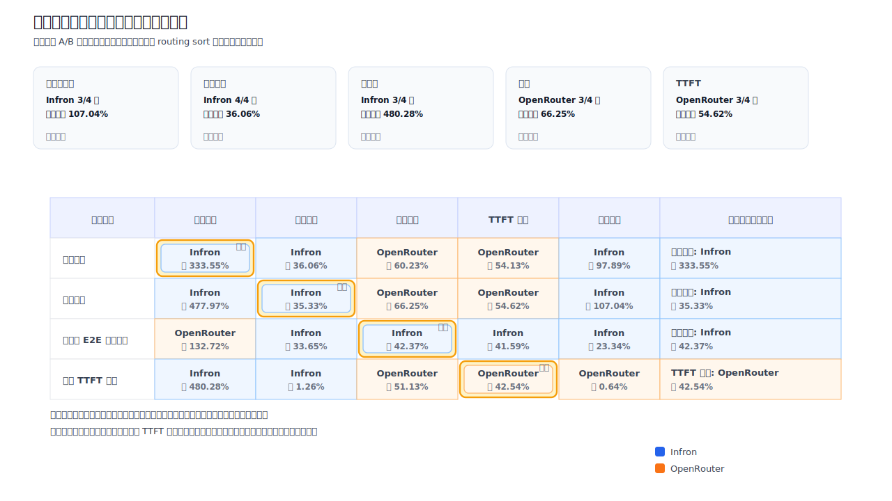

图 A：结论总览。矩阵按路由模式展示缓存命中率、实际成本、吞吐量、端到端 E2E 时延和流式 TTFT 的胜出方。

### 路由模式级结论

| 路由模式 | 达成目标胜出方 | 缓存命中率 | 实际成本 | 吞吐量 | 端到端 E2E 时延 | 流式 TTFT |
| --- | --- | --- | --- | --- | --- | --- |
| 吞吐优先 | **Infron** | **Infron**（97.89%） | **Infron**（56.40%） | **Infron**（333.55%） | **OpenRouter**（151.42%） | **OpenRouter**（118.00%） |
| 成本优先 | **Infron** | **Infron**（107.04%） | **Infron**（54.63%） | **Infron**（477.97%） | **OpenRouter**（196.26%） | **OpenRouter**（120.37%） |
| 端到端 E2E 时延优先 | **Infron** | **Infron**（23.34%） | **Infron**（50.72%） | **OpenRouter**（132.72%） | **Infron**（73.51%） | **Infron**（71.20%） |
| 流式 TTFT 优先 | **OpenRouter** | **OpenRouter**（0.64%） | **Infron**（1.27%） | **Infron**（480.28%） | **OpenRouter**（104.62%） | **OpenRouter**（74.02%） |

### 核心指标胜出统计

| 指标 | Infron 胜出模式 | OpenRouter 胜出模式 | 最大优势 |
| --- | --- | --- | --- |
| 缓存命中率 | 吞吐优先, 成本优先, 端到端 E2E 时延优先 | 流式 TTFT 优先 | Infron 107.04% |
| 实际成本 | 吞吐优先, 成本优先, 端到端 E2E 时延优先, 流式 TTFT 优先 | - | Infron 56.40% |
| 吞吐量 | 吞吐优先, 成本优先, 流式 TTFT 优先 | 端到端 E2E 时延优先 | Infron 480.28% |
| 端到端 E2E 时延 | 端到端 E2E 时延优先 | 吞吐优先, 成本优先, 流式 TTFT 优先 | OpenRouter 196.26% |
| 流式 TTFT | 端到端 E2E 时延优先 | 吞吐优先, 成本优先, 流式 TTFT 优先 | OpenRouter 120.37% |

## 1. 研究背景

LLM 推理平台的真实性能不只由模型本身决定，还受到 provider 路由、提示词缓存、流式响应、成本归因和 fallback 策略影响。对于长上下文、RAG、Agent 工具说明和稳定系统提示词场景，缓存命中率会直接影响单位请求成本；而实时业务还需要同时关注端到端 E2E 时延、流式 TTFT 和吞吐量。

本实验把推理平台视为可观测系统进行 A/B 测量。报告重点不是单一指标排名，而是回答在严格控制输入 token 和请求 payload 后，两个平台在不同路由目标下形成了怎样的速度、成本、缓存与首包体验取舍。

## 2. 实验设计、数据集构造与控制变量

实验使用内置业务代表性 prompt 模板，覆盖稳定长前缀、RAG 支持、Agent 工具说明、营销自动化和代码审查等常见生产形态。每一轮包含 first request 与 second request：第一次请求建立或刷新缓存状态，第二次请求观测缓存读取。


图 1：实验流程。相同 payload 在同一路由模式下发送给 Infron 与 OpenRouter，最终只在严格配对样本上聚合指标。

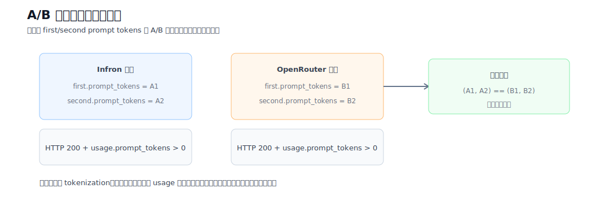

图 2：A/B 配对过滤。HTTP 异常、未完成记录、`usage.prompt_tokens <= 0` 以及 A/B 输入 token 不一致样本均不进入最终统计。

核心请求结构如下：

```json
{
  "model": "deepseek/deepseek-v4-flash",
  "messages": [
    {
      "role": "system",
      "content": "<稳定长前缀，用于缓存探针>"
    },
    {
      "role": "user",
      "content": "请只回复：cache probe ok"
    }
  ],
  "temperature": 0,
  "max_tokens": 320,
  "stream": true,
  "stream_options": {
    "include_usage": true
  },
  "usage": {
    "include": true
  },
  "provider": {
    "sort": "throughput | price | latency | ttft",
    "allow_fallbacks": true
  }
}
```

控制变量方法：同一 `sort/group/round` 下，两个平台必须 first/second 两次请求的 `usage.prompt_tokens` 完全一致。总 Input Tokens 使用响应返回的 `usage.prompt_tokens`，不使用本地 tokenizer 估算。

## 3. 实验环境与数据质量

| 项目 | 配置 |
| --- | --- |
| 模型 | `deepseek/deepseek-v4-flash` |
| 平台 | Infron、OpenRouter |
| 路由模式 | 吞吐优先, 成本优先, 端到端 E2E 时延优先, 流式 TTFT 优先 |
| 路由参数映射 | Infron: `throughput, price, latency, ttft`；OpenRouter: `throughput, price, latency, latency` |
| 实验组 | 4 |
| 每组轮数 | 50 |
| Workers | 4 |
| 请求方式 | 流式 Chat Completions，包含 `stream_options.include_usage` 和 `usage.include` |
| 本地网络环境 | 两个平台使用相同本地代理：`socks5://127.0.0.1:1086` |
| 数据集 | `business_representative`，Built-in representative business prompt templates |

## 4. 指标定义

| 指标 | 定义 | 方向 |
| --- | --- | --- |
| 总 Input Tokens | 纳入统计请求的响应侧 `usage.prompt_tokens` 合计 | 控制变量 |
| Token 级缓存命中率 | 第二次请求 cache read tokens / 第二次请求 prompt tokens | 越高越好 |
| 实际成本 | 响应返回的 cost 或 cost breakdown 合计 | 越低越好 |
| 吞吐量 | completion tokens / 端到端 E2E 时延秒数；reasoning 已按响应 usage 纳入 | 越高越好 |
| 端到端 E2E 时延 | 请求从发送到完整响应结束的耗时 | 越低越好 |
| 流式 TTFT | 首个流式 chunk/token 到达时间 | 越低越好 |

## 5. 核心指标总览

| 路由模式 | 平台 | 严格配对轮数 | 总 Input Tokens | Token 级缓存命中率 | 实际成本 | 吞吐量 | 端到端 E2E 时延 | 流式 TTFT | P95 端到端 E2E 时延 | P99 端到端 E2E 时延 |
| --- | --- | ---: | ---: | ---: | ---: | ---: | ---: | ---: | ---: | ---: |
| 吞吐优先 | Infron | 188 | 617874 | **91.99%** | **$0.02563400** | **27.93 tok/s** | 6244.30 ms | 4388.63 ms | 14659.28 ms | 18410.28 ms |
| 吞吐优先 | OpenRouter | 188 | 617874 | 46.48% | $0.04009089 | 6.44 tok/s | **2483.62 ms** | **2013.14 ms** | 3747.62 ms | 5381.18 ms |
| 成本优先 | Infron | 41 | 134752 | **91.95%** | **$0.00567200** | **37.34 tok/s** | 7337.67 ms | 4441.41 ms | 13426.01 ms | 15412.26 ms |
| 成本优先 | OpenRouter | 41 | 134752 | 44.41% | $0.00877069 | 6.46 tok/s | **2476.80 ms** | **2015.41 ms** | 3514.34 ms | 5461.30 ms |
| 端到端 E2E 时延优先 | Infron | 95 | 312236 | **96.78%** | **$0.01152800** | 7.94 tok/s | **2014.82 ms** | **1558.68 ms** | 3779.69 ms | 6181.24 ms |
| 端到端 E2E 时延优先 | OpenRouter | 95 | 312236 | 78.46% | $0.01737505 | **18.48 tok/s** | 3496.01 ms | 2668.49 ms | 10243.48 ms | 14543.98 ms |
| 流式 TTFT 优先 | Infron | 175 | 575212 | 83.31% | **$0.02923100** | **23.98 tok/s** | 6056.64 ms | 4227.42 ms | 15122.45 ms | 23232.36 ms |
| 流式 TTFT 优先 | OpenRouter | 175 | 575212 | **83.85%** | $0.02960294 | 4.13 tok/s | **2959.99 ms** | **2429.24 ms** | 5961.47 ms | 10466.84 ms |

## 6. 路由模式下钻

### 吞吐优先


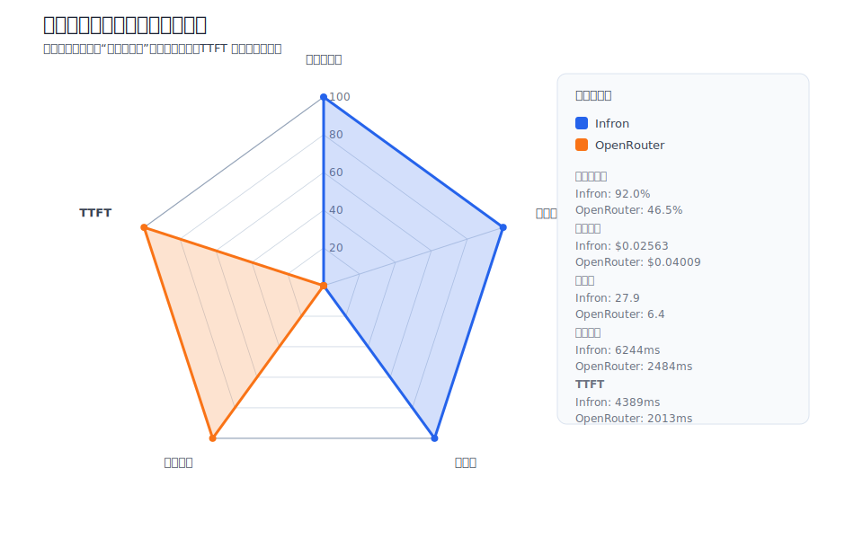

### 成本优先

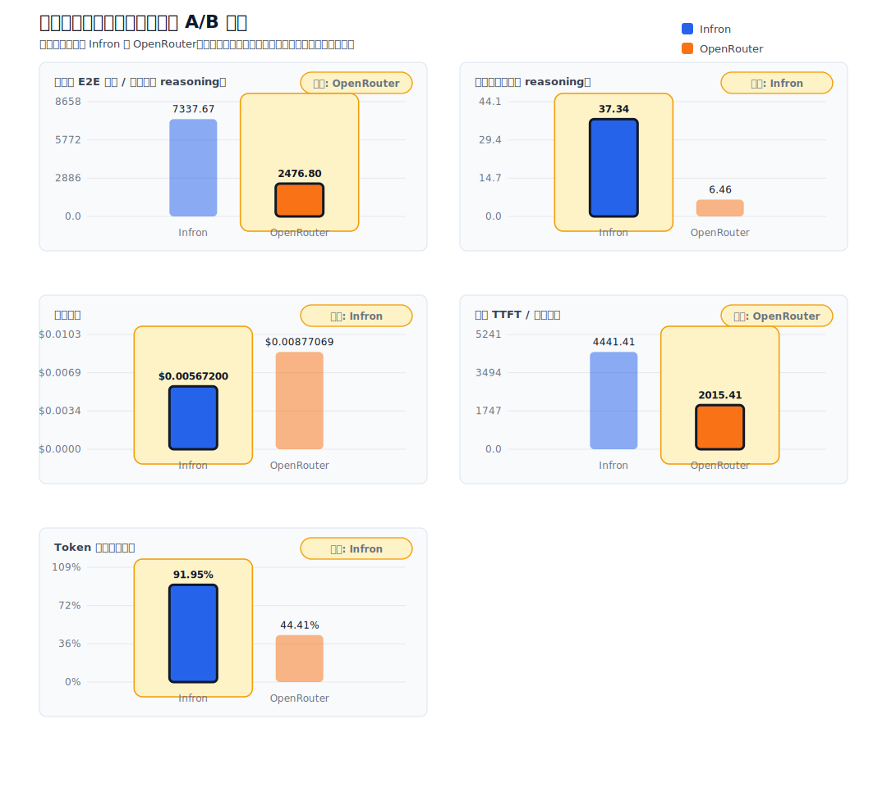


### 端到端 E2E 时延优先

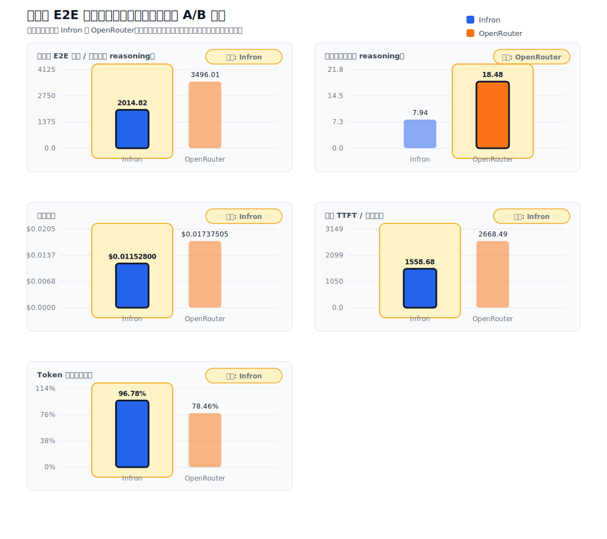

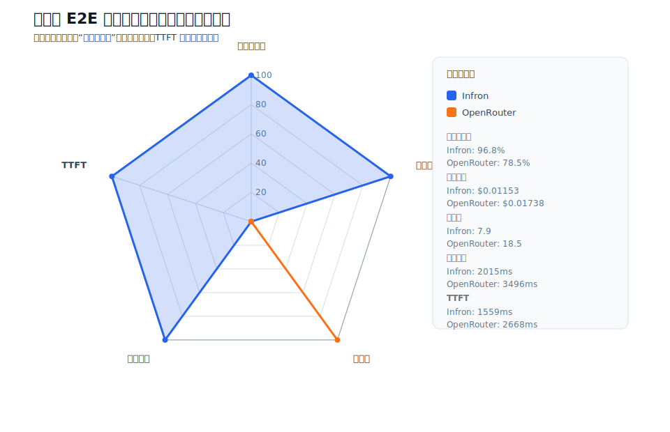

### 流式 TTFT 优先

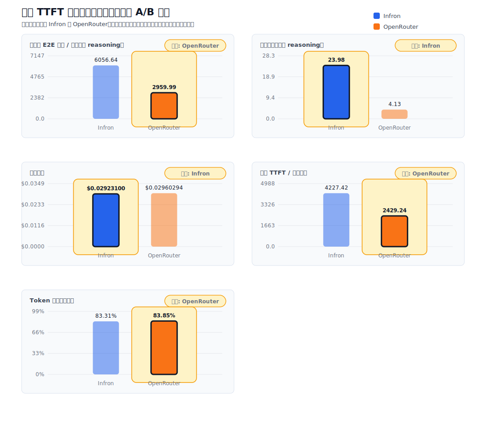

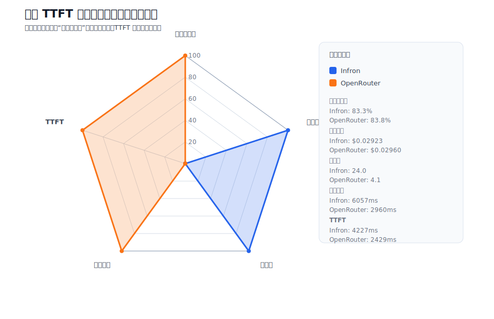


## 7. 核心指标趋势图

以下图表按路由模式组织，每张图展示端到端 E2E 时延、吞吐量、实际成本、缓存命中率和流式 TTFT 的 A/B 对比，并保留每轮观测曲线。

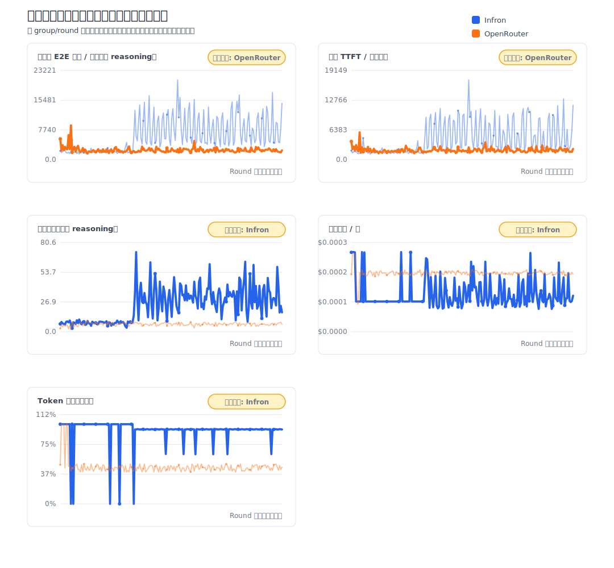

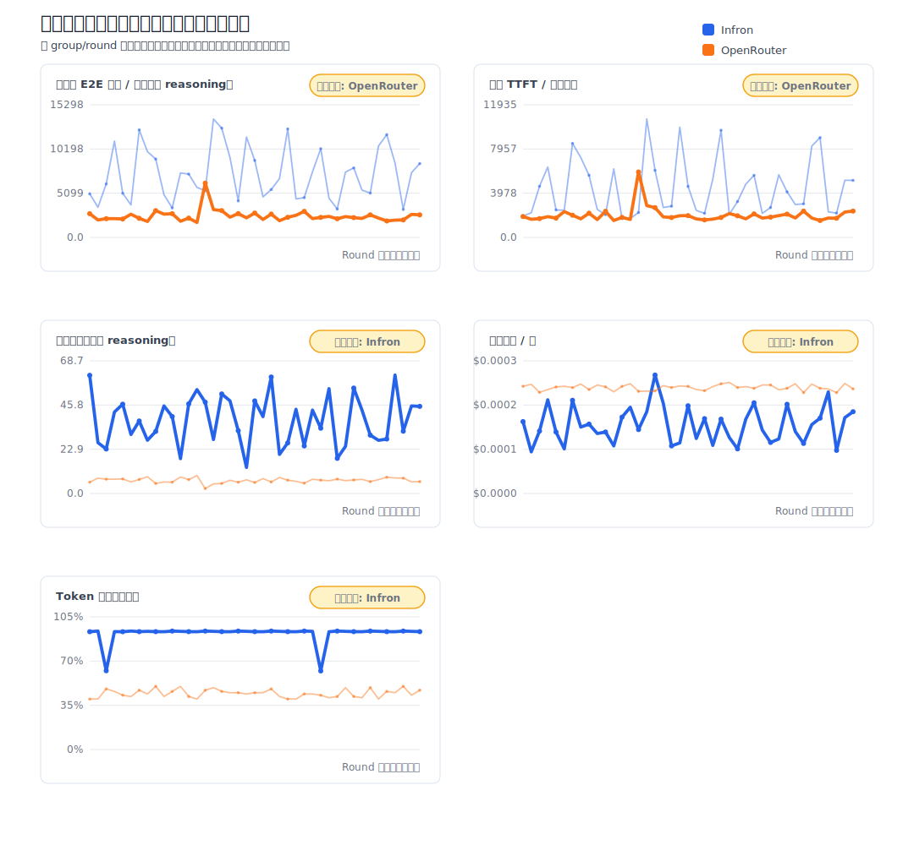

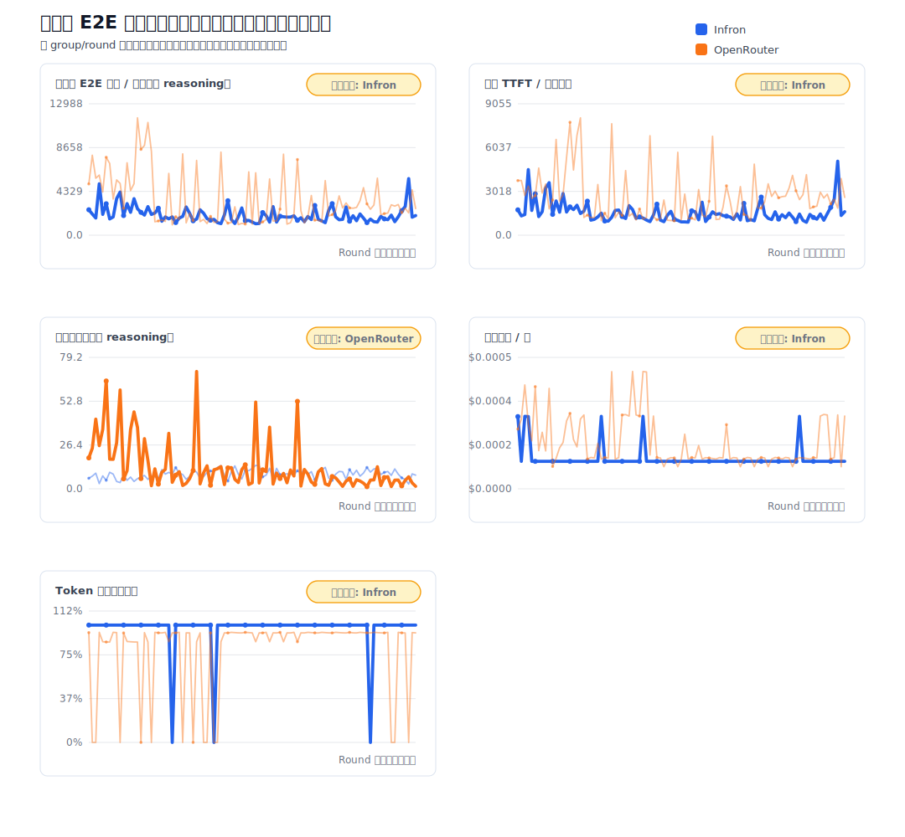

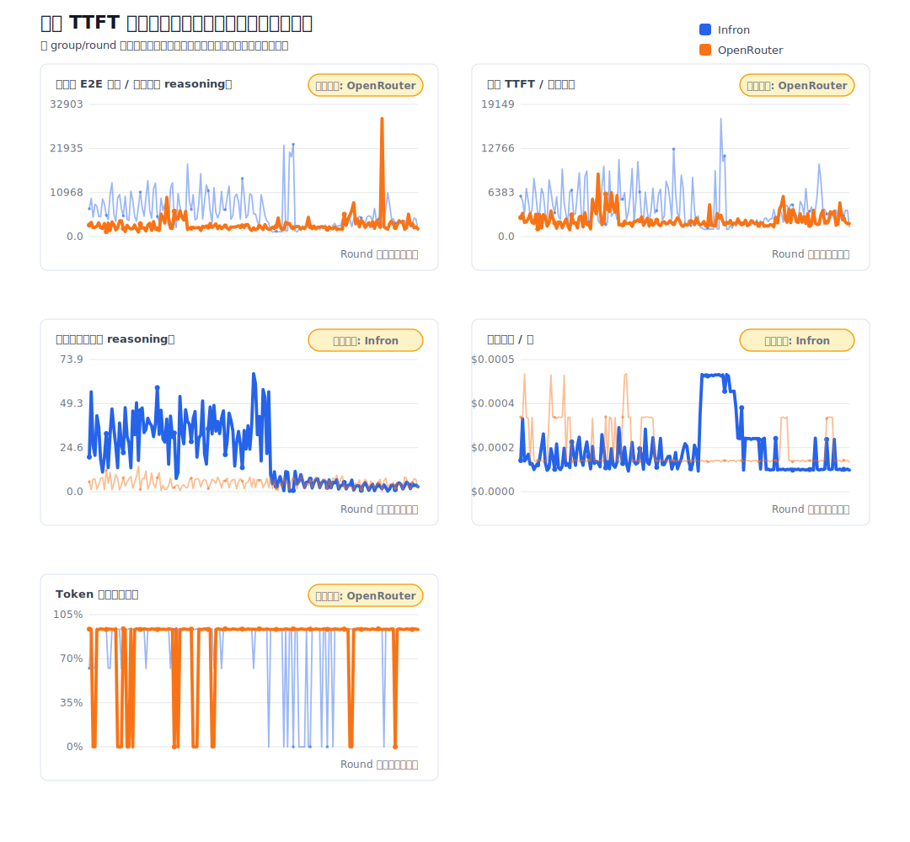

## 8. Provider 路由下钻

| 路由模式 | 平台 | 总请求数 | 已归因请求数 | Provider 分布 |
| --- | --- | ---: | ---: | --- |
| 吞吐优先 | Infron | 376 | 0 | `alibaba/us` 250, `fireworks` 125, `alibaba/sg` 1 |
| 吞吐优先 | OpenRouter | 376 | 0 | `Baidu` 366, `Fireworks` 10 |
| 成本优先 | Infron | 82 | 0 | `alibaba/us` 82 |
| 成本优先 | OpenRouter | 82 | 0 | `Baidu` 82 |
| 端到端 E2E 时延优先 | Infron | 190 | 0 | `fireworks` 190 |
| 端到端 E2E 时延优先 | OpenRouter | 190 | 0 | `Cloudflare` 124, `GMICloud` 65, `WandB` 1 |
| 流式 TTFT 优先 | Infron | 350 | 0 | `alibaba/us` 191, `deepinfra` 126, `morph` 33 |
| 流式 TTFT 优先 | OpenRouter | 350 | 0 | `Cloudflare` 348, `WandB` 2 |

## 9. Infron 技术机制说明

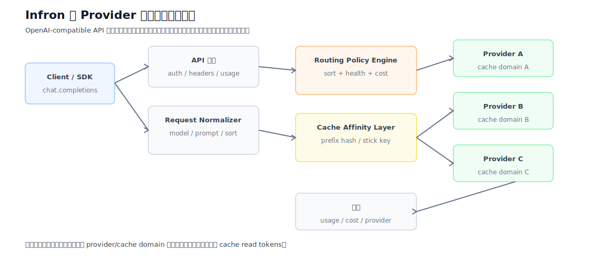

图 12：Infron 技术架构。Provider Stick 与 Cache Affinity 使重复长前缀更容易落入同一健康缓存域。


图 13：Provider Stick 与缓存亲和。该机制不等于禁用 fallback，而是在健康 provider 集合内优先保持缓存域稳定。


图 14：成本控制机制。实际成本由 token 处理、缓存读写和上游 provider 价格共同决定。

## 10. 业务价值讨论

缓存命中率更适合长上下文、重复系统提示词、RAG 前缀和批处理任务；端到端 E2E 时延和流式 TTFT 更适合实时交互体验；吞吐量更适合长输出和批量生成；实际成本更适合预算敏感型工作负载。不同路由模式对应不同业务目标，平台选择应基于业务 KPI 而不是单一平均值。

## 11. 局限性与后续工作

本轮实验使用内置代表性业务模板，不代表所有真实业务语料。后续可以继续补充显著性检验、更长时间窗口、并发压力、更多模型、更多 provider 对，以及更细粒度的上游 routing trace 和成本 breakdown。

## 12. 可复现性附录

| 工件 | 路径 |
| --- | --- |
| 中文 HTML 报告 | [GitHub Pages](https://infronai.github.io/prompt-cache-bench/experiments/deepseek/deepseek-v4-flash/infron-vs-openrouter-routing-sort-cache-cost-4x50-stream-ttft-2026-06-27/reports/prompt-cache-routing-ab-study__deepseek-v4-flash__infron-vs-openrouter__4x50-stream-ttft__2026-06-27.zh.html) |
| 英文 HTML 报告 | [GitHub Pages](https://infronai.github.io/prompt-cache-bench/experiments/deepseek/deepseek-v4-flash/infron-vs-openrouter-routing-sort-cache-cost-4x50-stream-ttft-2026-06-27/reports/prompt-cache-routing-ab-study__deepseek-v4-flash__infron-vs-openrouter__4x50-stream-ttft__2026-06-27.en.html) |
| 中文 Markdown | [GitHub](https://github.com/InfronAI/prompt-cache-bench/blob/main/experiments/deepseek/deepseek-v4-flash/infron-vs-openrouter-routing-sort-cache-cost-4x50-stream-ttft-2026-06-27/reports/prompt-cache-routing-ab-study__deepseek-v4-flash__infron-vs-openrouter__4x50-stream-ttft__2026-06-27.zh.md) |
| 英文 Markdown | [GitHub](https://github.com/InfronAI/prompt-cache-bench/blob/main/experiments/deepseek/deepseek-v4-flash/infron-vs-openrouter-routing-sort-cache-cost-4x50-stream-ttft-2026-06-27/reports/prompt-cache-routing-ab-study__deepseek-v4-flash__infron-vs-openrouter__4x50-stream-ttft__2026-06-27.en.md) |
| 数据目录 | [GitHub](https://github.com/InfronAI/prompt-cache-bench/tree/main/experiments/deepseek/deepseek-v4-flash/infron-vs-openrouter-routing-sort-cache-cost-4x50-stream-ttft-2026-06-27/data) |
| 完整配对数据集 | [benchmark_pairs.csv](https://github.com/InfronAI/prompt-cache-bench/blob/main/experiments/deepseek/deepseek-v4-flash/infron-vs-openrouter-routing-sort-cache-cost-4x50-stream-ttft-2026-06-27/data/benchmark_pairs.csv) |
| 请求级观测数据集 | [benchmark_requests.jsonl](https://github.com/InfronAI/prompt-cache-bench/blob/main/experiments/deepseek/deepseek-v4-flash/infron-vs-openrouter-routing-sort-cache-cost-4x50-stream-ttft-2026-06-27/data/benchmark_requests.jsonl) |
| Summary | [summary.json](https://github.com/InfronAI/prompt-cache-bench/blob/main/experiments/deepseek/deepseek-v4-flash/infron-vs-openrouter-routing-sort-cache-cost-4x50-stream-ttft-2026-06-27/data/summary.json) |
| 实验代码 | [rerun_routing_sort_cache_cost_ab.py](https://github.com/InfronAI/prompt-cache-bench/blob/main/experiments/deepseek/deepseek-v4-flash/infron-vs-openrouter-routing-sort-cache-cost-4x50-stream-ttft-2026-06-27/code/rerun_routing_sort_cache_cost_ab.py) |
| 图表目录 | [figures](https://github.com/InfronAI/prompt-cache-bench/tree/main/experiments/deepseek/deepseek-v4-flash/infron-vs-openrouter-routing-sort-cache-cost-4x50-stream-ttft-2026-06-27/figures) |
| Manifest | [manifest.json](https://github.com/InfronAI/prompt-cache-bench/blob/main/experiments/deepseek/deepseek-v4-flash/infron-vs-openrouter-routing-sort-cache-cost-4x50-stream-ttft-2026-06-27/metadata/manifest.json) |