# deepseek-v4-flash 路由策略、提示词缓存与流式 TTFT A/B 基准报告

## 摘要与结论大纲

本报告评估 `deepseek/deepseek-v4-flash` 在 Infron 与 OpenRouter 两个平台上的路由策略、提示词缓存、实际成本、吞吐量、端到端 E2E 时延与流式 TTFT。实验采用 4 个实验组、每组 50 轮、流式请求；每轮对两个平台分别发送两次相同请求，并只保留 `usage.prompt_tokens` 完全一致的严格 A/B 配对样本。

最终分析保留 797 个严格 A/B 配对样本、3188 条请求级观测记录；数据质量规则剔除 6 条记录。全部核心指标均来自响应返回的 telemetry，包括 `usage.prompt_tokens`、缓存 token、成本字段、端到端 E2E 时延、流式 TTFT 和 provider 字段。

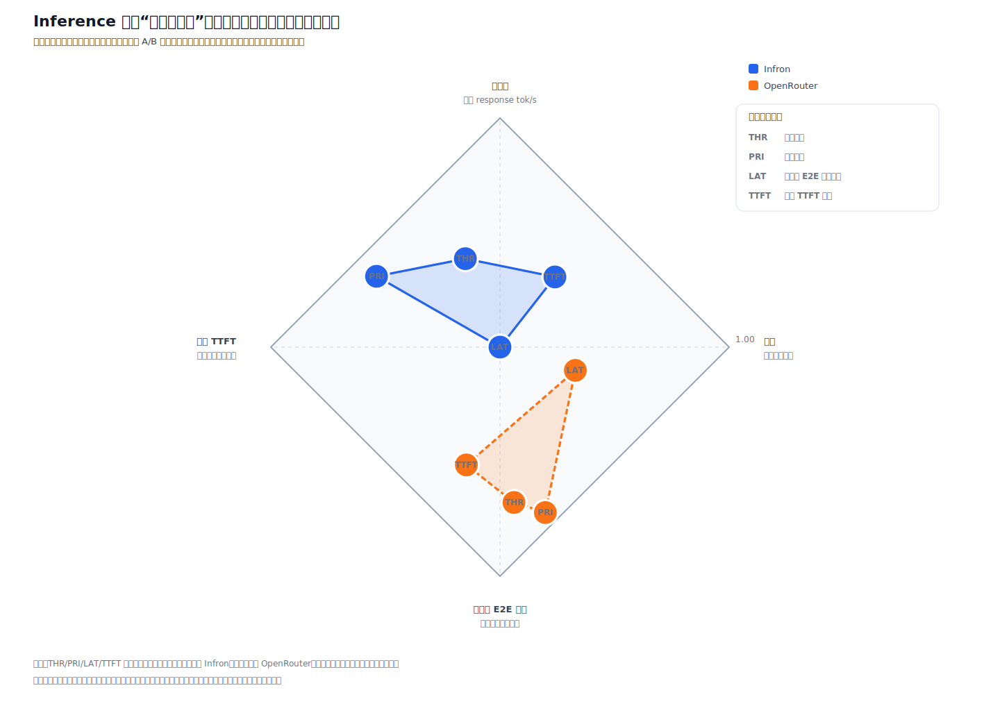

图 0：推理平台不可能四角。图中对比吞吐量、价格、端到端 E2E 时延、流式 TTFT 四个方向，展示各路由模式在多目标权衡中的相对位置。

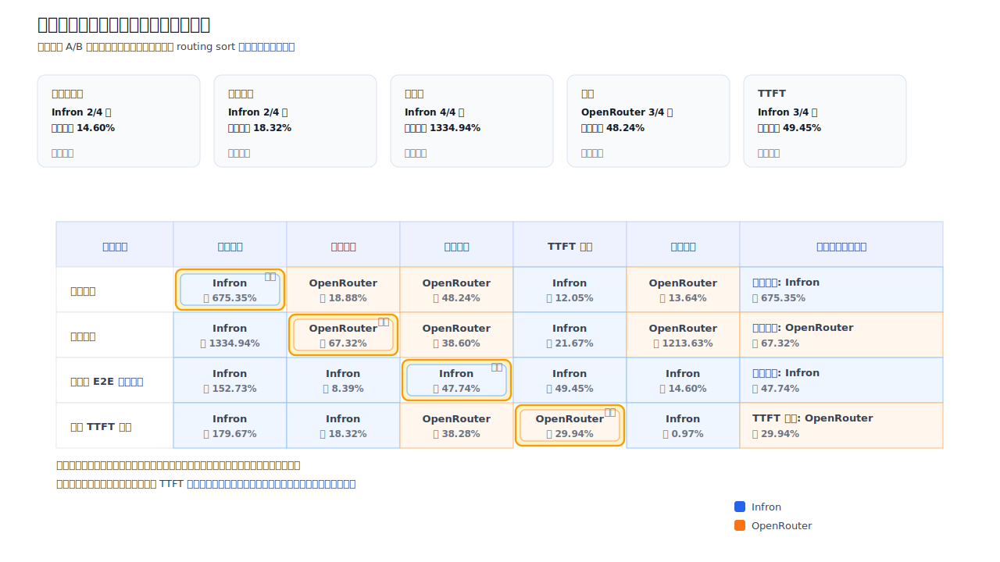

图 A：结论总览。矩阵按路由模式展示缓存命中率、实际成本、吞吐量、端到端 E2E 时延和流式 TTFT 的胜出方。

### 路由模式级结论

| 路由模式 | 达成目标胜出方 | 缓存命中率 | 实际成本 | 吞吐量 | 端到端 E2E 时延 | 流式 TTFT |
| --- | --- | --- | --- | --- | --- | --- |
| 吞吐优先 | **Infron** | **OpenRouter**（13.64%） | **OpenRouter**（23.27%） | **Infron**（675.35%） | **OpenRouter**（93.21%） | **Infron**（13.70%） |
| 成本优先 | **OpenRouter** | **OpenRouter**（1213.63%） | **OpenRouter**（205.97%） | **Infron**（1334.94%） | **OpenRouter**（62.87%） | **Infron**（27.67%） |
| 端到端 E2E 时延优先 | **Infron** | **Infron**（14.60%） | **Infron**（9.15%） | **Infron**（152.73%） | **Infron**（91.34%） | **Infron**（97.83%） |
| 流式 TTFT 优先 | **OpenRouter** | **Infron**（0.97%） | **Infron**（22.42%） | **Infron**（179.67%） | **OpenRouter**（62.03%） | **OpenRouter**（42.74%） |

### 核心指标胜出统计

| 指标 | Infron 胜出模式 | OpenRouter 胜出模式 | 最大优势 |
| --- | --- | --- | --- |
| 缓存命中率 | 端到端 E2E 时延优先, 流式 TTFT 优先 | 吞吐优先, 成本优先 | OpenRouter 1213.63% |
| 实际成本 | 端到端 E2E 时延优先, 流式 TTFT 优先 | 吞吐优先, 成本优先 | OpenRouter 205.97% |
| 吞吐量 | 吞吐优先, 成本优先, 端到端 E2E 时延优先, 流式 TTFT 优先 | - | Infron 1334.94% |
| 端到端 E2E 时延 | 端到端 E2E 时延优先 | 吞吐优先, 成本优先, 流式 TTFT 优先 | OpenRouter 93.21% |
| 流式 TTFT | 吞吐优先, 成本优先, 端到端 E2E 时延优先 | 流式 TTFT 优先 | Infron 97.83% |

### Reasoning 控制校验与缓存/成本归因摘要

本轮实验在全部请求中显式设置 `reasoning.effort=none`，用于控制 Thinking/Reasoning 对流式 TTFT、端到端 E2E 时延和吞吐量的影响。响应侧 telemetry 显示，Infron / 吞吐优先: 65934; Infron / 成本优先: 102730; Infron / 流式 TTFT 优先: 16447。OpenRouter / 吞吐优先; OpenRouter / 成本优先; Infron / 端到端 E2E 时延优先; OpenRouter / 端到端 E2E 时延优先; OpenRouter / 流式 TTFT 优先 未观测到 reasoning tokens。

| 路由模式 | 缓存命中率差值 | Infron 成本倍数 | Infron 主要上游路径 | OpenRouter 主要上游路径 | Reasoning Tokens 差异 | 主要归因 |
| --- | ---: | ---: | --- | --- | ---: | --- |
| 吞吐优先 | -11.00 pp | 1.23x | `alibaba/cn` 57.00%, `fireworks` 30.50% | `Alibaba` 99.50%, `Fireworks` 0.50% | 65,934 | 缓存亲和弱于 OpenRouter，且响应侧仍有 reasoning tokens，二者共同推高实际成本。 |
| 成本优先 | -83.61 pp | 3.06x | `alibaba/cn` 100.00% | `GMICloud` 98.99%, `DigitalOcean` 0.50% | 102,730 | 缓存亲和弱于 OpenRouter，且响应侧仍有 reasoning tokens，二者共同推高实际成本。 |
| 端到端 E2E 时延优先 | +12.67 pp | 0.92x | `fireworks` 100.00% | `GMICloud` 75.75%, `Cloudflare` 19.50% | 0 | 缓存亲和与上游价格路径共同带来成本优势。 |
| 流式 TTFT 优先 | +0.79 pp | 0.82x | `fireworks` 82.32%, `alibaba/cn` 17.68% | `Cloudflare` 97.98%, `Parasail` 1.26% | 16,447 | 缓存亲和与上游价格路径共同带来成本优势。 |

## 1. 研究背景

LLM 推理平台的真实性能不只由模型本身决定，还受到 provider 路由、提示词缓存、流式响应、成本归因和 fallback 策略影响。对于长上下文、RAG、Agent 工具说明和稳定系统提示词场景，缓存命中率会直接影响单位请求成本；而实时业务还需要同时关注端到端 E2E 时延、流式 TTFT 和吞吐量。

本实验把推理平台视为可观测系统进行 A/B 测量。报告重点不是单一指标排名，而是回答在严格控制输入 token 和请求 payload 后，两个平台在不同路由目标下形成了怎样的速度、成本、缓存与首包体验取舍。

## 2. 实验设计、数据集构造与控制变量

实验使用内置业务代表性 prompt 模板，覆盖稳定长前缀、RAG 支持、Agent 工具说明、营销自动化和代码审查等常见生产形态。每一轮包含 first request 与 second request：第一次请求建立或刷新缓存状态，第二次请求观测缓存读取。

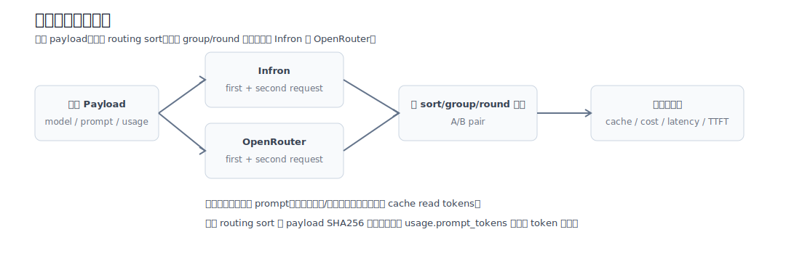

图 1：实验流程。相同 payload 在同一路由模式下发送给 Infron 与 OpenRouter，最终只在严格配对样本上聚合指标。


图 2：A/B 配对过滤。HTTP 异常、未完成记录、`usage.prompt_tokens <= 0` 以及 A/B 输入 token 不一致样本均不进入最终统计。

核心请求结构如下：

```json
{
  "model": "deepseek/deepseek-v4-flash",
  "messages": [
    {
      "role": "system",
      "content": "<稳定长前缀，用于缓存探针>"
    },
    {
      "role": "user",
      "content": "请只回复：cache probe ok"
    }
  ],
  "temperature": 0,
  "max_tokens": 320,
  "stream": true,
  "stream_options": {
    "include_usage": true
  },
  "usage": {
    "include": true
  },
  "reasoning": {
    "effort": "none"
  },
  "provider": {
    "sort": "throughput | price | latency | ttft",
    "allow_fallbacks": true
  }
}
```

控制变量方法：同一 `sort/group/round` 下，两个平台必须 first/second 两次请求的 `usage.prompt_tokens` 完全一致。总 Input Tokens 使用响应返回的 `usage.prompt_tokens`，不使用本地 tokenizer 估算。

## 3. 实验环境与数据质量

| 项目 | 配置 |
| --- | --- |
| 模型 | `deepseek/deepseek-v4-flash` |
| 平台 | Infron、OpenRouter |
| 路由模式 | 吞吐优先, 成本优先, 端到端 E2E 时延优先, 流式 TTFT 优先 |
| 路由参数映射 | Infron: `throughput, price, latency, ttft`；OpenRouter: `throughput, price, latency, latency` |
| 实验组 | 4 |
| 每组轮数 | 50 |
| Workers | 4 |
| 请求方式 | 流式 Chat Completions，包含 `stream_options.include_usage` 和 `usage.include` |
| Reasoning / Thinking 控制 | 所有请求显式携带 `reasoning.effort=none`；响应侧 telemetry 用于校验是否仍返回 reasoning tokens |
| 本地网络环境 | 两个平台使用相同本地代理：`socks5://127.0.0.1:1086` |
| 数据集 | `business_representative`，内置代表性业务提示词模板 |

## 4. 指标定义

| 指标 | 定义 | 方向 |
| --- | --- | --- |
| 总 Input Tokens | 纳入统计请求的响应侧 `usage.prompt_tokens` 合计 | 控制变量 |
| Token 级缓存命中率 | 第二次请求 cache read tokens / 第二次请求 prompt tokens | 越高越好 |
| 实际成本 | 响应返回的 cost 或 cost breakdown 合计 | 越低越好 |
| 吞吐量 | completion tokens / 端到端 E2E 时延秒数；reasoning 已按响应 usage 纳入 | 越高越好 |
| 端到端 E2E 时延 | 请求从发送到完整响应结束的耗时 | 越低越好 |
| 流式 TTFT | 首个流式 chunk/token 到达时间 | 越低越好 |

## 5. 核心指标总览

| 路由模式 | 平台 | 严格配对轮数 | 总 Input Tokens | Token 级缓存命中率 | 实际成本 | 吞吐量 | 端到端 E2E 时延 | 流式 TTFT | P95 端到端 E2E 时延 | P99 端到端 E2E 时延 |
| --- | --- | ---: | ---: | ---: | ---: | ---: | ---: | ---: | ---: | ---: |
| 吞吐优先 | Infron | 200 | 657312 | 80.64% | $0.03119800 | **34.54 tok/s** | 5182.69 ms | **2185.81 ms** | 13069.44 ms | 19099.79 ms |
| 吞吐优先 | OpenRouter | 200 | 657312 | **91.63%** | **$0.02530937** | 4.46 tok/s | **2682.41 ms** | 2485.29 ms | 3846.13 ms | 4930.68 ms |
| 成本优先 | Infron | 199 | 654020 | 6.89% | $0.05729000 | **39.26 tok/s** | 6918.70 ms | **3077.02 ms** | 12625.87 ms | 17557.83 ms |
| 成本优先 | OpenRouter | 199 | 654020 | **90.50%** | **$0.01872401** | 2.74 tok/s | **4247.97 ms** | 3928.34 ms | 7858.67 ms | 11465.22 ms |
| 端到端 E2E 时延优先 | Infron | 200 | 657312 | **99.44%** | **$0.02325700** | **7.63 tok/s** | **2097.07 ms** | **1794.06 ms** | 3743.97 ms | 4886.88 ms |
| 端到端 E2E 时延优先 | OpenRouter | 200 | 657312 | 86.77% | $0.02538584 | 3.02 tok/s | 4012.61 ms | 3549.11 ms | 8971.72 ms | 14784.79 ms |
| 流式 TTFT 优先 | Infron | 198 | 650734 | **81.98%** | **$0.02832900** | **12.37 tok/s** | 4562.48 ms | 3615.03 ms | 10735.07 ms | 27416.20 ms |
| 流式 TTFT 优先 | OpenRouter | 198 | 650734 | 81.20% | $0.03468097 | 4.42 tok/s | **2815.78 ms** | **2532.65 ms** | 5697.46 ms | 8340.43 ms |

## 6. 路由模式下钻

### 吞吐优先

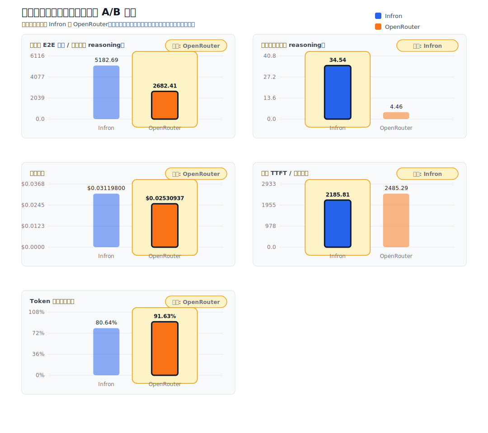

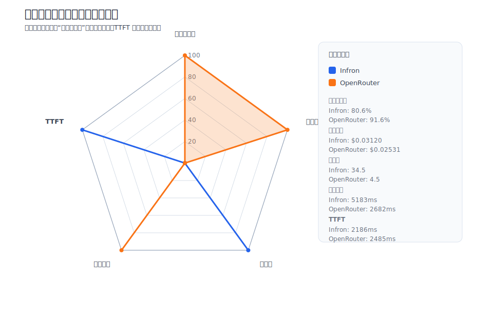

### 成本优先

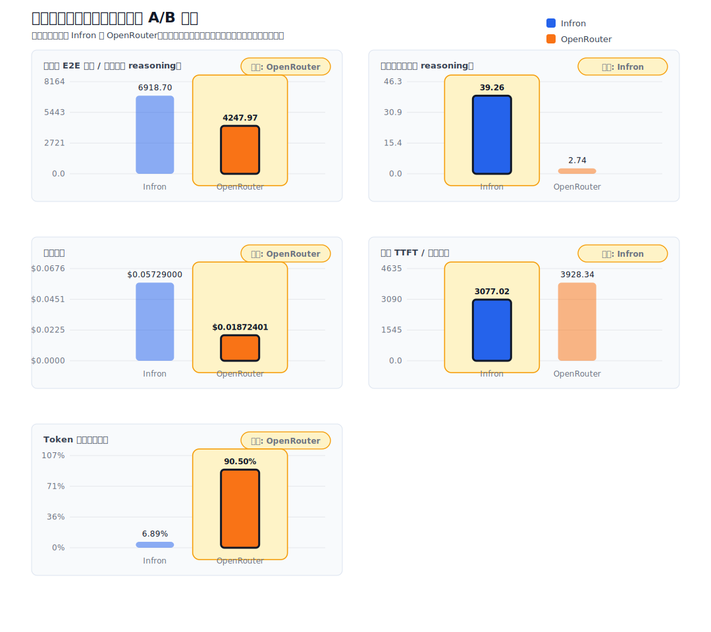


### 端到端 E2E 时延优先

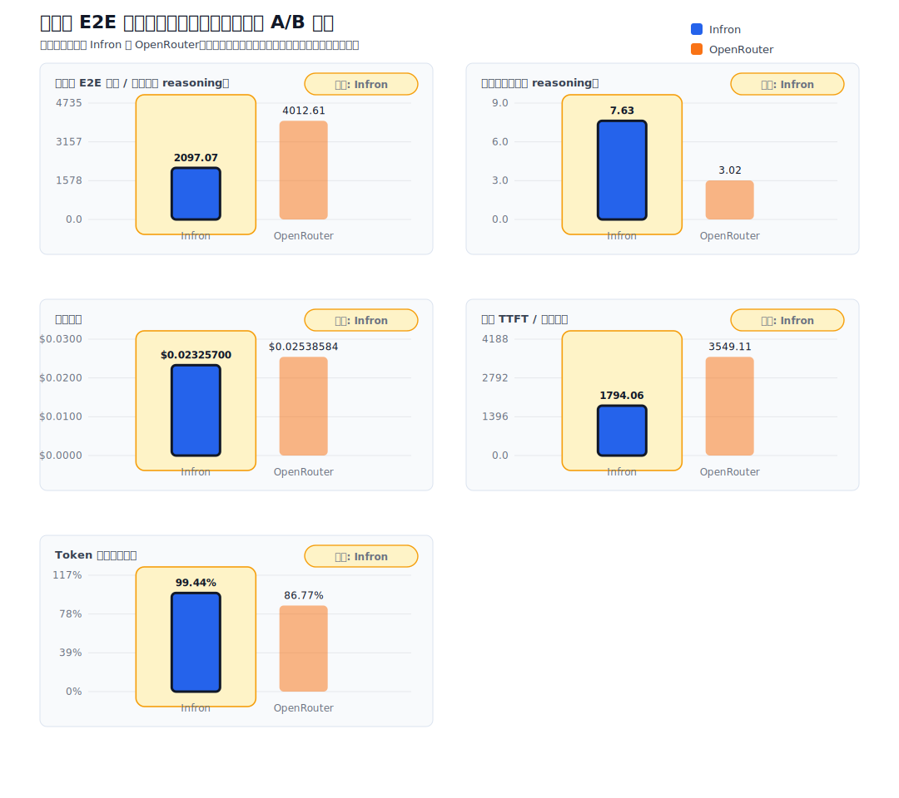

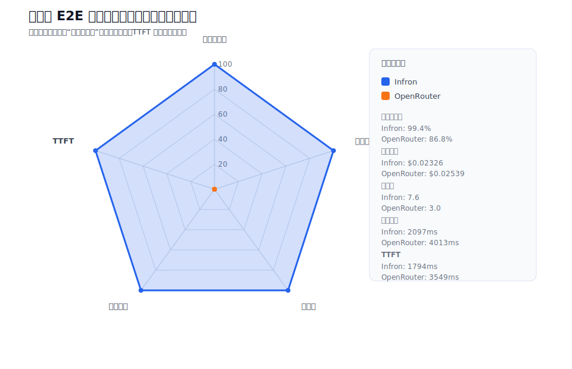

### 流式 TTFT 优先

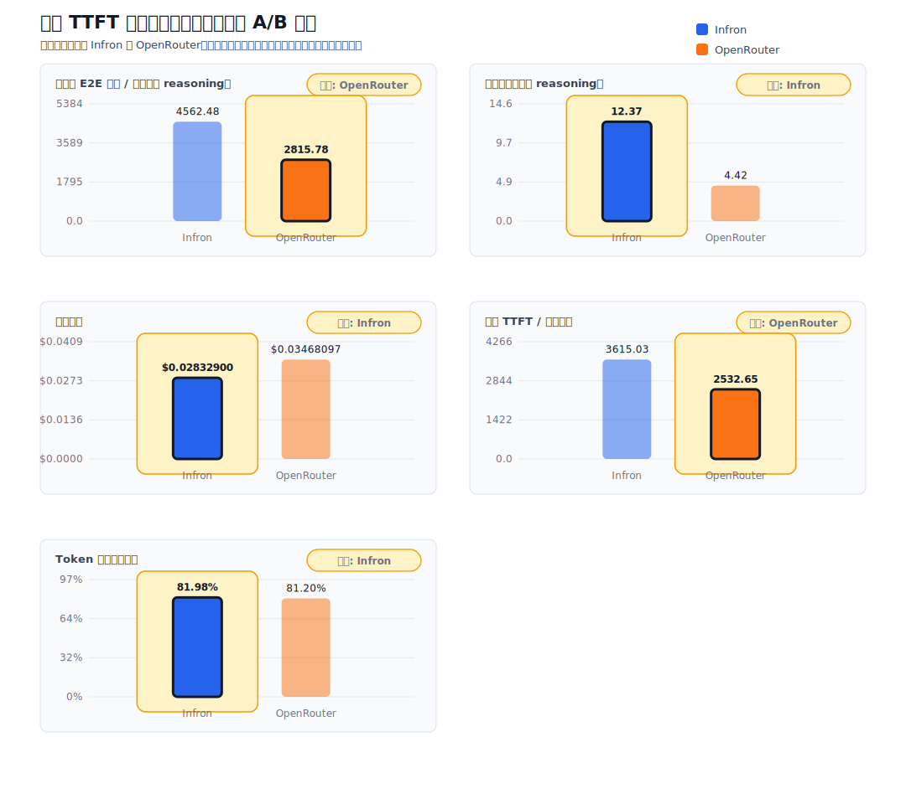

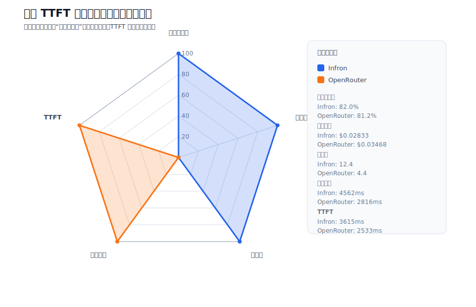


## 7. 核心指标趋势图

以下图表按路由模式组织，每张图展示端到端 E2E 时延、吞吐量、实际成本、缓存命中率和流式 TTFT 的 A/B 对比，并保留每轮观测曲线。

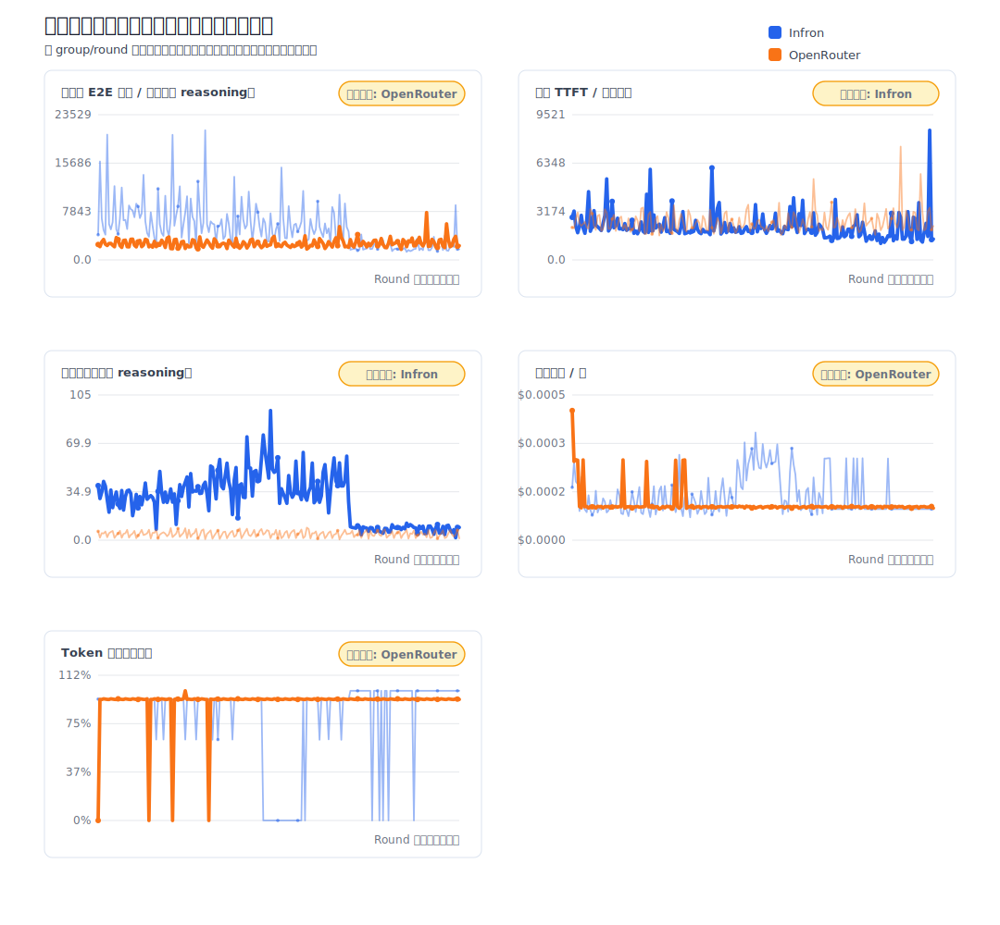

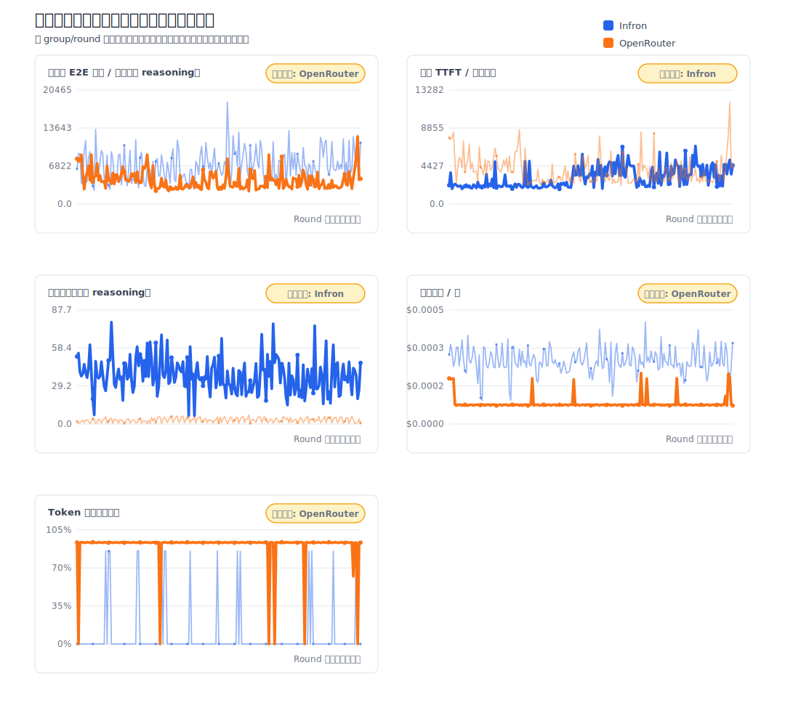

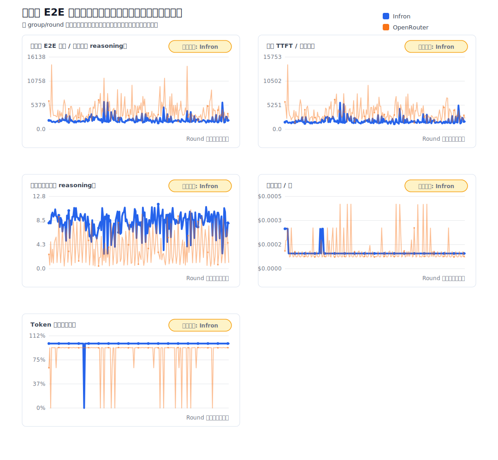

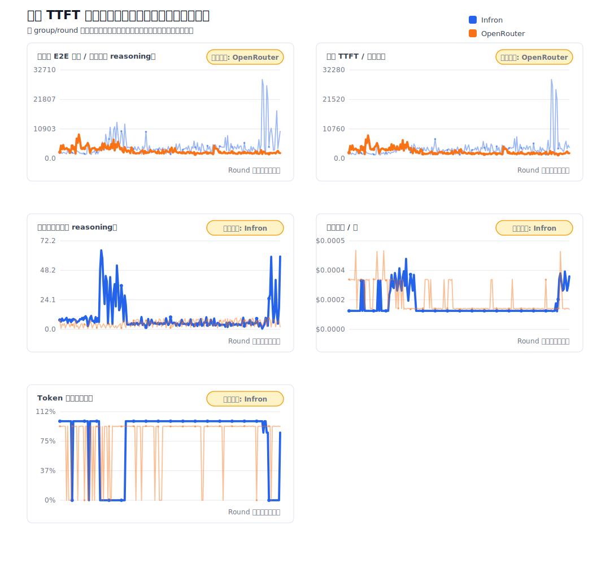

## 8. Provider 路由下钻

| 路由模式 | 平台 | 总请求数 | 已归因请求数 | Provider 分布 |
| --- | --- | ---: | ---: | --- |
| 吞吐优先 | Infron | 400 | 400 | `alibaba/cn` 228, `fireworks` 122, `alibaba/us` 44, `gmicloud` 6 |
| 吞吐优先 | OpenRouter | 400 | 400 | `Alibaba` 398, `Fireworks` 2 |
| 成本优先 | Infron | 398 | 398 | `alibaba/cn` 398 |
| 成本优先 | OpenRouter | 398 | 398 | `GMICloud` 394, `DigitalOcean` 2, `DeepInfra` 1, `Wafer` 1 |
| 端到端 E2E 时延优先 | Infron | 400 | 400 | `fireworks` 400 |
| 端到端 E2E 时延优先 | OpenRouter | 400 | 400 | `GMICloud` 303, `Cloudflare` 78, `WandB` 11, `Morph` 6, `Parasail` 2 |
| 流式 TTFT 优先 | Infron | 396 | 396 | `fireworks` 326, `alibaba/cn` 70 |
| 流式 TTFT 优先 | OpenRouter | 396 | 396 | `Cloudflare` 388, `Parasail` 5, `WandB` 3 |

### 缓存命中率与实际成本反向表现下钻

- **吞吐优先**：缓存亲和弱于 OpenRouter，且响应侧仍有 reasoning tokens，二者共同推高实际成本。
- **成本优先**：缓存亲和弱于 OpenRouter，且响应侧仍有 reasoning tokens，二者共同推高实际成本。
- **端到端 E2E 时延优先**：缓存亲和与上游价格路径共同带来成本优势。
- **流式 TTFT 优先**：缓存亲和与上游价格路径共同带来成本优势。

## 9. Infron 技术机制说明


图 12：Infron 技术架构。Provider Stick 与 Cache Affinity 使重复长前缀更容易落入同一健康缓存域。

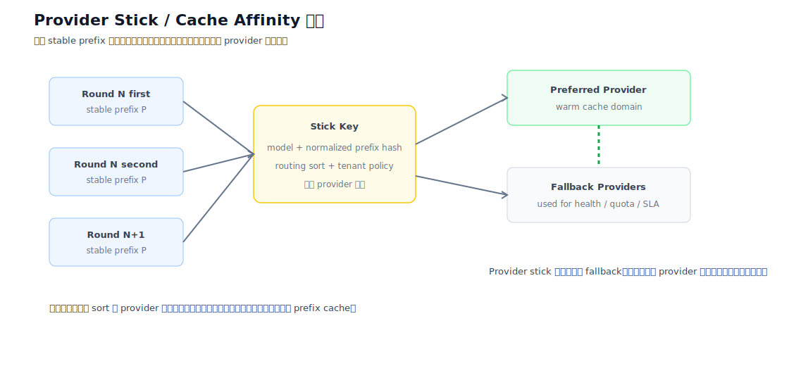

图 13：Provider Stick 与缓存亲和。该机制不等于禁用 fallback，而是在健康 provider 集合内优先保持缓存域稳定。

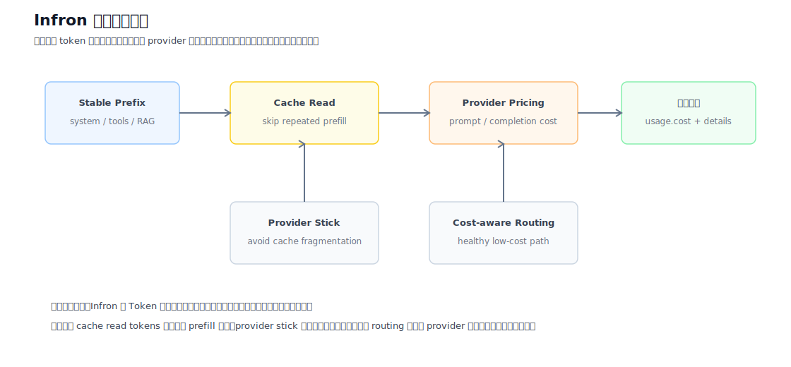

图 14：成本控制机制。实际成本由 token 处理、缓存读写和上游 provider 价格共同决定。

## 10. 业务价值讨论

缓存命中率更适合长上下文、重复系统提示词、RAG 前缀和批处理任务；端到端 E2E 时延和流式 TTFT 更适合实时交互体验；吞吐量更适合长输出和批量生成；实际成本更适合预算敏感型工作负载。不同路由模式对应不同业务目标，平台选择应基于业务 KPI 而不是单一平均值。

## 11. 局限性与后续工作

本轮实验使用内置代表性业务模板，不代表所有真实业务语料。后续可以继续补充显著性检验、更长时间窗口、并发压力、更多模型、更多 provider 对，以及更细粒度的上游 routing trace 和成本 breakdown。

## 12. 可复现性附录

| 工件 | 路径 |
| --- | --- |
| 中文 HTML 报告 | [GitHub Pages](https://infronai.github.io/prompt-cache-bench/experiments/deepseek/deepseek-v4-flash/infron-vs-openrouter-routing-sort-cache-cost-4x50-stream-ttft-reasoning-none-2026-06-29/reports/routing-cache-cost-streaming-performance-ab-study__deepseek-v4-flash__infron-vs-openrouter__4x50-stream-ttft-reasoning-none__2026-06-29.zh.html) |
| 英文 HTML 报告 | [GitHub Pages](https://infronai.github.io/prompt-cache-bench/experiments/deepseek/deepseek-v4-flash/infron-vs-openrouter-routing-sort-cache-cost-4x50-stream-ttft-reasoning-none-2026-06-29/reports/routing-cache-cost-streaming-performance-ab-study__deepseek-v4-flash__infron-vs-openrouter__4x50-stream-ttft-reasoning-none__2026-06-29.en.html) |
| 中文 Markdown | [GitHub](https://github.com/InfronAI/prompt-cache-bench/blob/main/experiments/deepseek/deepseek-v4-flash/infron-vs-openrouter-routing-sort-cache-cost-4x50-stream-ttft-reasoning-none-2026-06-29/reports/routing-cache-cost-streaming-performance-ab-study__deepseek-v4-flash__infron-vs-openrouter__4x50-stream-ttft-reasoning-none__2026-06-29.zh.md) |
| 英文 Markdown | [GitHub](https://github.com/InfronAI/prompt-cache-bench/blob/main/experiments/deepseek/deepseek-v4-flash/infron-vs-openrouter-routing-sort-cache-cost-4x50-stream-ttft-reasoning-none-2026-06-29/reports/routing-cache-cost-streaming-performance-ab-study__deepseek-v4-flash__infron-vs-openrouter__4x50-stream-ttft-reasoning-none__2026-06-29.en.md) |
| 数据目录 | [GitHub](https://github.com/InfronAI/prompt-cache-bench/tree/main/experiments/deepseek/deepseek-v4-flash/infron-vs-openrouter-routing-sort-cache-cost-4x50-stream-ttft-reasoning-none-2026-06-29/data) |
| 完整配对数据集 | [benchmark_pairs.csv](https://github.com/InfronAI/prompt-cache-bench/blob/main/experiments/deepseek/deepseek-v4-flash/infron-vs-openrouter-routing-sort-cache-cost-4x50-stream-ttft-reasoning-none-2026-06-29/data/benchmark_pairs.csv) |
| 请求级观测数据集 | [benchmark_requests.jsonl](https://github.com/InfronAI/prompt-cache-bench/blob/main/experiments/deepseek/deepseek-v4-flash/infron-vs-openrouter-routing-sort-cache-cost-4x50-stream-ttft-reasoning-none-2026-06-29/data/benchmark_requests.jsonl) |
| Summary | [summary.json](https://github.com/InfronAI/prompt-cache-bench/blob/main/experiments/deepseek/deepseek-v4-flash/infron-vs-openrouter-routing-sort-cache-cost-4x50-stream-ttft-reasoning-none-2026-06-29/data/summary.json) |
| 实验代码 | [rerun_routing_sort_cache_cost_ab.py](https://github.com/InfronAI/prompt-cache-bench/blob/main/experiments/deepseek/deepseek-v4-flash/infron-vs-openrouter-routing-sort-cache-cost-4x50-stream-ttft-reasoning-none-2026-06-29/code/rerun_routing_sort_cache_cost_ab.py) |
| 图表目录 | [figures](https://github.com/InfronAI/prompt-cache-bench/tree/main/experiments/deepseek/deepseek-v4-flash/infron-vs-openrouter-routing-sort-cache-cost-4x50-stream-ttft-reasoning-none-2026-06-29/figures) |
| Manifest | [manifest.json](https://github.com/InfronAI/prompt-cache-bench/blob/main/experiments/deepseek/deepseek-v4-flash/infron-vs-openrouter-routing-sort-cache-cost-4x50-stream-ttft-reasoning-none-2026-06-29/metadata/manifest.json) |